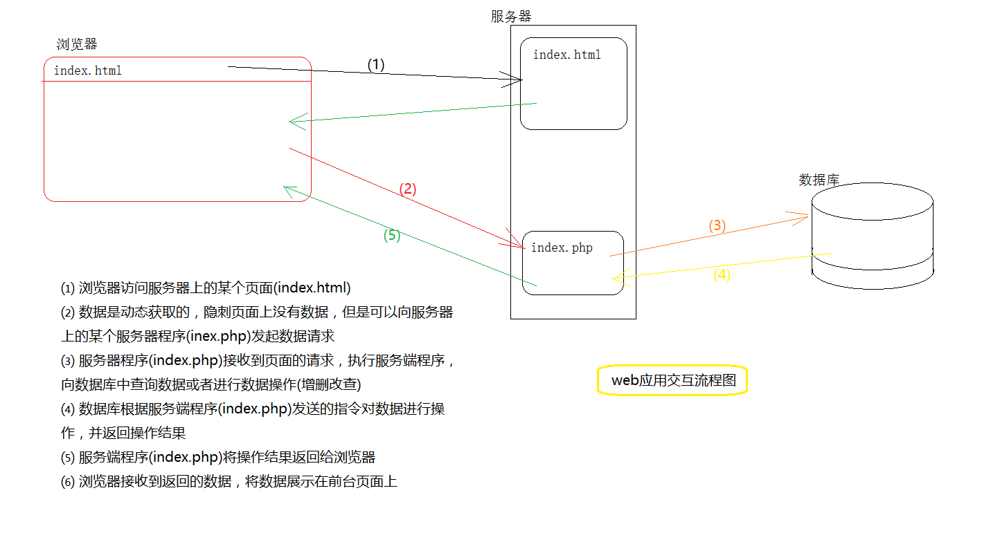
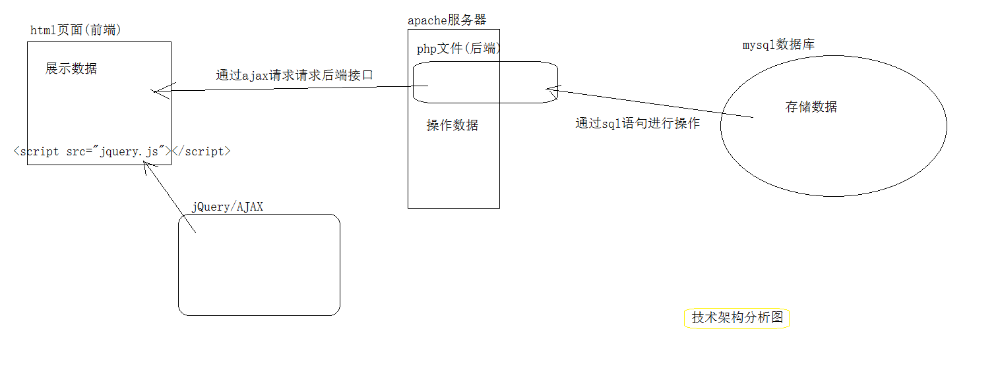
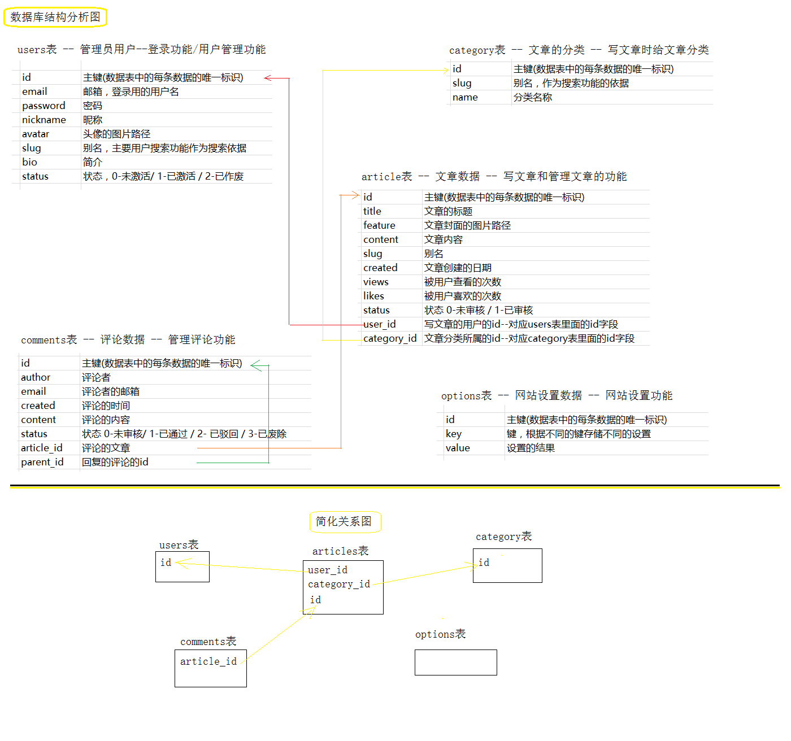

# 项目准备工作

## 技术架构

​	B/S架构web应用的交互主要流程如下：

​	

结合我们目前掌握的知识和技术，决定采用如下的技术架构完成项目



即：

1. 使用html+css+js在前台页面进行数据渲染

 2.  使用 php 在服务端对数据库进行操作
 3.  使用 mysql 数据库对数据进行存储，使用sql语句对数据库进行操作
 4.  使用jQuery中的ajax方法对php文件进行异步请求

因此我们为项目准备的结构大致如下：


项目目录结构建立起来之后，我们的代码就有地方放了，但是数据还没有地方存储，并且数据的存放方式也是有讲究的，所以接下来要讨论的就是数据如何存储——即数据库的结构设计。



因为我们是前端开发人员，所以不用太过关注后端如何架构，因此只要能够理解为什么这么存储这些数据即可。

接着需要把服务端搭建起来。

​	首先需要打开apache服务器的虚拟目录配置文件 在里面添加服务器虚拟配置，其路径一般是   "apache服务器的里目录/conf/extra"

​	代码如下

```xml
<VirtualHost 127.0.0.4:80>
    #设置主机名
    ServerName server.bx15.com
    #设置主机别名，即用该别名也可以访问(前提是域名解析正确)
    ServerAlias www.server.bx15.com
    #设置该站点根目录 - 指向你的代码的绝对路径，这里只是一个例子，根据自己的实际情况修改
    DocumentRoot "E:\work\codes\alibx\sfuw\server"
    #设置文件夹访问控制，其路径要和上一行的DocumentRoot一样,
    <Directory "E:\work\codes\alibx\sfuw\server">
        #用于显示设定“可显示文件列表”(当无可显示网页的时候)
        Options Indexes
        #启用文件夹访问控制的文件.htaccess设置
        AllowOverride None
        #请求控制
        # Require all granted
        #默认打开的页面设置
        DirectoryIndex index.php index.html
        Order allow,deny
        Allow from all
    </Directory>
</VirtualHost>
```

接着要修改host文件，让我们的服务器可以被访问，host文件的路径是： "C:\Windows\System32\drivers\etc\hosts" ，使用记事本打开它，我们自己在里面添加这些代码

```xml
127.0.0.4		server.bx15.com
127.0.0.4		www.server.bx15.com
```

使用浏览器直接打开  ： "server.bx15.com" 如果能访问，那么配置就完成了

**准备工作完毕！**