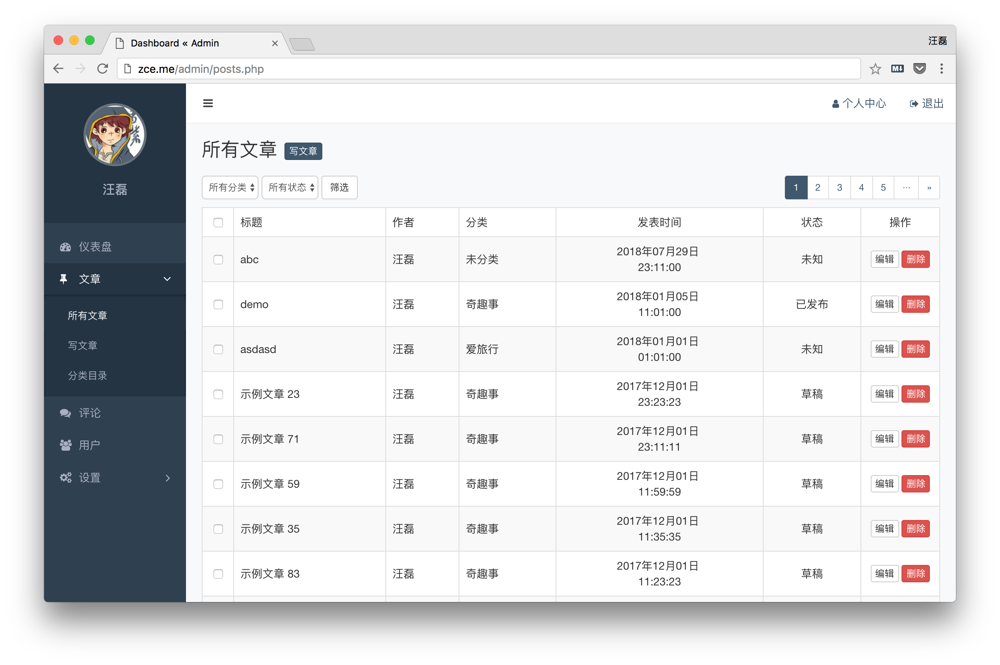
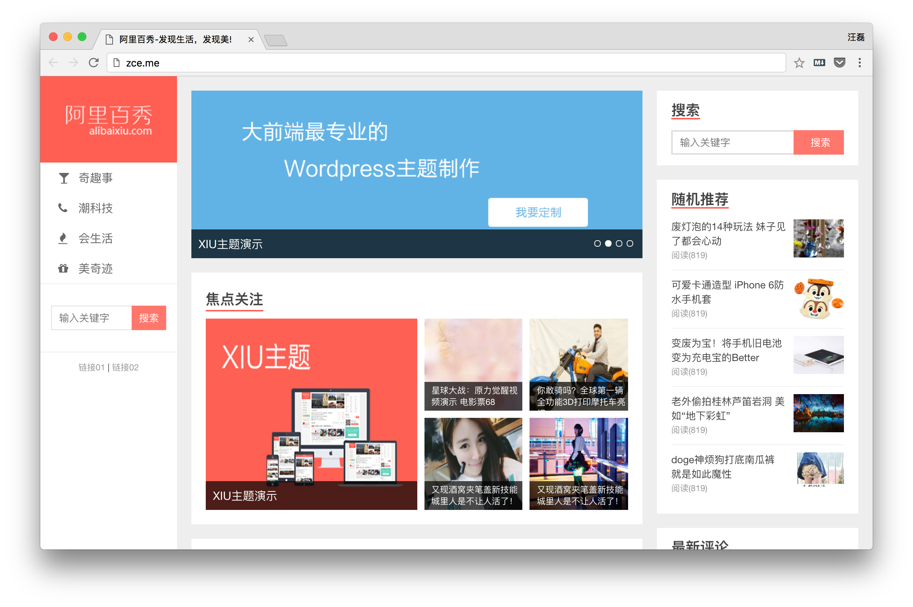

# 阿里百秀项目

## 项目目标

- 了解 Web 开发过程
- 掌握基本的动态网站开发
- 培养 B/S 架构下前端开发思维
- 锻炼 JavaScript jQuery AJAX

### 动态网站

所谓的动态网站，指的是数据层面的动，并不是页面视觉层面的动。如果只是视觉层面的动，就根本不需要 PHP 这一类动态网站开发技术，静态页面就可以完成了。

所以我们必须要有一个数据源头，当每次请求到特定的 PHP 文件（或者是其他的动态网站开发技术），通过 PHP 脚本执行代码，获取数据库中最新的数据，然后动态组织（生成）一个 HTML 页面（可以理解为字符串拼接操作）。

**以上就是动态网站的本质**，目前来说，市面上的网站绝大多数都是动态网站。

### B/S架构

​   B -- Browser(浏览器)   S -- Server(服务器)

​   平常所见到的网站就是B/S架构应用

### 开发流程简介

了解了动态网站的概念过后，我们作为开发者更多想到的就是如何具体开发一个动态网站应用程序，有那些具体的工作，流程是怎样的？

正常情况下，我们大概会有如下几个阶段：

1. **需求分析**：分析我们这个应用程序到底要去做哪些功能，应对哪些业务。
2. **原型设计**：根据需求分析的结果规划应用程序的原型，可以理解为“打草稿”（花不了太多的时间，收效是很大的）。
3. **UI 设计**：将“草稿”转换为设计稿，并提供相应的产物（设计稿、静态页面）。
4. **技术选型**：根据业务场景分别选择对应的技术栈（数据库技术栈、后端技术栈、前端技术栈），一般考虑的因素：人、业务。
5. **数据库设计**：根据需求和原型分析我们有哪些类型的数据需要存，从而得到我们数据库的基本结构。
6. **项目架构设计**：俗称搭架构，其中具体的操作主要就是制定项目规范约束、创建基本的项目结构、编写基础的公共模块代码和组织代码。
7. **业务迭代开发**：开发者的日常，基于项目架构（条条框框）下完成各项业务功能。
8. **集中测试**：将所有功能模块整合到一起过后，集中测试业务功能是否有 BUG，是否满足需求。
9. **部署上线**：从开发环境向生产环境转换，就是把应用部署到服务器上。

## 项目简介

​   该项目是一个自媒体信息发布平台，项目涉及前台页面的展示和后台功能的开发，主要围绕后台功能进行教学和练习

​   **后台和后端的区别**

​       **后台** ：幕后工作实施的地方，运维人员(管理员)管理展示在前台页面上的让用户浏览的信息的地方，可以是一个web应用

​       **后端** ：和前端相对，后端是一类职业，主要指服务器开发人员(我们是前端开发人员)

## 项目预览

#### 后台页面

​

#### 前台页面



### 功能模块

- 用户登录
  - 登录界面可以根据是否填写表单内容拒绝登录操作
  - 管理员可以通过用户名和密码登录到后台
- 内容管理
  - 管理员可以通过管理后台查看全部内容
  - 管理员可以通过管理后台增加内容
  - 管理员可以通过管理后台删除内容
  - ~~管理员可以通过管理后台修改内容~~
- 分类管理
  - 管理员可以通过管理后台查看全部分类
  - 管理员可以通过管理后台增加分类
  - 管理员可以通过管理后台删除分类
  - 管理员可以通过管理后台修改分类名称
- 评论管理
  - 管理员可以通过管理后台查看全部评论
  - 管理员可以通过管理后台审核评论
  - 管理员可以通过管理后台删除评论
- 用户管理
  - 管理员可以通过管理后台查看全部用户
  - 管理员可以通过管理后台增加用户
  - 管理员可以通过管理后台删除用户（不能删除当前登录用户）
  - ~~管理员可以通过管理后台禁用用户~~
- 网站设置
  - 管理员可以通过管理后台维护侧边导航的菜单
  - 管理员可以通过管理后台维护首页轮播
  - 管理员可以通过管理后台维护推荐位展示

### 课程介绍

这个项目中，绝大部分的逻辑是一样的

​   比如：

​       用户的新增/删除/修改/展示

​       分类的新增/删除/修改/展示

​       文章的新增/删除/修改/展示

​       ...

​   基本都是在进行增删改查，所以我们关于增删改查只讲一个最复杂的文章模块，剩下的逻辑几乎是一样的

所以课程主要涉及的内容有：

​   文章的增删改查模块

​   用户登录模块

​   网站设置模块

​   前台页面展示模块

​   ...


## 搭建开发环境

#### 1. 安装phpStudy
解压 `phpStudy` 到一个不含中文及特殊字符的目录即可

#### 2. 创建项目根目录
创建 `*/phpStudy/WWW/baixiu` 文件夹, 作为阿里百秀项目的根目录

#### 3. 配置虚拟主机
虚拟主机可以让一台服务器模拟成为多台服务器, 即一台电脑同时运行多个项目, 实现多网站管理

###### 3.1 启用配置
+ 打开 `httpd.conf` 配置文件
+ 搜索 `httpd-vhosts.conf` 关键字, 在 `470` 行, 去掉 `#` 号注释

###### 3.2 虚拟主机配置
+ 打开 `*/phpStudy/Apache/conf/extra/httpd-vhosts.conf` 配置文件
+ 添加如下配置

```config
<VirtualHost *:80>
    #设置主机名
    ServerName baixiu.com
    #设置主机别名，即用该别名也可以访问(前提是域名解析正确)
    ServerAlias www.baixiu.com
    #设置该站点根目录 - 指向你的代码的绝对路径，这里只是一个例子，根据自己的实际情况修改
    DocumentRoot "C:\phpStudy\WWW\baixiu"
    #设置文件夹访问控制，其路径要和上一行的DocumentRoot一样,
    <Directory "C:\phpStudy\WWW\baixiu">
        #用于显示设定“可显示文件列表”(当无可显示网页的时候)
        Options Indexes
        #启用文件夹访问控制的文件.htaccess设置
        AllowOverride None
        #默认打开的页面设置
        DirectoryIndex index.php index.html
        Order allow,deny
        Allow from all
    </Directory>
</VirtualHost>
```

###### 3.3 修改本地DNS
因为我们并没有购买刚配置过的网站域名, 所以访问域名是无法找到本地服务器的, 为了解决该问题我们在开发阶段可以硬性的强制让浏览器去本地找对应服务
+ 打开 `C:/Windows/System32/drivers/etc/hosts` 本地DNS配置文件
+ 添加如下配置

```config
127.0.0.1 baixiu.com
127.0.0.1 www.baixiu.com
```

###### 3.4 虚拟主机测试
+ 因为修改了 `Apache` 配置, 所以需要重启 `Apache` 服务器
+ 然后将写好的静态html文件拷贝到 `*/phpStudy/WWW/baixiu` 项目文件夹中
+ 在浏览器中输出 `baixiu.com`, 验证是否可以访问到页面

#### 4. 创建数据库
+ 打开 `phpStudy` 内置的 `MySQL` 管理页面, 在 `MySQL 管理器 => MySQL-Front`
+ 创建一个新的数据库 `baixiu`
+ 然后执行已设计并写好的 `sql` 文件创建项目所需的数据表
+ 可修改 `user` 表中的邮箱与密码, 便于日后使用
