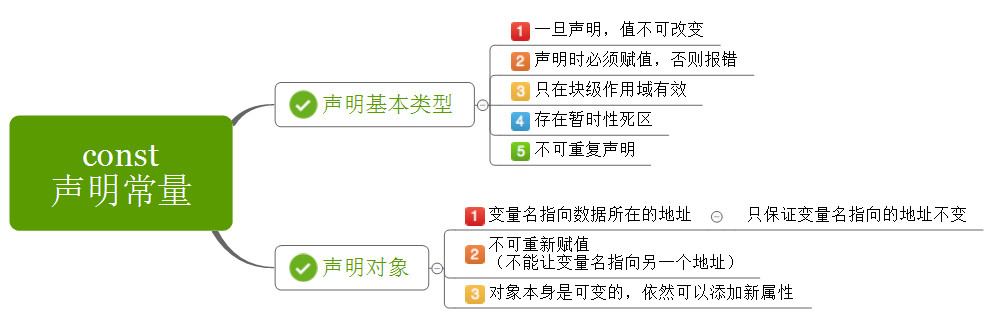
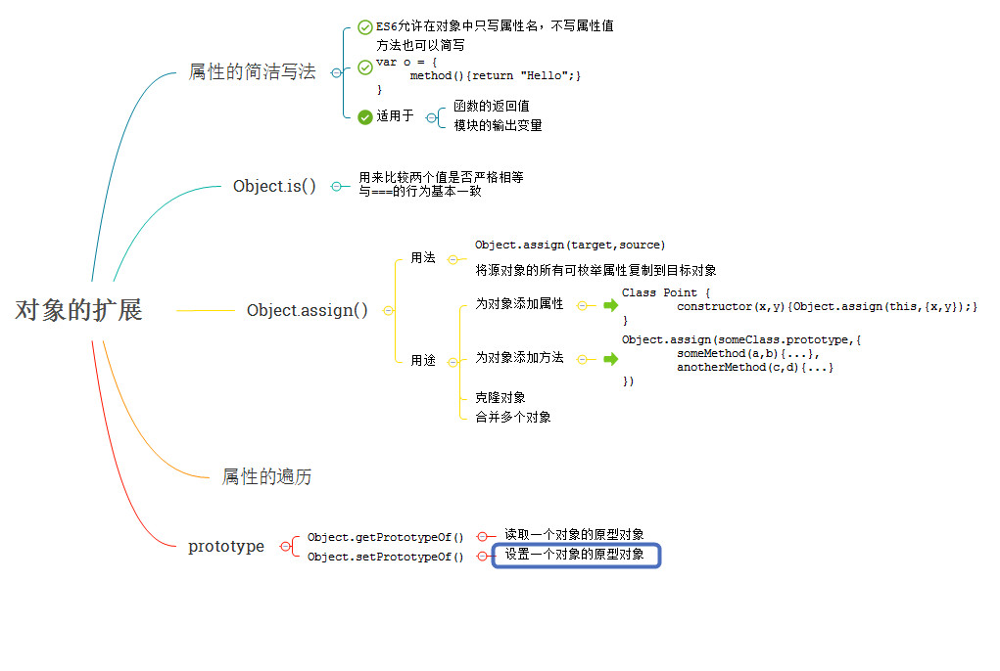

# ES6常用新增语法

## ECMAScript6
> ES6也称为ECMAScript2015，是2015年出版的javaScript国际新标准，
标准的制定者计划，以后每年发布一次标准，使用年份作为版本号，
ES6是在2015年发布的，所以又称为ECMAScript2015，2016年发布的标准即为ES7。

## 主要升级内容
字符编码
新字符串
增强计算api:  SIMD，Math
增强正则
变量赋值 模式匹配
函数式编程
函数新数据结构set , map
二进制数组语法糖
后端语言特性  class ,const , decorator，Iterator
将部分库移植到标准  proxy , iterator , promise , module , object ， Async
新概念 Generator/yield , symbol

## 资料
- [阮一峰](http://es6.ruanyifeng.com/)
- [中文网](https://www.tslang.cn/index.html)

## let与const
> 新的变量定义方式。

#### let
- 作用：
    + 替代var关键字定义变量
- 特点：
    + 不允许重复声明
    + 块级作用域
    + 没有预解析
    + 存在暂时性死区
    + 全局变量不再是window属性

#### const
- 作用：
    + 定义常量
- 特点：
    + 不允许重复声明
    + 块级作用域
    + 没有预解析
    + 存在暂时性死区
    + 全局变量不再是window属性
    + 定义时必须赋值，同时不允许修改

#### 特点演示

- 不允许重复声明
```javascript
// SyntaxError，在语法分析时就报错
let a = 10;
let a = 20;
```
```javascript
function fn(arg) {
	let arg;
}
fn(10); // SyntaxError
```

- 块级作用域
```javascript
{
	let a = 10;
	console.log(a); // 10
}
console.log(a);  // ReferenceError
```

- 没有预解析
```javascript
console.log(a);  // ReferenceError
let a = 10;
```

- 存在暂时性死区
    + 即在某作用域内如果存在let、const声明的变量常量，
    + 如果在声明前使用它们就报错，也不会从上级作用域中查找。
```javascript
let a = 10;
{
	console.log(a);  // ReferenceError
	let a = 20;
}
```

- 全局变量不再是window属性
```javascript
let a 10;
console.log(a); // 10
console.log(window.a); // undefined
```

- const定义常量时必须一起赋值
```javascript
const NAME;  // SyntaxError;
```

- 常量的值不允许修改
```javascript
const NAME = '地球';
NAME = '火星';  // TypeError
```

#### 使用场景

- 防止变量污染
```javascript
let i = 10;
for(let i = 0; i < 3; i++) {
	console.log(i);
}
console.log(i); // 10
```

- 帮助预防潜在错误
```javascript
console.log(a + b); // RefrenceError
let a = 10;
let b = 20;
```

- 常量特性
```javascript
const PI = 3.1415926;
PI = 2.1415926;  // TypeError
```

- let特性总结


- const特性总结



## 解构赋值
> 按照一定的模式，从数组和对象中提取值，然后对变量进行赋值

#### 数组解构

- 完全解构
```javascript
let arr = [10, 20, 30];
let [ a, b, c ] = arr;
console.log(a); // 10
console.log(b); // 20
console.log(c); // 30
```

- 部分解构
```javascript
let [ a, , c ] = [10, 20, 30];
console.log(a); // 10
console.log(c); // 30
```

- 特殊值
```javascript
let [ a, b, c ] = [10, [ 20, 21, 22 ], {a: 1, b: 2}];
console.log(a); // 10
console.log(b); // [ 20, 21, 22 ]
console.log(c); // {a: 1, b: 2}
```

- 深层解构
```javascript
let [ a, [b1, b2] ] = [10, [ 20, 21, 22 ], 30];
console.log(a); // 10
console.log(b1); // 20
console.log(b2); // 21
```

- 解构缺失
```javascript
let [ a, b ] = [10];
console.log(a); // 10
console.log(b); // undefined
```

- 默认值
```javascript
let [ a = 'aa', b = 'bb' ] = [10];
console.log(a); // 10
console.log(b); // bb
```

#### 对象解构

- 完全解构
```javascript
let { a, b, c } = { a: 10, b: 20, c: 30 };
console.log(a); // 10
console.log(b); // 20
console.log(c); // 30
```

- 部分解构
```javascript
let { a, c } = { a: 10, b: 20, c: 30 };
console.log(a); // 10
console.log(c); // 30
```

- 特殊值
```javascript
let { a, b, c } = { a: 10, b: [20, 21, 22], c: { c1: 30, c2: 31 } };
console.log(a); // 10
console.log(b); // [20, 21, 22]
console.log(c); // { c1: 30, c2: 31 }
```

- 深层解构1
```javascript
let { b: [ b1, b2 ], c: { c1, c2 } } = { a: 10, b: [20, 21], c: { c1: 30, c2: 31 } };
console.log(b);   // RefrenceError
console.log(b1); // 20
console.log(b2); // 21
console.log(c);   // RefrenceError
console.log(c1); // 30
console.log(c2); // 31
```

- 深层解构2
```javascript
// 对象深层解构时前面的引导符不算变量，如有需要，需单独解构
let { c, c: { c1, c2 } } = { a: 10, b: [20, 21], c: { c1: 30, c2: 31 } };
console.log(c);   // { c1: 30, c2: 31 }
console.log(c1); // 30
console.log(c2); // 31
```

- 解构缺失
```javascript
let { a, b } = { a: 10 };
console.log(a); // 10
console.log(b); // undefined
```

- 默认值
```javascript
let { a = 'aa', b = 'bb' } = { a: 10 };
console.log(a); // 10
console.log(b); // bb
```

- 重起变量名
```javascript
let { a: myA } = { a: 10 };
console.log(myA); // 10
console.log(a);      // ReferenceError
```

#### 使用场景

- 变量交换
```javascript
let a = 10, b = 20, c = 30;
// 注意这里a b c已经声明了,就不用再声明了
[a, b, c] = [ b, c, a ];
console.log(a, b, c);
```

- 提取对象中值
```javascript
let ajaxResponseData = {
	code: 200,
	msg: '成功',
	result: {
		name: '车',
		info: '各种车',
		list: ['兰博基尼', '法拉利']
	}
};

// 解构提取result中info与list的值
let { result: { info, list } } = ajaxResponseData;
console.log(info);
console.log(list);
```

- 函数返回多个值（本质还是提取对象中的值）
```javascript
function fn() {
	let obj = {};
	return {
		get: function(key){
			return obj[key];
		},
		set: function(key, val){
			obj[key] = val;
		}
	};
}

// 解构fn的返回值
let { get, set } = fn();
set('fib', [1, 1, 2, 3, 5, 8, 13]);
get('fib');
```

- 解构特点总结


## \`\`字符串
> 新的字符串定义方式。

- 多行字符串
```javascript
let str = `第一行第一行
	第二行第二行`;
console.log(str);
```

- 模版字符串
```javascript
// 可以访问变量、调用函数、及各种表达式运算
let mei = {
	name: '小美',
	age: 16
};
let str = `${ mei.name }今年${ mei.age }了，
	还有${ 30 - mei.age }年他就30了`;
console.log(str);
```


## 语句

#### for of
> 新的循环语句,可遍历数组得到里面的每个值,也可以遍历Set与Map以及内置的类数组的对象

- 遍历数组
```
let arr = ['a', 'b', 10, 20];
for(let v of arr) {
	console.log(v);   // 'a', 'b', 10, 20
}
```


## 运算符

#### ...运算符 （扩展运算符、多值运算符）
> 多个值可包装成数组，也可解开真伪数组为多个值。

- 用于形参定义 - 可获取剩余参数为数组
```javascript
function fn(a, ...s) {
	console.log(s);
}
fn(1, 2, 3, 4, 5, 6);
```

- 用于函数调用 - 可解开数组依次传递(替代apply)
```javascript
let nums = [55, 33, 66, 11];
console.log(Math.min.apply(null, nums)) // 11
console.log(Math.min(...nums)) // 11
```

- 用于数组定义 - 可合并数组
```javascript
let arr1 = [1, 2, 3];
let arr2 = [4, 5, 6];
let arr3 = [7, 8, 9];
let arr4 = [ ...arr1, ...arr2, ...arr3 ];
console.log(arr4);
```

- 用于数组解构赋值 - 可用1个变量获取数组剩余值
```javascript
let arr = [ 11, 22, 33, 44 ];
let [ a, ...b ] = arr;
console.log(a, b);  // 11, [ 22, 33, 44 ]
```


## 函数

#### 函数形参的定义

- 设置默认值
> 具有默认值的形参最好定义在后面
```javascript
function fn(a = 10, b = 20) {
	console.log(a + b);
}
fn();
fn(100);
fn(100, 200);
```

- 参数解构赋值
```javascript
function fn({a, b}) {
	console.log(a + b);
}
fn({a: 11, b: 22});
```

- ...形参语法
> 1. 把函数剩余的参数存储到数组中
2. 该语法定义的形参可以替代arguments
3. 只有最后一个形参才能这样写
```javascript
function total(...nums) {
	return nums.reduce(function(prevResult, current) {
		return prevResult + current;
	});
}
total(11, 22, 33, 44);  // 110
```

#### 箭头函数
- 简述：
    + 使用=>定义函数。
- 特点：
    + this固定指向上级this，不再和调用方式有关
    + 不能作为构造函数使用
    + 不能使用arguments，可使用...语法代替
- 语法：
   + 形参 => 代码体

- 基本用法
```javascript
let add = (a, b) => {
	return a + b;
};
console.log(add(11, 22));
```

- 一个形参可省略小括号
```javascript
let add = a => {
	return a + 22;
};
console.log(add(11));
```

- 一句代码可省略大括号，并自动return执行结果
```javascript
let add = a => a + 22;
add(11);
```

- 使用例子
```javascript
let arr = [ 1, 2, 3, 4 ];
let newArr = arr.map(v => v * v);
console.log(newArr);
```

- this固定指向上级this
```javascript
function Tab() {
	this.tabBtn = document;
	this.tabBox = document.body;
}
Tab.prototype = {
	on: function() {
		this.tabBtn.onclick = () => {
			console.log(this);
			this.tabBox.style.backgroundColor = 'blue';
		};
	}
};
new Tab().on();
```

- 不能作为构造函数使用
```javascript
let Person = (name, age) => {
	this.name = name;
	this.age = age;
};
let p = new Person();
```

- 不能使用arguments对象
```javascript
let fn = () => console.log(arguments);
fn(1, 2, 3);
```

- 函数相关特性预览


## 对象

#### 属性方法简洁表示

- 引用变量定义属性方法
```javascript
let a = 10;
let b = 20;
let fn = function(){};
let obj = { a, b, fn };
console.log(obj);
```

- 方法定义 （改造闭包缓存例子）
```javascript
let obj = {
	fn1: function() {
		console.log('传统写法');
	},
	fn2() {
		console.log('简洁写法');
	}
};
obj.fn1();
obj.fn2();
```

#### 属性名支持表达式

- 引用变量值

```javascript
let key = 'name';
let obj = {
	[ key ]: '小美';
};
console.log(obj);
```

- 表达式计算值

```javascript
let key = 'name';
let obj = {
	[ 'my' + key ]: '小美',
};
console.log(obj);
```

- 对象特性预览


## class类
- 简述：
    + 提供了与传统面向对象语言相似的写法，减少其他程序员的学习门槛。
    + 在功能上相比es5基本没有什么区别。
- 特点：
    + 只能配合new关键字创建实例
    + 类名不会预解析
    + 类原型上的属性名可以使用表达式
    + 类原型上的属性默认是不可枚举的

#### 语法

- 类的定义

```javascript
class Person {

	// 以前的构造函数
	constructor(name, age, gender) {
		this.name = name;
		this.age = age;
		this.gender = gender;
	};

	// 以前原型上的方法
	say() {
		console.log(`${ this.name }今年${ this.age }岁了`);
	};

};

// 使用方式一样
let xiaoming = new Person('小明', 14, '男');
xiaoming.say();
```

- 静态方法
静态方法属于`类自己`,通过`类名.方法名`调用
注意这里static关键字`只能`作用于方法,`不能`作用于属性

```javascript
class Person {

	constructor() {
		Person.total++ ||  (Person.total = 1);
	};

	// 统计总人口,
	static getTotal() {
		return Person.total;
	};

};

let p1 = new Person;
let p2 = new Person;
console.log(Person.getTotal()); // 2
```

- 继承特性1 - 实例成员继承
通过extends关键字实现继承
如果子类有构造器,必须添加super()调用父类构造器
继承后子类实例便可使用父类实例的属性与方法

```javascript
class Animal {

	constructor(name, age, gender) {
		this.name = name;
		this.age = age;
		this.gender = gender;
	};

	eat() {
		console.log('都得吃啊！');
	};

};

class Person extends Animal {

	constructor(name, age, gender) {
		super(name, age, gender);
	};

	say() {
		console.log(`${ this.name }今年${ this.age }岁了`);
	};

};
let xiaoming = new Person('小明', 14, '男');
xiaoming.eat();
xiaoming.say();
```

- 继承特性2 - 静态成员继承

```javascript
class Animal {

	static test() {
		console.log('来自父类的静态方法');
	};

};
class Person extends Animal {};
Person.test();
```

#### 本质

- 类本质上还是一个函数
```javascript
class Person {};
typeof Person; // function
```

- 类中的实例方法都定义在了原型中
```javascript
class Person {
	eat() {
		console.log('吃吃吃');
	};
};
Person.prototype;
```

- 类中的静态方法都定义在了自身
```javascript
class Person {
	static getTotal() {
		console.log('70亿');
	};
};
Person;
```

- 继承原理

```javascript
class Animal {
	eat() {
		console.log('都得吃啊！');
	}

	static sleep() {
		console.log('睡');
	}
};

class Dog extends Animal {}

// 实现原理
Dog.prototype 继承 Animal.prototype,即子类原型 ==> 父类原型
Dog 继承 Animal,即子类 ==> 父类
```


## 模块
- es6新增了`模块`规范, 可惜目前的主流浏览器都`不支持`, 但未来它会统一模块化开发
- es6里的模块就是一个`独立`的文件, 该文件内部的所有`变量`, 外部无法`获取`,也就是说有了模块概念后就不会再存在全局变量
- 如果你希望在一个模块里调用另一个模块间的东西,需要使用`import`与`export`导入导出语法

#### webpack安装
- 因为浏览器还`不支持`es6模块特性,这里我们需要借助`webpack`工具把es6模块打包为浏览器可执行脚本
- webpack是`模块打包`工具,可把各种模块编写的代码打包成浏览器可`直接运行`的代码
- 安装命令: `npm install -g webpack`
- 测试命令: `webpack -v`
- 打包命令: `webpack 打包入口文件名 输出文件名`

#### 导出导入具名变量
- 下面的代码演示了导出具名变量的两种方式与导入具名变量的两种方式

###### 演示1

- 单个分别导出, 导出那个就在那个前面添加export关键字

```javascript
export let year = 2017;
let month = 10;
let day = 28;
export function getDate() {
	return `${year}_${month}_${day}`;
}
```

- 单个按需导入, 导入什么就用什么变量接收

```javascript
import { year, getDate } from './a.js';
console.log(year);                 // 2017
console.log(getDate());         // 2017_10_28
```

###### 演示2

- 批量整体导出, 导出那个就在对象里面添加那个

```javascript
let year = 2017;
let month = 10;
let day = 28;
function getDate() {
	return `${year}_${month}_${day}`;
}
export { year, month, day, getDate };
```

- 批量整体导入, 导入时随便起个变量名接收

```javascript
import * as a from './a.js';
console.log(a.year);                 // 2017
console.log(a.getDate());         // 2017_10_28
```

#### 导出导入默认值

###### export

- 导出时必须使用default关键字来修饰, 且一个模块只能导出一个默认值

```javascript
const cacheData = {};
export default function(key, val) {
	if(val) {
		cacheData[key] = val;
		return cacheData;
	}else  {
		return cacheData[key];
	}
};
```

###### import

- 导入时随便起个变量名接收

```javascript
import cache from './cache.js';
cache('a', 10);
cache('a');      // 10
```
