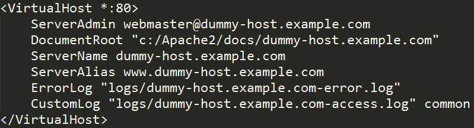

# 博学谷

## 库使用

### artTemplate
> [github地址](https://github.com/aui/art-template)

### jquery.cookie
> [github地址](https://github.com/carhartl/jquery-cookie)

##### 获取
```javascript
// 获取所有 --> 以对象方式获取当前域名路径下所有cookie
var cookieObj = $.cookie();

// 获取单个 --> 获取当前域名路径下指定cookie
var cookieVal = $.cookie('cookieKey');
```

##### 设置与修改
```javascript
// 设置会话cookie --> 在当前域名路径下设置指定cookie
var cookieStr = $.cookie('cookieKey', 'cookieVal');

// 设置指定天数过期时间 --> 在当前域名路径下设置指定cookie
var cookieStr = $.cookie('cookieKey', 'cookieVal', { expires: 100 });

// 设置其他属性 --> 在当前域名路径下设置指定cookie
var cookieStr = $.cookie('cookieKey', 'cookieVal', { domain: '/', path: '/', secure: true });
```

##### 删除
```javascript
// 删除单个cookie --> 删除当前路径下指定cookie
// 返回值代表在当前路径下是否还存在这个cookie，因为同一个cookie名可能存在与不同的路径中，每次只能删除一个
var isExist = $.removeCookie('cookieKey');

// 删除单个cookie --> 删除指定路径下指定cookie
// 该cookie一定在当前路径下可以访问的到，即该cookie路径是当前路径的上级
// 返回值代表在当前路径下是否还存在这个cookie，因为同一个cookie名可能存在与不同的路径中，每次只能删除一个
var cookieVal = $.cookie('cookieKey', { path: '/' });
```

### nprogress
> [官方地址](http://ricostacruz.com/nprogress/)

### jquery.form
> [github地址](https://github.com/jquery-form/form)

###### 提交

- ajaxSubmit
    + 根据form表单的数据发送ajax请求
```javascript
$('form').on('submit', function () {
	$(this).ajaxSubmit({
		url: '/v6/example',
		type: 'post',
		data: {newProperty: '额外添加的属性'},
		success: function (data) {
			console.log(data);
		}
	});
	return false;
});
```

- ajaxForm
    + 监听表单submit事件，并阻止默认的提交
    + 然后根据form表单的数据发送ajax请求
```javascript
$(this).ajaxForm({
	url: '/v6/example',
	type: 'post',
	data: {newProperty: '额外添加的属性'},
	success: function (data) {
		console.log(data);
	}
});
```

### jquery-ajax全局事件
> 如果使用了jquery的ajax相关方法发送请求，
那么jquery就会在document触发上触发几个jquery定义的事件。

##### 事件种类

- ajaxStart
    + 在请求刚刚发送出去时，该事件被触发。
    + 如果同时发送多个请求，只有第一个请求会触发该事件。

- ajaxSend
    + 在请求刚刚发送出去时，该事件被触发。
    + 如果同时发送多个请求，每一个请求都会触发该事件。

- ajaxSuccess
    + 每有一个请求成功，或数据按照指定的方式解析成功，就会触发该事件。

- ajaxError
    + 每有一个请求失败，或数据解析失败，就会触发该事件。

- ajaxStop
    + 请求完成后触发该事件，不在乎请求是否成功。
    + 如果同时发送多个请求，只有最后一个请求会触发该事件。

- ajaxComplete
    + 请求完成后触发该事件，不在乎请求是否成功。
    + 如果同时发送多个请求，每一个请求都会触发该事件。

##### 常用事件
- 我们的页面可能同时发送多个ajax请求，
- 通常我们会在第一个请求发送后展示一张loading图片，
- 最后一个请求结束后隐藏loading图片，
- 那么对应的两个事件就是ajaxStart和ajaxStop。

### bootstrap-datepicter
> [官方地址](http://bootstrap-datepicker.readthedocs.io/en/latest/)
> [github地址](http://bootstrap-datepicker.readthedocs.io/en/latest/)

##### 基本使用
```javascript
$('input').datepicter();
```

##### 属性配置
```javascript
$('input').datepicter({
	language: 'zn-CN',
	format: 'yy-mm-dd',
	......
});
```

- language
    + 设置语言
    + 值为语言模块定义的语种名词，如'zh-CN'
    + 语言模块需要单独引入对应的js，并且语言模块依赖jQuery与datepicter

- startDate
    + 设置可选日期范围最小值
    + 值可以是Date对象，如new Date()
    + 也可以是能够用来创建Date实例的字符串，如'2018-8-1'

- endDate
    + 设置可选日期范围最大值
    + 值可以是Date对象，如new Date()
    + 也可以是能够用来创建Date实例的字符串，如'2018-8-1'

- format
    + 设置日期输出格式
    + 模式字符串，如'yyyy-mm-dd'
    + yy、yyyy、mm、dd以阿拉伯数字表示年、月、日
    + MM、DD以文字表示月、星期

##### 方法调用
```javascript
$('input').datepicter('methodName', 'param1', 'param2', ...);
```

- destroy
    + 销毁日期组件，包括注册的事件和元素之间的关联
    + 参数：无

- hide
    + 隐藏日期组件
    + 参数：无

- show
    + 显示日期组件
    + 参数：无

- setDate
    + 动态重置日期
    + 参数：
    + 传入的日期可以为Date对象也可以为能表示时间的字符串
    + 传入的日期如果超出限制的最小最大范围则设置无效

- clearDates
    + 清空已选日期
    + 参数：无

- getDate
    + 获取已选日期
    + 参数：无

##### 事件监听
```javascript
// 事件回调中接收到的jquery事件对象，新增了一个date属性，用来获取选取的日期
$('input').on('changeDate', function($e){
	console.log($e.date);
});
```

- hide
    + 日期组件隐藏时被触发

- show
    + 日期组件显式时被触发
    + 当选择日期后也会触发

- changeDate
    + 当选择新的日期后被触发

### region

##### 代码范例
```html
<div id="region-container">
    <select name="" id="p" data-id="">
		<option value="">请选择省</option>
	</select>
	<select name="" id="c" data-id="">
		<option value="">请选择市</option>
	</select>
	<select name="" id="d" data-id="">
		<option value="">请选择县</option>
	</select>
</div>
<script>
	$('#region-container').region({
		url: 'region/region.json'
	});
</script>
```

##### 注意事项
- 3个select的ID属性，必须是p、c、d
- 每个select中必须要有一个默认提示性的option
- data-id属性可以设置默认选项，值为对应城市的编号

### uploadify
> [官方地址](http://www.uploadify.com/)

##### 基本使用
```html
<input  id="uploadify" type="file" />
<script>
	$('#uploadify').uploadify({
		swf: '/lib/uploadify/uploadify.swf',
		uploader: '/v6/uploader/avatar',
		fileTypeExts: '*.gif; *.jpg; *.png'
	});
</script>
```

##### 属性配置

- fileObjName
    + 设置提交给后端文件数据对应的key
    + 默认值为'Filedata'
    
- formData
    + 配置除fileObjName，需要额外提交的数据
    + 值为key、value形式的对象

- fileSizeLimit
    + 限制文件大小
    + 值为字符串，可以使用B、KB、MB、GB作为描述大小的单位

- fileTypeExts
    + 限制上传文件的类型
    + 默认值为'*'

- buttonText
    + 设置按钮文本
    
- buttonClass
    + 设置按钮class属性值，用来控制按钮样式
    
- auto
    + 配置选取文件后是否自动上传

- onUploadSuccess
    + 文件上传成功的回调
    + 回调接收的第一个参数为文件对象，第二个参数为请求回来的数据
    
##### 方法调用

- upload
    + 使用脚本的方式随时提交选择的文件
```javascript
	$('#uploadify').uploadify('upload');
```

- disable
    + 禁用或开启上传功能
```javascript
	$('#uploadify').uploadify('disable', true ||false);
```

- destroy
    + 卸载插件
```javascript
	$('#uploadify').uploadify('destroy');
```

- settings
    + 动态修改属性配置
```javascript
	$('#uploadify').uploadify('settings', 'buttonText', '按钮');
```

### ckeditor
> [官方地址](ttp://ckeditor.com)

- CKEDITOR.replace
    + 在指定元素的地方生成一个富文本编辑器
    + 第一个参数为元素的ID选择器
    + 可以传入第二个参数为配置对象
    + 返回值为富文本编辑器对象
```html
<textarea id="ckeditor"></textarea>
var edit = CKEDITOR.replace("ckeditor", config);
```

- 实例.updateElement
    + 更新编辑内容到文本框的方法
    
- 实例.setData
    + 设置内容

- 实例.getData
    + 获取内容


## 工作环境与状况了解

### 工作岗位与职责
- 产品经理
- UI设计
- 后端程序猿
- 前端程序猿
- 测试工程狮
- 运维工程狮

### 项目流程
- 需求设计阶段 --> 主要工作人员：产品
    + 调研与需求确立
    + 估时
    + 产出需求文档与产品原型
- 美术设计阶段 --> 主要工作人员：设计
    + 估时
    + 产出ui界面
- 开发实现阶段 --> 主要工作人员：前端(web、IOS、Android、PC)、后端、测试
    + 估时
    + 前端架构，开发
    + 后端架构，开发
    + 测试用例编写
- 测试调试阶段 --> 主要工作人员：前端(web、IOS、Android、PC)、后端、测试
    + 前后端联调
    + 测试
    + bug修复
- 上线部署 --> 主要工作人员：运维、测试
    + 线上环境部署与项目上线
    + 测试，确保线上项目运行无问题
    + 如出现问题开发人员紧急修复或撤销上线延后处理

### web前端开发方式
- 前后端不分离
    + 通常是前端人员开发完毕后，将代码交给后端，后端会对代码进行二次开发改造
    + 前后代码混在一起，前端代码中经常参杂着后端代码，这些代码的作用通常是填充动态数据的，即后端负责数据的渲染
    + 前后端需要一起部署上线，耦合度比较高
- 前后端分离
    + 前端不再将代码交给后端二次开发改造，前后端可以使用两个仓库分开管理和维护
    + 前端展示的动态数据都是通过ajax请求渲染上去的，即前端负责数据的渲染
    + 前后端可以分开部署，耦合度较低

## 环境搭建

### phpStudy配置

- 配置网站根目录
    + 网站根目录是HTTP服务器上存放网站程序的空间
    + 先右键phpStudy图标，选择phpStudy设置，勾选允许目录列表
    + 根目录配置
        1. 方式一
            + 在phpStudy设置下，点击端口常规设置
            + 选择网站目录
        2. 方式二
            + 打开**/phpStudy/Apache/conf/httpd.conf主配置文件
            + 查找并修改DocumentRoot "C:/phpStudy/WWW"
    + 重启HTTP服务器

- 配置虚拟主机
    + 虚拟主机可以让一台服务器模拟成为多台服务器，实现多网站管理
    + 1. 开启配置
        + 打开httpd.conf配置文件
        + 查找#Include conf/extra/httpd-vhosts.conf，去掉#号注释
    + 2. 虚拟主机配置
        + 打开**/phpStudy/Apache/conf/extra/httpd-vhosts.conf
        + 复制virtualHost
            + 修改DocumentRoot为"C:/phpStudy/WWW/boxuegu"
            + 修改ServerName为"boxuegu.com" 
            + 修改ServerAlias为"www.boxuegu.com" 
    + 3. 修改DNS
        + 打开C:/Windows/System32/drivers/etc/hosts
        + 127.0.0.1 boxuegu.com
        + 127.0.0.1 www.boxuegu.com
    + 4. 成功验证
        + 重启Apache
        + 浏览器访问www.boxuegu.com

- 使用php抽取页面公共模块
    + 配置后我们写在html中的php代码就会执行，这里我们的目的是使用php的include方法实现页面公共部分的拆分
    + 添加配置
        1. 打开**/phpStudy/Apache/conf/httpd.conf主配置文件
        2. 查找AddType application/x-httpd-php .php这行配置
        3. copy一行出来，把.php改为.html即可
    + 测试
        1. 抽取页面中head标签内所有的link，放置到html/common/style.html，作为所有页面的公共模块
        2. 使用导入抽取的公共模块
        3. 浏览器访问www.boxuegu.com验证

- 配置反向代理
    + 一种跨域方案，这种方案是通过后台配置实现的，配置后前端不需要做任何事情
        1. 我们开发所需的web接口已经开发完毕并在公网上线
        2. 但是其接口域名与我们的域名不一样，所以当使用ajax请求这些接口时浏览器会报跨域错误
    + 开启代理服务
        1. 打开**/phpStudy/Apache/conf/httpd.conf主配置文件
        2. 查找#LoadModule proxy_module modules/mod_proxy.so解除注释
        3. 查找#LoadModule proxy_http_module modules/mod_proxy_http.so解除注释
    + 配置转发，把所有www.boxuegu.com/v6的请求转发到api.botue.com/v6
        1. 打开**/phpStudy/Apache/conf/extra/httpd-vhosts.conf
        2. 找到boxuegu对应的虚拟主机配置 
        3. 添加一行ProxyRequests Off
        4. 添加一行ProxyPass /v6 http://api.botue.com
