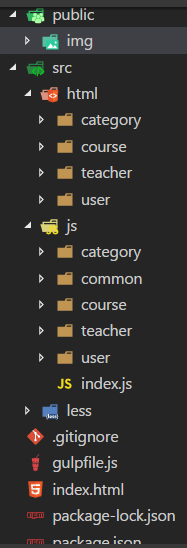

# 博学谷

## 参考github项目
- https://github.com/guopengfei116/boxuegu_11/

## md文件转html
- 全局安装包
    + `npm i -g  i5ting_toc`
- 安装后进入你要转换的md文件所在目录，运行下面命令就自动转换了
    + `i5ting_toc -f xxx.md`

#### 设计项目结构
- 把之前写好的静态文件直接导入到项目中
- 通过npm创建如下目录
   + package.json: `npm init -y`
   + /node_modules: npm 安装包自动创建
- 通过git创建如下目录
   + /.git: `git init`
- 通过gulp创建如下目录
   + /dist: 当我们运行gulp任务的时候自动创建
- 然后手动创建如下目录
   + .gitignore
   + gulpfile.js
   + /public
       * /public/img
   + /src
       *  /src/js
       *  /src/less
       *  /src/html
   + index.html

#### 安装包
- 运行时依赖：
    + `npm install jquery@1 art-template bootstrap font-awesome`
- 开发时依赖：
    + `npm install gulp gulp-htmlmin gulp-concat gulp-clean-css gulp-less gulp-uglify gulp-rename browserify -D`

#### 调整/src/html目录
- 把home目录名修改为user

#### 调整/src/js目录
- 创建/src/js/category
    + 根据对应目录的html创建js
- 创建/src/js/course
    + 根据对应目录的html创建js
- 创建/src/js/teacher
    + 根据对应目录的html创建js
- 创建/src/js/user
    + 根据对应目录的html创建js
- 创建/src/js/common
- 创建/src/js/index.js
- 把common.js放置到/src/js/common目录下

#### 最终结构预览


## gulp构建流程编写

#### browserify打包CommonJS模块

- 安装包
    + `npm i browserify vinyl-source-stream vinyl-buffer -D`

- 编写一个打包任务
```javascript
// 打包CommonJS模块
gulp.task('js', function() {
    browserify('src/js/index.js').bundle() // 打包index.js
        .pipe(source('index.js'))
        .pipe(buffer())
        // .pipe(uglify())
        .pipe(gulp.dest('dist/js'));
});
```

- 编写测试脚本
```javascript
// src/common/a.js
module.exports = 123;
```
```javascript
// src/common/b.js
module.exports = {
	aa: 1111,
	bb: 2222,
	cc: 3333
};
```
```javascript
// src/js/index.js
var a = require('./a.js');
var b = require('./b.js');
console.log(a);
console.log(b);
```

- 浏览器环境测试
   + 运行：`gulp js`
   + 创建dist/js/test.html，引入构建生成的index.js
   + 打开浏览器看看页面的控制台有没有正确打印值

## 加入jquery-form插件
- 安装
    + `npm i jquery-form`
- 在gulpfile中进行jsLibs的配置
    + 数组中添加`'node_modules/jquery-form/dist/jquery.form.min.js'`
- 运行gulp打包jsLab任务
    + `gulp jsLib`

## 实现登陆功能

#### html修改
- 修改form表单的action与method属性
    + action对应接口地址
    + method对应接口方法
- 修改input的name属性
    + name值对应接口字段名

#### js编写
```javascript
// 当用户点击登陆按钮的时候，这个插件ajaxForm方法会自动监听submit事件
// 然后阻止浏览器默认的刷新提交，然后自动变成ajax的方式发送请求。
$('#login-form').ajaxForm({
    success: function(data) {
        if(data.code == 200) {
            alert('登陆成功');
        }else {
            alert('登陆失败');
        }
    },
    error: function() {
        alert('登陆失败');
    }
});
```

## 实现首页退出功能

#### 实现公共的header部分js
- 创建src/js/common/header.js
```javascript
// 退出功能
$('#btn-logout').on('click', function() {
    $.ajax({
        url: '/v6/logout',
        type: 'post',
        success: function(data) {
            if(data.code == 200) {
                alert('退出成功');
                location.href = '/dist/html/user/login.html';
            }
        }
    });
});
```

#### 首页功能实现
- 在index.html中给退出按钮添加一个id为btn-logout
- 然后在src/js/index.js中导入公共的header.js
```javascript
// 首页需要头部功能，所以这里导入一下
require('./common/header.js');
```