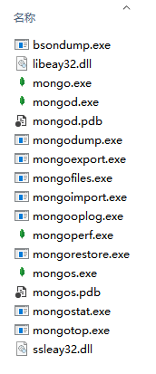

# mongoDB

## 简介

#### 作用
- 用来管理数据的软件
- 可自动对数据有组织的存放
- 提供相应的增删查改接口方便对数据进行操作
- 支持众多语言进行连接操作
- 提供一系列措施提高数据处理的性能

#### 特点
- 增删查该不支持sql语句
- 没有表结构
- 使用简单方便性能优越

#### 官网与资源
- [MongoDB官网](https://www.mongodb.com/)
- [菜鸟中文文档](https://www.runoob.com/mongodb/mongodb-tutorial.html)

## 安装

#### 注意事项
- 安装路径不要出现中文
- mongoDB最新版已不再支持32位windows操作系统
    + 这里有以前的32位安装包，但是官方已经不提供下载链接了
- mongoDB在低版本win7和win8存在不兼容问题可能存在各种问题
    + 要么升级win7安装所有的更新
    + 要么更换为win10

#### 安装检测
- 安装完毕后命令行运行mongo --version
- 如果打印出相应的版本号那么就成功了
- 如果没有打印相关的版本号那么做如下操作
    + 查看目录完整性，默认安装的路径**C:\Program Files\MongoDB\Server\3.4\bin**
    + 
    + 如果内容没有问题接下来把这个bin路径配置到环境变量中

#### 环境变量配置
- 在桌面或者资源管理器中右键**此电脑**，选择**属性**进入系统面板
- 点击**高级系统设置**弹出相应设置框
- 点击**环境变量**弹出相应设置框
    + 在系统变量中找到**Path**变量
    + 选择**Path**变量，然后点击**编辑**按钮弹出编辑框
    + 点击新建把mongo的bin路径赋值进入即可
- 配置完毕后打开新的命令行工具输入mongo --version进行检测

## 基本概念

#### 数据库
- MongoDB可以创建多个数据库
    + 一般每个数据库对应一个项目
    + 也就说一个MongoDB可以同时为多个项目提供服务
    + 运行show dbs命令可以查看所有的数据库列表

#### 集合
- 每个数据库中会有很多文件，每个文件称作集合或表（collection或table）
    + MongoDB是以JSON格式存储数据的，也就是说每个文件中存储的是多条JSON数据
    + 这些数据都是特殊编码的二进制数据存储，我们无法直接打开文件查看内容

#### 文档
- 一个文件中，存储的每一条JSON数据，称为文档（document）
- 注意：不要把文档认为是一个文件，它代表的仅仅是集合中的一条数据

#### 字段
- JSON数据中的每个属性，称为字段（field）

## 使用

#### 启动服务
- 创建数据目录
    + MongoDB会将数据存储在db目录中，但是这个目录需要我们手动创建
    + 在c盘根目录下创建一个data目录，再在data中创建db目录
    + db目录也可以创建在其他位置，但是**c:\data\db**是mogoDB操作的默认路径所以我们这里这样配置
- 启动服务
    + 安装的bin目录下有个**mongod.exe**CLI应用程序，执行它即可启动服务
    + 在命令行输入**mongod --dbpath c:\data\db**回车即可启动服务
    + 因为**c:\data\db**是默认路径，所以这里不加--dbpath参数也可以
    + 服务启动后与我们启动node_http服务一样，命令行工具会停在那里留个光标闪动
    + 使用Ctrl + C即可停止服务
    + 如果32位有异常，添加**--journal --storageEngine=mmapv1**
	    * mongod --dbpath="路径" --journal --storageEngine=mmapv1

#### 命令行连接（使用MongoDB客户端连接）

###### 说明
- 安装的bin目录下有个**mongo.exe**CLI应用程序，执行它即可连接服务
- 基本语法**mongo mongodb://ip:prot/database**
- 语法中后面的都是可选项，如果不输默认为**mongodb://127.0.0.1:27017/test**
- 使用Ctrl + C，或者执行exit命令可中断连接

###### 连接
- 命令行工具中执行mongo连接默认数据库
- 使用**show dbs**命令查看所有数据库
- 使用**use store**命令切换到**store**数据库
    + 如果当前没有这个数据库会自动创建后再切换
- 使用**db**命令可以查看当前所处数据库的名称
- 使用**show collections**命令可以查看当前数据库中的所有集合

###### 增
- 基本语法：数据库.集合.insert(JSON)
    + 注意：这里插入的数据不用严格遵守JSON格式也可以
- 使用**db.goods.insertOne({name: '豪车', time: 2015})**命令给goods集合文件插入一条数据
    + 如果当前没有这个集合文件会自动创建后再插入
- 使用**db.goods.insertMany([{name: '垃圾', time: 2015}, {name: '奔驰', time: 2012}, {name: '宝马', time: 2012}])**命令给goods集合文件插入多条数据
    + 如果当前没有这个集合文件会自动创建后再插入
- 使用**show collections**命令查看集合变化

###### 查
- 基本语法：数据库.集合.find(条件)
    + 注意：这里输入的键值必须使用引号包起来，否则查不到数据
    + 补充：如果是查找多条数据，可以db.goods.find().pretty()格式化输出
- 使用**db.goods.find()**命令列出goods集合中的所有数据
- 使用**db.goods.find({"time": "2012"})**命令找出time为2012的所有数据
- 使用**db.goods.findOne({"time": "2012"})**命令找出time为2012的第一条数据
- 使用**db.goods.find({"name": /豪/})**命令列出goods集合中name字段含有'豪'的数据

###### 删
- 基本语法：数据库.集合.remove(条件, 是否只删除一条)
- 使用**db.goods.remove({'time': '2015'})**命令删除goods集合中time为2015的所有数据
- 使用**db.goods.remove({'time': '2012'}, true)**命令删除goods集合中time为2012的第一条数据
- 使用**db.goods.remove()**命令删除全部数据

###### 改
- 基本语法：数据库.集合.update(条件, 新值, 没有匹配是否新增, 是否更新多条数据)
- 使用**db.goods.update({'time': '2015'}, {'name': '玛莎拉', 'time': '2017'})**命令替换goods集合中time为2015的第一条数据
- 使用**db.goods.update({'time': '2015'}, {$set: {'time': '2017'})**命令替换goods集合中time为2015的第一条数据的time字段

###### save
- 基本语法：数据库.集合.save(JSON)
    + 如果数据中含有_id字段，那么update这个_id的数据
    + 如果没有_id字段，那么insert该数据

#### node程序连接MongoDB

###### 安装驱动包
- mongoDB支持众多编程语言来操作
- 每种编程语言官方都提供了相应的驱动包
- 在node.js中操作mongo需要安装mongodb这个包
    + 使用cnpm install mongodb -S进行安装

###### 连接
```javascript
'use strict';
const mongodb = require('mongodb');
const MongoClient = mongodb.MongoClient;

// 连接itcast数据库
let dbUrl = 'mongodb://localhost:27017/store';
MongoClient.connect(dbUrl, (err, db) => {
	if(!err) {
		console.log('在这里进行数据的增删查改');
	}else {
		console.log('数据库连接失败');
	}
});
```

###### 增
```javascript
MongoClient.connect(dbUrl, (err, db) => {
	if(!err) {
		db.collection('goods').insertOne({
			name: '奖品', time: '2015'
		}, (err, result) => {
			if(!err) {
				console.log(result);
			}else {
				console.log('插入失败');
			}
			// 操作完毕后调用close方法结束数据库连接以释放内存资源
			db.close();
		});
	}
}
```

###### 删
```javascript
MongoClient.connect(dbUrl, (err, db) => {
	if(!err) {
		db.collection('goods').remove({
			'time': '2015'
		}, (err, result) => {
			if(!err) {
				console.log(result);
			}else {
				console.log('删除失败');
			}
			// 操作完毕后调用close方法结束数据库连接以释放内存资源
			db.close();
		});
	}
};
```

###### 查 
```javascript
MongoClient.connect(dbUrl, (err, db) => {
	if(!err) {
		db.collection('goods').find()
		.toArray(function(err, result) {
			if(!err) {
				console.log(result);
			}else {
				console.log('搜索失败');
				console.log(result);
			}
			// 操作完毕后最好调用close方法结束数据库连接以释放内存资源
			db.close();
		});
	}
};
```

###### 改
```javascript
MongoClient.connect(dbUrl, (err, db) => {
	if(!err) {
		db.collection('students').update({
			gender: '女'
		},{
			$set: { age: 18 }
		}, (err, result) => {
			if(err) {
				console.log('修改失败');
			}else {
				console.log('修改成功');
			}
			// 操作完毕后最好调用close方法结束数据库连接以释放内存资源
			db.close();
		});
	}
};
```

## 常用方法

#### 数据库实例
- 删除数据库自己
    + db.dropDatabase()
- 获取指定集合实例
    + db.collection(集合名称)

#### 集合实例
- 删除集合自己
    + collection.drop()
- 插入数据
    + collection.insert(内容)
    + collection.insertOne(一条内容)
    + collection.insertMany(多条内容)
- 删除数据
    + collection.remove(条件, 是否只删除一条)
- 查找数据
    + collection.find(条件, isOne)
- 修改数据
    + collection.update(条件, 新值, 没有匹配是否新增, 是否更新多条数据)

## 条件查询

#### 含义
- (>) 大于 - $gt (greater then)
- (<) 小于 - $lt (less then)
- (>=) 大于等于 - $gte (greater then or equal)
- (<= ) 小于等于 - $lte (less then or equal)
- (!=) 不等于 - $ne (not equal)

#### 范例
- 查询价格大于100的商品
    + db.store.find({price: {$gt: 100}})
- 查询价格小于100的商品
    + db.store.find({price: {$lt: 100}})
- 查询价格大于等于100的商品
    + db.store.find({price: {$gte: 100}})
- 查询价格小于等于100的商品
    + db.store.find({price: {$lte: 100}})
- 查询价格等于100的商品
    + db.store.find({price: 100})
- 查询价格不等于100的商品
    + db.store.find({price: {$ne: 100}})
    
## 查询结果处理

#### 指定起始位置与数量
- 获取下标2之后的数据
    + db.store.find().skip(2)
- 获取前2条数据
	+ db.store.find().limit(2)
- 获取下标2之后的2条数据
    + db.store.find().skip(2).limit(2)

#### 排序
- 以price字段做升序排序
    + db.store.find().sort({price: 1})
- 以price字段做降序排序
    + db.store.find().sort({price: -1})
- 注：这里必须是正1与负1

#### 结果数量
- 获取价格大于100的商品数量
    + db.store.find({price: { $gt: 100 }}).count()
