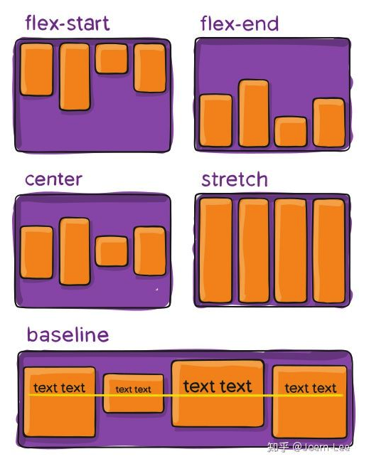

# Flex

> Flex 是 **Flexible Box** 的缩写，意为 **弹性布局**，用来为盒状模型提供最大的 **灵活性**。</br>
> Flex 布局主要思想是让容器有能力让 **子元素** 在可利用的空间中 **动态** 地扩张或收缩，改变其宽度、高度，甚至顺序，以最佳方式填充容器可用空间。</br>
> 几乎可以适配所有的显示设备和屏幕尺寸。

## 宽度自适应

看下面的案例，一个父元素包含了三个子元素，且他们的宽度一致，并且要求子元素的宽度跟随父元素动态拉长或缩短。


一般而言我们会给子元素使用 flex:1 来让它扩张以 **撑满** 所有剩余的空间；</br>
如果有多个并列的子元素都使用了 flex:1，则这些子元素会 **平分** 父容器中剩余的空间;</br>
如果这些并列的子元素的 flex 值不一样，则谁的值更大，谁占据剩余空间的 **比例** 就更大。</br>

```html
<style type="text/css">
  .container {
    display: flex;
    height: 500px;
  }
  .container .item {
    flex: 1;
    border: 1px solid blue;
  }
</style>

<div class="container">
  <div class="item">1</div>
  <div class="item">2</div>
  <div class="item">3</div>
</div>
```


小试牛刀：如果让中间元素的宽度是其他兄弟元素的`两倍`时，如何修改代码？

## 排版方向

默认情况下，元素`从左向右`依次排列，与现代文字的书写方向一致。</br>
但是如果你想换成`从右向左`，`从上到下`，`从下到上`，通过给父元素设置 **flex-direction** 就可以实现！</br>


```html
<!--
  flex-direction: row | row-reverse | column | column-reverse
-->
<style type="text/css">
  .container {
    display: flex;
    flex-direction: row-reverse;
    height: 500px;
  }
  .container .item {
    flex: 1;
    border: 1px solid blue;
  }
</style>

<div class="container">
  <div class="item">1</div>
  <div class="item">2</div>
  <div class="item">3</div>
</div>
```

## 对齐方式

对齐方式就是元素相对于父元素的位置，默认情况下：</br>
`从左向右`排版时，元素在横轴的最`左边`；</br>
`从右向左`排版时，元素在横轴的最`右边`；</br>
`从上向下`排版时，元素在纵轴的最`上边`；</br>
`从下向上`排版时，元素在纵轴的最`下边`；</br>
那如果想要`改变`这些排版的`默认对齐`方式时，可以吗？</br>
答案是肯定的，比如下面的案例，我想要元素在`中间`位置！</br>
通过给父元素设置 **justify-content** 就可以实现！</br>


```html
<style type="text/css">
  .container {
    display: flex;
    flex-direction: row-reverse;
    justify-content: center;
    height: 500px;
  }
  
  .container .item {
    width: 50px;
    border: 1px solid blue;
  }
</style>

<div class="container">
  <div class="item">1</div>
  <div class="item">2</div>
  <div class="item">3</div>
</div>
```


- flex-start(default): 左对齐|上对齐(依据flex-direction)
- flex-end：右对齐|下对齐(依据flex-direction)
- center：居中
- space-between：等间距排列，首末子元素与父元素相距0
- space-around：等间距排列，首末子元素与父元素相距1/2个间距
- space-evenly：等间距排列，首末子元素与父元素相距1个间距

## 主轴与交叉轴

其实刚才的对齐方式都是针对水平方向的，因为排版是水平方向；
如果排版方向改为垂直，是不是会发生什么呢？

主轴含义：flex-direction属性的方向
交叉轴含义：flex-direction属性的反方向

## 交叉轴对齐方式



- stretch（default）：拉伸item来充满容器，但遵守min-width和max-width属性
- flex-start: 左对齐|上对齐(依据flex-direction)
- flex-end：右对齐|下对齐(依据flex-direction)
- center：居中
- baseline：与他们的基线对齐

## 进阶思考

让全部元素水平垂直居中，怎么做？

```css
/* 主轴与交叉轴都居中即可 */
justify-content: center;
align-items: center;
```

## 换行处理

默认情况下，Flex容器里的子盒子只会`占一行`；</br>
就算给子元素设置了宽度，并且当所有子元素的总宽度超过父容器时，子元素会`自动收缩`；</br>
如果你不想这样，可以通过 **flex-wrap** 属性解决。</br>

```html
<style>
  .container {
    display: flex;
    flex-wrap: wrap;
  }
  .container div {
    width: 200px;
    height: 100px;
    border: 1px solid blue;
  }
</style>
<article>
  <div class="container">
    <div>1</div>
    <div>2</div>
    <div>3</div>
    <div>4</div>
    <div>5</div>
    <div>6</div>
  </div>
</article>
```
