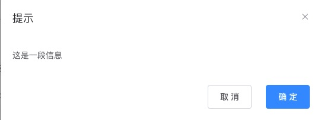

# Slot

> Vue 实现了一套内容分发的 API，这套 API 的设计灵感源自 Web Components 规范草案，将 `<slot>` 元素作为承载分发内容的出口。

上面是 Vue 官方的解释，Slot 译为 **插槽**，如果把组件化开发认为是搭积木，那么插槽就是某块积木上的一个槽位，两个不同组件通过槽位组合在一起。

这样做的好处有很多，但是最重要的在于它拥抱变化。

比如在实际开发中，有些东西相对是固定的，有些是灵活多变的，这时候我们就可以把多变的部分设计成一个插槽，然后根据不同时期的需要插入不同的组件。

## 经典案例 - 弹窗

最经典的案例，莫过于弹窗组件，假设我设计实现了一个精美的弹窗组件，如下图，而弹窗里面的东西通常是多变的，那么我就会提供一个插槽，让弹窗使用者自己根据需要插入他想要的内容。



## 从使用者的角度理解Slot

```html
<body>
  <div id="app">
    <el-dialog
      title="插槽弹窗"
      :visible="true"
      width="30%"
      type="success">
      <!-- 默认槽位，可以不写v-slot:default -->
      <template v-slot:default>
        <ul>
          <li>插入组件</li>
          <li>随意内容</li>
          <li>任意内容</li>
          <li>任意内容</li>
        </ul>
      </template>
    </el-dialog>
  </div>

  <script>
    document.addEventListener("DOMContentLoaded", () => {
      const vm = new Vue({
        el: '#app',
      });
    })
  </script>
</body>
```

`一个组件可以有多个插槽`

比如 **el-dialog** 弹窗，除了中间内容的 default 插槽，还在弹窗底部提供了 **footer** 插槽

```html
<body>
  <div id="app">
    <el-dialog
      title="插槽弹窗"
      :visible="true"
      width="30%"
      type="success">

      <!-- 默认槽位 -->
      <template v-slot:default>
        <ul>
          <li>插入组件</li>
          <li>随意内容</li>
          <li>任意内容</li>
          <li>任意内容</li>
        </ul>
      </template>

      <!-- 具名槽位 -->
      <template v-slot:footer>
        <el-button >取 消</el-button>
        <el-button type="primary" >确 定</el-button>
      </template>
    </el-dialog>
  </div>

  <script>
    document.addEventListener("DOMContentLoaded", () => {
      const vm = new Vue({
        el: '#app',
      });
    })
  </script>
</body>
```

`插槽后背内容`

后背内容指的是**插槽的默认值**，仍然拿el-dialog组件举例，这个组件除了 **default** 和 **footer** 插槽，实际上还有一个 **title** 插槽。

之前我们并没有为 title 插槽指定过组件，所以它就按照默认的后背内容进行展示，通过浏览器调试工具可以看到默认是一个 span 标签，接下来我们为 title 槽位传个自定义组件试试。

```html
<body>
  <div id="app">
    <el-dialog
      title="插槽弹窗"
      :visible="true"
      width="30%"
      type="success">

      <!-- 具名槽位 -->
      <template v-slot:title>
        <el-steps :active="1" finish-status="success">
          <el-step title="已完成"></el-step>
          <el-step title="进行中"></el-step>
          <el-step title="步骤 3"></el-step>
        </el-steps>
      </template>

      <!-- 默认槽位 -->
      <template v-slot:default>
        <ul>
          <li>插入组件</li>
          <li>随意内容</li>
          <li>任意内容</li>
          <li>任意内容</li>
        </ul>
      </template>

      <!-- 具名槽位 -->
      <template v-slot:footer>
        <el-button >取 消</el-button>
        <el-button type="primary" >确 定</el-button>
      </template>
    </el-dialog>
  </div>

  <script>
    document.addEventListener("DOMContentLoaded", () => {
      const vm = new Vue({
        el: '#app',
      });
    })
  </script>
</body>
```

## 从封装组件的角度理解Slot

假设我们设计一个Button组件，按钮内容可由用户指定，比如文字、图标等，

也就是Button按钮要给用户开放一个插槽用于内容自定义，具体到代码就是一对slot标签，然后通过name属性设置插槽名字。

```html
<body>
  <div id="app">
    <my-button>
      <template v-slot:content>
        <span>1</span>
        <span>2</span>
      </template>
    </my-button>
  </div>

  <script>
    window.onload = function() {
      // 封装一个按钮组件，用slot标签定义一个插槽
      Vue.component("my-button", {
        template: `
          <button type="button" style="padding: 12px 23px; background-color: #67c23a; border: 1px solid #67c23a; border-radius: 20px; color: #fff; outline: none;">
            <slot name="content"></slot>
          </button>
        `
      });

      const vm = new Vue({
        el: '#app',
      });
    };
  </script>
</body>
```

组件封装者如果不设定`slot名称`，那么默认是**default**，

使用方如果不指定`slot名称`，默认也是**default**

```html
<body>
  <!-- 组件使用方 -->
  <div id="app">
    <div>
      <!-- 指定slot名称 -->
      <my-button>
        <template v-slot:default>按钮1</template>
      </my-button>
  
      <!-- 不传slot名称，默认default -->
      <my-button>
        <template>按钮2</template>
      </my-button>

      <!-- 不传slot，走内部缺省处理 -->
      <my-button></my-button>
    </div>
  </div>

  <script>
    window.onload = function() {

      // 组件封装方
      // slot标签省略name，默认就是default
      Vue.component("my-button", {
        template: `
          <button type="button" style="padding: 12px 23px; background-color: #67c23a; border: 1px solid #67c23a; border-radius: 20px; color: #fff; outline: none;">
            <slot>点击</slot>
          </button>
        `
      });

      const vm = new Vue({
        el: '#app',
      });
    };
  </script>
</body>
```

## render函数 与 jsx

普通render函数

```html
<body>
  <div id="app"></div>

  <script>
    window.onload = function() {
      // slot标签省略name，默认就是default
      Vue.component("my-button", {
        template: `
          <button type="button" style="padding: 12px 23px; background-color: #67c23a; border: 1px solid #67c23a; border-radius: 20px; color: #fff; outline: none;">
            <slot><i class="el-icon-delete"></i></slot>
          </button>
        `
      });

      // render函数语法
      const vm = new Vue({
        el: '#app',
        render(createElement) {
          return createElement('div', { style: "color: red" }, [
            createElement(
              "my-button",
              {
                scopedSlots: {
                  default() {
                    return "按钮1";
                  }
                }
              },
            ),
            createElement(
              "my-button",
              {
                scopedSlots: {
                  default() {
                    return "按钮2";
                  }
                }
              },
            ),
          ])
        }
      });
    };
  </script>
</body>
```

使用jsx的render函数

```html
<body>
  <div id="app"></div>

  <script>
    window.onload = function() {
      // slot标签省略name，默认就是default
      Vue.component("my-button", {
        template: `
          <button type="button" style="padding: 12px 23px; background-color: #67c23a; border: 1px solid #67c23a; border-radius: 20px; color: #fff; outline: none;">
            <slot name="header"></slot>
            <slot><i class="el-icon-delete"></i></slot>
            <slot name="footer"></slot>
          </button>
        `
      });

      // render jsx syntax
      const vm = new Vue({
        el: '#app',
        render(createElement) {
          return (
            <div style="color: red">
              <my-button scopedSlots={{
                header() {
                  return <p style="color: blue">头部</p>
                },
                default() {
                  return <span style="color: green">中间默认</span>
                },
                footer() {
                  return <p style="color: yellow">底部</p>
                }
              }}
              ></my-button>
              <my-button scopedSlots={{ default: () => "按钮"}}></my-button>
            </div>
          );
        }
      });
    };
  </script>
</body>
```

## 父向子(slot)传参

模板方式

```html
<body>
  <!-- 组件使用方 -->
  <div id="app">
    <div>
      <!-- 指定slot名称 -->
      <my-button>
        <template v-slot:default="{ obj }">
          {{ obj }}
        </template>
      </my-button>
  
      <!-- 不传slot名称，默认default -->
      <my-button>
        <template v-slot="{ a }">
          {{ a == "a" ? "b" : a }}
        </template>
      </my-button>

      <!-- 不传slot，走内部缺省处理 -->
      <my-button></my-button>
    </div>
  </div>

  <script>
    window.onload = function() {

      // 组件封装方
      // slot标签省略name，默认就是default
      Vue.component("my-button", {
        template: `
          <button type="button" style="padding: 12px 23px; background-color: #67c23a; border: 1px solid #67c23a; border-radius: 20px; color: #fff; outline: none;">
            <slot a="a" :obj="{a: 1, b: 2}">
              用按钮不传文字，牛逼！
            </slot>
          </button>
        `
      });

      const vm = new Vue({
        el: '#app',
      });
    };
  </script>
</body>
```

render函数方式

```html
<body>
  <div id="app"></div>

  <script>
    window.onload = function() {

      // 封装一个按钮组件
      Vue.component("my-button", {
        template: `
          <button type="button" style="padding: 12px 23px; background-color: #67c23a; border: 1px solid #67c23a; border-radius: 20px; color: #fff; outline: none;">
            <slot name="header" str="字符串参数"></slot>
            <slot :obj="{a: '对象', b: '参数'}">
              用按钮不传文字，牛逼！  
            </slot>
            <slot name="footer" s="1" :n="100" :b="true"></slot>
          </button>
        `
      });

      // render jsx syntax
      const vm = new Vue({
        el: '#app',
        render(createElement) {
          return (
            <div style="color: red">
              <my-button scopedSlots={{
                header({ str }) {
                  return <p style="color: blue">头部: {{ str }}</p>
                },
                default({ obj }) {
                  return <span style="color: green">中间默认: {{ obj }}</span>
                },
                footer(scope) {
                  return (
                    <p style="color: yellow">
                      底部:
                      <span>{{ scope.s }}</span>
                      <span>{{ scope.n }}</span>
                      <span>{{ scope.b }}</span>
                    </p>
                  )
                }
              }}
              ></my-button>
            </div>
          );
        }
      });
    };
  </script>
</body>
```
