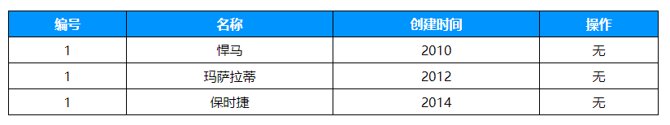

# Node

## 什么是Node.js

#### 简介
js是一门脚本语言，且需要一个解析器才能运行。
最初浏览器充当了js解析器的角色，每款浏览器都集成了js解析器，让我们可以在浏览器中运行js程序。
但实际上，js解析器可以脱离浏览器存在与其他平台当中。
Node.js便是这样一个类似与浏览器的程序运行平台，但两个平台上的程序在功能与定位上截然不同。

#### 浏览器平台中的js
在浏览器中js的用途是操作DOM，构建用户界面，所以浏览器提供了DOM相关的内置对象。
同时提供了BOM相关的内置对象辅助用户界面功能的开发。

#### Node.js平台中的js
在Node.js中js的用途是操作磁盘文件或搭建网络服务器，所以Node.js提供了file、network相关的内置对象。
同时还提供了很多其他内置对象辅助开发。

#### 作用
- 开发网站服务器
- 编写命令行工具
    + 软件分两种：
    + GUI：通过友好的UI界面来操作
    + CLI：通过命令窗口，键入各种命令来操作

#### 特点
- 事件驱动
- 非阻塞I/O
- 高效轻量
- 开源跨平台

#### 官网与资源
- [Node官网](https://nodejs.org/en/)
- [国内开发者社区](https://cnodejs.org/)

#### 安装
- [下载地址](https://nodejs.org/en/download/)
- Windows选择和系统版本匹配的msi文件下载安装
- MacOS系统选择pkg文件下载安装

## node两种执行方式

#### 命令行方式REPL
- 按下win键 + R打开运行窗口
- 键入cmd，回车后打开命令行工具
- 键入node命令，回车后进入node交互模式
- 输入console.log('Hello World!')回车即可执行

#### 执行文件方式
- 使用编辑器编写一段js脚本，并保存，假设文件名为a.js
- 切记不要出现浏览器内置的DOM与BOM内置对象API，因为node中没有
- 接下来在终端下键入node a.js即可执行文件中的脚本

## 入门

#### web服务
```javascript
'use strict';
const http = require('http');
let server = http.createServer((req, resp) => {
	resp.write('Hello Word!');
	resp.end();
});
server.listen(8888, () => console.log('node is running'));
```

#### 商品列表案例


###### 演化过程
- 纯静态商品列表
- 模拟接口动态渲染商品列表
- 使用第三方接口动态渲染商品列表
- 使用自己实现的接口动态渲染商品列表

###### node实现商品列表接口
```javascript
'use strict';
const http = require('http');
let responeseData = [{id: 1, name: '法拉利', time: '2013'}, {id: 2, name: '玛莎拉蒂', time: '2015'}];
let server = http.createServer((req, resp) => {
	resp.writeHead(200, {
		"Content-Type": "application/json;charset=utf-8",
		"Access-Control-Allow-Origin": "*",
		"Access-Control-Allow-Methods": "*"
	});
	resp.write(JSON.stringify(responeseData));
	resp.end();
});
server.listen(8888, () => console.log('node is running'));
```

## 完整的商品管理案例
- 一个完整的商品管理需要多个接口
- 所以我们需要获取请求的url，并设定每个url的请求方法、处理规则及返回内容

#### 实现接口 - 获取歌曲列表
- 需要区分客户端请求的url
- 需要区分客户端请求的method
- 实现接口功能
- 设接口url为'/api/goods/list',method为'GET'

###### 区分请求的方法与url
```javascript
'use strict';
const http = require('http');
let server = http.createServer((req, resp) => {
	resp.writeHead(200, {
		"Content-Type": "application/json;charset=utf-8",
		"Access-Control-Allow-Origin": "*",
		"Access-Control-Allow-Methods": "*"
	});
	resp.write('您请求的方法为：' + req.method); // 注意方法名为大写字母
	resp.write('\n');
	resp.write('您请求的url为：' + req.url);
	resp.end();
});
server.listen(8888, () => console.log('node is running'));
```

###### 商品列表接口实现
```javascript
'use strict';
const http = require('http');
let responeseData = [{id: 1, name: '法拉利', time: '2013'}, {id: 2, name: '玛莎拉蒂', time: '2015'}];
let server = http.createServer((req, resp) => {
	resp.writeHead(200, {
		"Content-Type": "application/json;charset=utf-8",
		"Access-Control-Allow-Origin": "*",
		"Access-Control-Allow-Methods": "*"
	});
	if(req.method === 'GET' && req.url === '/api/goods/list') {
		resp.write(JSON.stringify(responeseData));
	}
	resp.end();
});
server.listen(8888, () => console.log('node is running'));
```

#### 删除商品
- 设接口url为'/api/goods/delete?id=要删除的商品id',method为'GET'
- 删除商品的url是变化的，所以处理方式有一些调整
   1. 我们需要根据url来区分不同的接口，因为这个接口是活的，所以我们需要通过固定的pathname来判断区分
   2. 我们需要根据客户端传过来的id删除对应数据，所以我们要解析查询字符串中的值
   3. 这里我们可以使用node内置的url模块可以实现url的解析与数据提取

###### 解析url
```javascript
'use strict';
const http = require('http');
const url = require('url'); 
let server = http.createServer((req, resp) => {
	resp.writeHead(200, {
		"Content-Type": "application/json;charset=utf-8",
		"Access-Control-Allow-Origin": "*",
		"Access-Control-Allow-Methods": "*"
	});
	let urlObj = url.parse(req.url, true);
	let queryObj = urlObj.query;
	resp.write('url解析为：' + JSON.stringify(urlObj));
	resp.write('\n');
	resp.write('search解析为：' +  JSON.stringify(queryObj));
	resp.end();
});
server.listen(8888, () => console.log('node is running'));
```

###### 删除商品接口实现
```javascript
'use strict';
const http = require('http');
const url = require('url'); 
let responeseData = [{id: 1, name: '法拉利', time: '2013'}, {id: 2, name: '玛莎拉蒂', time: '2015'}];
let server = http.createServer((req, resp) => {
	
	// 统一的接口响应头与基本数据格式
	resp.writeHead(200, {
		"Content-Type": "application/json;charset=utf-8",
		"Access-Control-Allow-Origin": "*",
		"Access-Control-Allow-Methods": "*"
	});
	
	// 解析url与search
	let urlObj = url.parse(req.url, true);
	let queryObj = urlObj.query;
	
	// 根据method与url做不同处理与返回
	if(req.method === 'GET') {
		
		// 获取歌曲列表
		if(req.url === '/api/goods/list') {
			resp.write(JSON.stringify(responeseData));
		}
		// 删除歌曲
		else if(urlObj.pathname === '/api/goods/delete') {
			// 过滤掉删除的商品，留下的商品列表数据覆盖原数据实现删除
			responeseData = responeseData.filter((song) => {
				if(song.id != queryObj.id) {
					return true;
				}
			});
			resp.write(JSON.stringify(responeseData));
		}
		resp.end();
		
	}else if((req.method === 'POST')) {
		
	}
});
server.listen(8888, () => console.log('node is running'));
```

#### 搜索商品
- 设接口url为'/api/goods/search?name=搜索条件',method为'GET'
- 实现上与删除商品差不多

#### 添加商品
- 设接口url为'/api/goods/add',method为'POST'
- 添加商品的method为post，客户端提交的数据不在url中，所以需要其他方式获取
    1. 因为post请求可以发送大量数据，所以node是分块接收数据的
    2. request对象可以监听data事件来获取客户端发来的每一块数据
    3. request对象可以监听end事件来获知数据接收完毕
    4. 把所有的数据块加在一起就得到了来自客户端的完整数据，数据是类似与'name=张三&age=18'这样的字符串
    5. 使用node内置的querystring模块可以把这种数据转为对象的形式方便使用

###### 接收post数据
```javascript
'use strict';
const http = require('http');
const url = require('url'); 
const querystring = require('querystring');
let server = http.createServer((req, resp) => {
	resp.writeHead(200, {
		"Content-Type": "application/json;charset=utf-8",
		"Access-Control-Allow-Origin": "*",
		"Access-Control-Allow-Methods": "*"
	});
	let data = '';
	req.on('data', (chunk) => {
		data += chunk;	
	});
	req.on('end', () => {
		resp.write('服务端接收到的原数据为：' + data);
		resp.write('\n');
		resp.write('解析后的数据为：' + JSON.stringify(querystring.parse(data)));
		resp.end();
	});
});
server.listen(8888, () => console.log('node is running'));
```

###### 添加商品接口实现
```javascript
'use strict';
const http = require('http');
const url = require('url'); 
const querystring = require('querystring');
let responeseData = [{id: 1, name: '法拉利', time: '2013'}, {id: 2, name: '玛莎拉蒂', time: '2015'}];
let currentId = 2;
let server = http.createServer((req, resp) => {
	
	// 统一的接口响应头与基本数据格式
	resp.writeHead(200, {
		"Content-Type": "application/json;charset=utf-8",
		"Access-Control-Allow-Origin": "*",
		"Access-Control-Allow-Methods": "*"
	});
	
	// 解析url与search
	let urlObj = url.parse(req.url, true);
	let queryObj = urlObj.query;
	
	// 根据请求方式与url做不同处理与返回
	if(req.method === 'GET') {
		
		// 获取歌曲列表
		if(req.url === '/api/goods/list') {
			resp.write(JSON.stringify(responeseData));
		}
		// 删除歌曲
		else if(urlObj.pathname === '/api/goods/delete') {
			responeseData = responeseData.filter((song) => {
				if(song.id != queryObj.id) {
					return true;
				}
			});
			resp.write(JSON.stringify(responeseData));
		}
		resp.end();
		
	}else if(req.method === 'POST') {
		
		// 添加歌曲
		if(urlObj.pathname === '/api/goods/add') {
			let data = '';
			req.on('data', (chunk) => {
				data += chunk;
			});
			req.on('end', () => {
				data = querystring.parse(data);
				responeseData.push({
					id: ++currentId,
					name: data.name,
					time: Date.now()
				});
				resp.write(JSON.stringify(responeseData));
				resp.end();
			});
		}
		
	}
	
});
server.listen(8888, () => console.log('node is running'));
```

## 文件操作

#### 写入文件
```javascript
'use strict';
const fs = require('fs');
fs.writeFile('a.txt', 'hello word', (err) => {
	if(!err) {
		console.log('文件写入成功');
	}else {
		console.log(err.message);
	}
});
```

#### 读取文件
```javascript
'use strict';
const fs = require('fs');
fs.readFile('a.txt', (err, data) => {
	if(!err) {
		console.log(data); // 得到的是2进制数据，因为太长显示时以16进制显示
		console.log(data.toString('utf8')); // 转换为对应的utf8编码字符串
	}else {
		console.log(err.message);
	}
});
```

#### 文件读写时的路径规则

###### 相对路径 - ./或../开头
- 是相对于node环境的运行时路径，并不是相对于文件所在路径
- 比如在C:/workspace目录下执行node js/a.js命令，a.js中读取'./test.txt'文件
- 最终读取的文件路径为C:/workspace/test.txt，并不是C:/workspace/js/test.txt

###### 绝对路径 - /开头
- 相对于执行文件所在磁盘的根路径
- 比如在C:/workspace目录下执行node js/a.js命令，a.js中读取'/test.txt'文件
- 最终读取的文件路径为C:/test.txt

## 文件服务器

#### 由来
- 我们已经可以使用node实现各种web接口供任何人调用。
- 但是如果将来有一天我们要把某个项目搬到互联网上，还需要把前端的静态资源，比如html、css、js等文件放置到服务器上。
- 否则用户只能通过浏览器访问接口获取数据，却没有对应的页面去呈现它。
- 所以我们不光要用node实现数据的获取，还要实现静态文件的获取。
- 也就是说我们要用node实现一个文件服务器，其作用类似与之前我们接触的apache服务器，配置好后可用url打开页面。

#### 文件服务器基本实现
```javascript
'use strict';
const http = require('http');
const url = require('url');
const fs = require('fs');

// 创建http服务
http.createServer((req, resp) => {

	// url解析，计算文件路径
	let urlObj = url.parse(req.url);
	let filePath = __dirname + urlObj.pathname;

	// 根据请求读取文件内容并返回
	fs.readFile(filePath, (err, data) => {

		// 文件读取成功返回200，失败返回500
		if(!err) {
			resp.writeHead(200, {
				'Content-Type': 'text/html; charset=utf-8'
			});
			resp.write(data);
			resp.end();
		}else {
			resp.writeHead(500);
			resp.end();
		}
	});
}).listen(8888, () => console.log('node is running'));
```

#### 问题一
- 上面的代码对客户端请求的路径没有做任何限制
- 也就是说客户端可以到服务器上的任何文件
- 比如尝试使用浏览器访问localhost:8888/server.js
- 会发现连后端的代码都暴露了出去，所以我们要在处理请求时加上相应的限制

#### 实现请求限制的关键代码
```javascript
// 假设只允许客户端访问public目录下文件
if(req.url.startsWith('/public')) {

	// 文件读取成功返回200，失败返回500
	fs.readFile(filePath, (err, data) => {
		if(!err) {
			resp.writeHead(200, {
				'Content-Type': 'text/html; charset=utf-8'
			});
			resp.write(data);
			resp.end();
		}else {
			resp.writeHead(500);
			resp.end();
		}
	});
}
// 其他请求一律返回404
else {
	resp.writeHead(404);
	resp.end();
}
```

#### 问题二
- 上面的代码已经实现了文件服务器的功能，但是还存在一些问题
- 即客户端无论访问什么文件，我们的响应头中都告知浏览器是html文件
- 这样浏览器虽接收到了文件，但可能无法给予正确处理
- 比如：开打一个html页面，页面中通过link标签引入css文件，会发现文件虽然加载但未执行

#### 处理不同类型文件的响应信息
```javascript
'use strict';
const http = require('http');
const url = require('url');
const fs = require('fs');

// 创建一个http服务
http.createServer((req, resp) => {

	// url解析，计算文件路径
	let urlObj = url.parse(req.url);
	let filePath = __dirname + urlObj.pathname;

	// 只允许客户端访问public目录下文件
	if(req.url.startsWith('/public')) {

		// 计算文件类型
		let fileType = '';
		if(filePath.endsWith('.html')) {
			fileType = 'text/html';
		}else if(filePath.endsWith('.css')) {
			fileType = 'text/css';
		}else if(filePath.endsWith('.js')) {
			fileType = 'application/javascript';
		}

		// 文件读取成功返回200，失败返回500
		fs.readFile(filePath, (err, data) => {
			if(!err) {
				resp.writeHead(200, {
					'Content-Type': fileType + '; charset=utf-8'
				});
				resp.write(data);
				resp.end();
			}else {
				resp.writeHead(500);
				resp.end();
			}
		});
	}
	// 其他请求一律返回404
	else {
		resp.writeHead(404);
		resp.end();
	}
}).listen(8888, () => console.log('node is running'));
```

#### 问题三
- 文件类型有很多种，一一处理比较繁琐
- 如果遇到类似问题一般可以搜到相关的处理包
- 所以为了支持更多的文件类型，使用mime第三方包来解决问题
- 项目中运行npm install mime -S安装后方可使用

#### 使用第三方包处理不同类型文件的响应信息
```javascript
'use strict';
const http = require('http');
const url = require('url');
const fs = require('fs');
const mime = require('mime');

// 创建一个http服务
http.createServer((req, resp) => {

	// url解析，计算文件路径
	let urlObj = url.parse(req.url);
	let filePath = __dirname + urlObj.pathname;
	
	// 只允许客户端访问public目录下文件
	if(req.url.startsWith('/public')) {
		
		// 计算文件类型
		let fileType = mime.lookup(filePath);  
		
		// 文件读取成功返回200，失败返回500
		fs.readFile(filePath, (err, data) => {
			if(!err) {
				resp.writeHead(200, {
					'Content-Type': fileType + '; charset=utf-8'
				});
				resp.write(data);
				resp.end();
			}else {
				resp.writeHead(500);
				resp.end();
			}
		});
	}
	// 其他请求一律返回404
	else {
		resp.writeHead(404);
		resp.end();
	}
}).listen(8888, () => console.log('node is running'));
```

## 商品管理前后端项目整合
前面的商品案例接口与文件服务器是分别单独实现的，现在把它们的代码合并起来

#### 项目内容
- 商品管理前端页面
- 商品管理接口
- 文件服务器

#### 目录结构
- frontend 存放前端代码，比如html/css/js/less/sass...
- public 存放媒体文件，比如img/audio/video/font
- app.js 后端服务启动入口脚本
- node_modules 存放npm管理的第三方依赖包
- package.json 项目描述文件

#### 约定
- 访问接口，以**/api**开头的请求路径
- 加载文件，以**/frontend**或**/public**或**/node_modules**开头的请求路径
    + frontend 前端代码需要对客户端暴露才能访问
    + public 前端可能会引用这里的媒体文件，所以暴露
    + node_modules 前端可能会引用这里的第三方框架，所以暴露
    + 其他目录禁止对客户端暴露，预防安全隐患

#### 实现
```javascript
'use strict';
// 这是内置模块
const http = require('http');
const fs = require('fs');
const url = require('url');

// 这是第三方模块
const mime = require('mime');

// 商品列表数据
let goodsList = [];
let goodsMaxId = 0;

// 创建http服务，然后里面判断请求路径为/api打头作为接口，/frontend或/public或/nodu_modules大头作为文件访问
http.createServer((req, resp) => {

    // 请求接口
    // 1、根据不同url与method来区分请求的是那个接口
    // 2、然后每个接口做对应的事情，做完之后返回最新的商品列表数据给前端渲染
    if(req.url.startsWith('/api')) {

        resp.writeHead(200, {
            'Content-Type': 'application/json; charset=utf-8',
            "Access-Control-Allow-Origin": "*",  // 任何域名都可以请求这个接口
            "Access-Control-Allow-Methods": "*"   // 任何方法都可以请求这个接口
        });

        // 获取商品列表
        if(req.url.startsWith('/api/goods/list') && req.method === 'GET') {
            resp.write(JSON.stringify(goodsList));
            resp.end();
        }
        // 添加商品
        else if(req.url.startsWith('/api/goods/add') && req.method === 'POST') {

            let data = "";
            req.on('data', chunk => {
                data += chunk;
            });
            req.on('end', () => {
                // 前端传过来的数据是name=%E6%B0%B4%E7%94%B5%E8%B4%B9这样的
                // 我们需要手动切割提取=号后面的数据并解码，
                // 然后拼成一个新的商品数据添加到列表中，
                // 最后把新的数据返回前端使用
                goodsList.push({
                    id: ++goodsMaxId,
                    name: decodeURIComponent(data.split('=')[1]),
                    time: new Date().toLocaleDateString()
                });
                resp.write(JSON.stringify(goodsList));
                resp.end();
            });
            
        }
        // 删除商品，需要接收来自客户端传入的id
        else if(req.url.startsWith('/api/goods/delete') && req.method === 'GET') {

            let urlObj = url.parse(req.url, true);
            goodsList = goodsList.filter(goods => goods.id != urlObj.query.id);
            resp.write(JSON.stringify(goodsList));
            resp.end();

        }
        // 搜索商品，需要接收来自客户端传入的name
        else if(req.url.startsWith('/api/goods/search') && req.method === 'GET') {

            // 如果有搜索内容返回搜索结果，否则返回全部数据
            let urlObj = url.parse(req.url, true);
            if(urlObj.query.name) {
                resp.write(JSON.stringify(goodsList.filter(goods => goods.name == urlObj.query.name)));
                resp.end();
            }else {
                resp.write(JSON.stringify(goodsList));
                resp.end();
            }
        }
    }
    // 请求文件,实现类似与apache服务器的功能
    // 1、先获取pathname，这个pathname是/开头的，我们需要在前面加上'.'，把他转为相对路径来读取文件
    // 2、利用mime.lookup方法来获取文件类型
    // 3、利用fs.readFile方法读取对应文件，返回前端；如果发生错误，返回500
    else if(/^\/(frontend|public|node_modules)/.test(req.url)) {

        let filePath = '.' + url.parse(req.url).pathname;
        let fileType = mime.lookup(filePath);
        resp.writeHead(200, {
            'Content-Type': `${ fileType }; charset=utf-8`
        });

        fs.readFile(filePath, (err, data) => {
            if(!err) {
                resp.write(data);
                resp.end();
            }else {
                resp.writeHead(500);
                resp.end();
            }
        });
    }
    // 其他请求
    // 目前不做处理，统一返回404
    else {
        resp.writeHead(404);
        resp.end();
    }
}).listen(8888, () => console.log('项目网站走起'));
```

## 模块化

#### 为什么要模块化
- 全局变量污染
- js模块间的依赖不明确

#### 模块化分类
- js一开始是没有模块化规范的
- 但是随着js的发展，构建的大型项目越来越多，模块化的需求也越来越强烈
- 所以后续出现了不同版本的js模块化规范

###### AMD
- 异步模块定义，专为浏览器环境而定义的一套模块化开发规范
- 代表实现有require.js前端开发库

###### CommonJS
- 为非浏览器环境而定义的一套模块化开发规范
- Node.js中实现了CommonJS规范，在Node中每个文件就是一个模块

###### ES6模块化
- 之前js一直没有模块系统，前辈们提出了各种规范以解决此问题，主流便是ADM与CommonJS
- 现在ES6也定义了相应的模块规范，使得ES6的模块即适用于浏览器又适用于服务器
- 不过遗憾的是目前没有任何浏览器支持，Node.js也不支持
- 但这应该是模块化日后发展的方向，因为可以统一前后端模块化开发方向
- 后续我们学习Vue.js时，会采用一些工具在前端提前享受ES6的模块化开发

#### Node.js模块化使用

###### 特点
- 所有代码都运行在模块作用域中，不会污染全局作用域
- 模块可以多次加载，但是只会在第一次加载时运行，然后把执行结果缓存
- 除第一次外，以后再加载同一模块，会直接从缓存中读取结果
- 相比AMD异步加载模块，CommonJS会按照顺序依次加载

###### require加载规则
- 参数字符串以'/'开头，则表示加载的是一个位于绝对路径的模块文件
- 参数字符串以'./'或'../'开头，则表示加载的是一个位于相对路径的模块文件
- 如果不以'/'或'./'或'../'开头，则表示加载的是内置核心模块或者node_modules中的模块
- 如果模块没有找到，require还会尝试自动添加.js .json .node后缀名再去搜索

###### 对外暴露一个值
```javascript
'use strict';
// a.js对外暴漏值
module.exports = function(arr) {
	return arr.reduce((v1, v2) => v1 + v2 );
};
```
```javascript
'use strict';
// mian.js加载其他文件
// 加载的如果是一个文件，路径前面必须加上'./或../或/'
let sum = require('./a.js');
let nums = [ 10, 4, 2, 6, 21, 12 ];
console.log(sum(nums)); // 55
```

###### 对外暴露多个值方式一
```javascript
'use strict';
// a.js对外暴漏值
exports.min = function(arr) {
	return Math.min(...arr);
};
exports.max = function(arr) {
	return Math.max(...arr)
};
```
```javascript
'use strict';
// mian.js加载其他文件
let math = require('./a.js');
let nums = [ 10, 4, 2, 6, 21, 12 ];
console.log(math.max(nums)); // 21
console.log(math.min(nums)); // 2
```

###### 对外暴露多个值方式二
```javascript
'use strict';
// a.js对外暴漏值
module.exports = {
	everyEven(arr) {
		return arr.every(v =>v % 2 === 0);
	},
	someEven(arr) {
		return arr.some(v =>v % 2 === 0);
	}
};
```
```javascript
'use strict';
// mian.js加载其他文件
let isEven = require('./a.js');
let nums = [ 10, 4, 2, 6, 21, 12 ];
console.log(isEven.everyEven(nums)); // false
console.log(isEven.someEven(nums)); // true
```

## 案例模块化改造

#### 目录结构
- frontend 前端代码
    + js 脚本
    + css 样式
    + tpl 其他页面或模版
    + index.html 页面入口
- afterend 后端代码
    + controller 业务逻辑
    + model 数据操作
    + view 前后不分离的页面模版放在这里
- public 开放的媒体文件
    + imgs 图片
    + font 字体
    + audio 音乐
    + video 视频
- app.js 服务启动入口
- node_modules npm 管理的第三方依赖包
- package.json 项目描述文件

#### 接口控制器
```javascript
'use strict';
const url = require('url');
const querystring = require('querystring');

// 歌曲数据管理对象
const GoodsManager = require('../model/goods_manager.js');
let goodsDataManager = new GoodsManager();

// 导出api处理方法
module.exports = function(req, resp) {

	// 解析url
	let urlObj = url.parse(req.url, true);

	// 返回数据
	resp.writeHead(200, {
		'Content-Type': 'application/json; charset=utf-8',
		"Access-Control-Allow-Origin": "*",
		"Access-Control-Allow-Methods": "*"
	});

	// 根据请求方式与url做不同处理与返回
	if(req.method === 'GET') {
	
		// 获取商品列表
		if(req.url === '/api/getprodlist') {
			resp.write(JSON.stringify(goodsDataManager.getAll()));
		}
		// 删除商品
		else if(urlObj.pathname === '/api/delproduct') {
			goodsDataManager.del(urlObj.query.id);
			resp.write(JSON.stringify(goodsDataManager.getAll()));
		}
		// 搜索商品
		else if(urlObj.pathname === '/api/searchproduct') {
			resp.write(JSON.stringify(goodsDataManager.search(urlObj.query.name)));
		}
		resp.end();
	
	}else if(req.method === 'POST') {
	
		// 添加歌曲
		if(urlObj.pathname === '/api/addproduct') {
			let data = '';
			req.on('data', (chunk) => {
				data += chunk;
			});
			req.on('end', () => {
				data = querystring.parse(data);
				goodsDataManager.add(data.name);
				resp.write(JSON.stringify(goodsDataManager.getAll()));
				resp.end();
			});
		}
	}
};
```

#### 文件控制器
```javascript
'use strict';
const fs = require('fs');
const mime = require('mime');
const url = require('url');
const path = require('path');

// 导出文件请求处理方法
module.exports = function(req, resp) {

	// 解析url
	let urlObj = url.parse(req.url, true);
	let filePath = path.resolve('./' + urlObj.pathname);

	// 读取文件内容并返回
	fs.readFile(filePath, (err, data) => {
		
		if(!err) {
			// 设置响应头
			let mimeType = mime.lookup(filePath);
			resp.writeHead(200, {
				'Content-Type': mimeType + '; charset=utf-8'
			});
			resp.write(data);
			resp.end();
		}else {
			resp.writeHead(500);
			resp.end();
		}
	});
};
```

#### 商品管理数据模型
```javascript
'use strict';
class GoodsManager {

	constructor(goodsList = []) {
		this.goodsList = goodsList;
		this.init();
	};

	// 遍历商品列表找出当前最大的ID值，没有找到设初始值为0，供以后添加新商品时时候
	init() {
		GoodsManager.id = this.goodsList.length? 
			this.goodsList.reduce((g1, g2) => g1.id > g2.id? g1.id: g2.id) : 0;
	};

	// 获取下一个新商品的ID
	static getNextId() {
		return ++GoodsManager.id;
	};

	// 获取全部商品
	getAll() {
		return this.goodsList;
	};

	// 添加商品
	add(name) {
		this.goodsList.push({
			id: GoodsManager.getNextId(),
			name: name,
			time: new Date().toLocaleDateString()
		});
	};

	// 删除商品，注意比较使用==，因为可能存在数字与字符串数字的比较
	del(id) {
		this.goodsList = this.goodsList.filter(goods => goods.id != id);
	};

	// 搜索商品
	search(name) {
		return this.goodsList.filter(goods => goods.name === name);
	};

	// 修改商品名称
	modify(id, newName) {
		this.goodsList.forEach(goods => {
            if(goods.id === id) {
                goods.name = newName;
            } 
        });
	};
}

// 导出商品类
module.exports = GoodsManager;
```

#### 服务启动入口
```javascript
'use strict';
const http = require('http');
const apiHandler = require('./afterend/controller/api.js');
const fileHandler = require('./afterend/controller/file.js');

// 创建一个http服务
http.createServer((req, resp) => {

	// 接口请求
	if(req.url.startsWith('/api')) {
		apiHandler(req, resp);
	}
	// 文件加载请求
	else if(req.url.startsWith('/frontend') || req.url.startsWith('/public')
		|| req.url.startsWith('/node_modules')) {
		fileHandler(req, resp);
	}
	// 其他请求返回404
	else {
		resp.writeHead(404);
		resp.end();
	}

}).listen(8888, () => console.log('node is running'));
```

## 数据持久化

#### 解决问题
- 目前后端的数据只存储在内存当中，一旦后端服务关闭数据就会丢失
- 要解决这个问题，就需要把数据存储到硬盘当中，这样即使后端服务终止数据也不会丢失
- 这里我们通过前面学到的文件读写api把商品数据读写到文件中，达到数据持久化的目的

#### 商品数据模型改造
```javascript
'use strict';
const fs = require('fs');

// 本地数据所在路径，注意文件操作时的相对路径，相对的是node运行时路径
let localeDataPath = './datamock/goods.json';

// 商品类
class GoodsManager {

	constructor(goodsList) {
		this.goodsList = goodsList;
		this.init();
	};

	// 1、如果没有指定商品初始数据，那么以同步方式读取本地存储商品列表数据的文件
	// 2、遍历商品列表找出当前最大的ID值，没有找到设初始值为0，供以后添加新商品时时候
	init() {
		if(!this.goodsList) {
			this.goodsList = JSON.parse(fs.readFileSync(localeDataPath, 'utf-8'));
		}
		GoodsManager.id = this.goodsList.length? 
			this.goodsList.reduce((g1, g2) => g1.id > g2.id? g1.id: g2.id) : 0;
	};

	// 静态方法：获取下一个新商品的ID
	static getNextId() {
		return ++GoodsManager.id;
	};

	// 获取全部商品
	getAll() {
		return this.goodsList;
	};

	// 添加商品
	add(name) {
		this.goodsList.push({
			id: GoodsManager.getNextId(),
			name: name,
			time: new Date().toLocaleDateString()
		});
		fs.writeFile(localeDataPath, JSON.stringify(this.goodsList));
	};

	// 删除商品，注意比较使用==，因为可能存在数字与字符串数字的比较
	del(id) {
		this.goodsList = this.goodsList.filter(goods => goods.id != id);
		fs.writeFile(localeDataPath, JSON.stringify(this.goodsList));
	};

	// 搜索商品
	search(name) {
		return this.goodsList.filter(goods => goods.name === name);
	};

	// 修改商品名称
	modify(id, newName) {
		this.goodsList.forEach(goods => {
            if(goods.id === id) {
                goods.name = newName;
            }
        });
        fs.writeFile(localeDataPath, JSON.stringify(this.goodsList));
	};
}

// 导出类
module.exports = GoodsManager;
```
