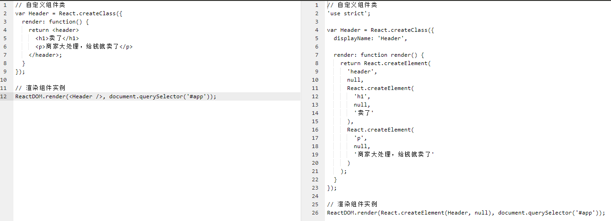
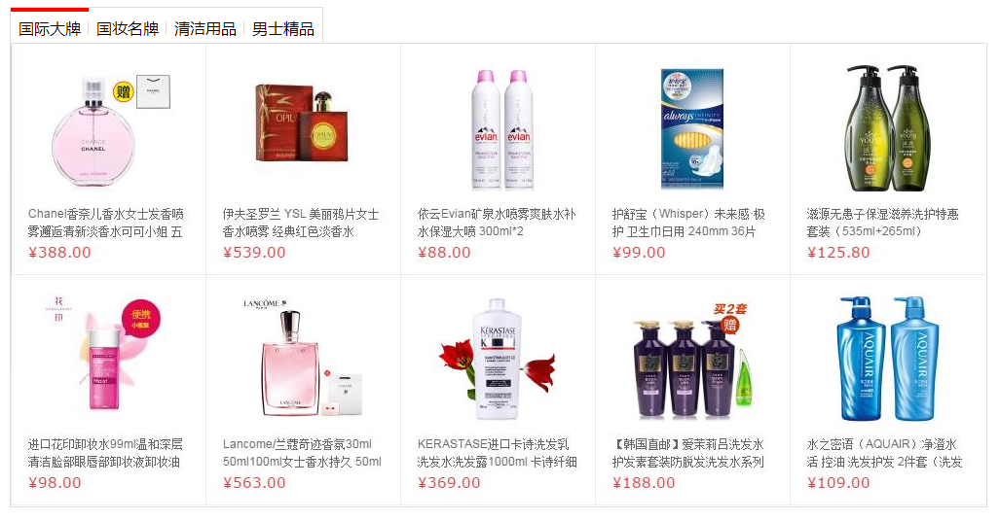

# React
- 一个前端组件化开发框架
- 在React中所有的一切都是组件，有最基本的内置组件，也可以在内置组件基础上定义出自定义组件
- 主要解决的问题是提高前端页面组件的可复用性，以应对频繁的需求变化

#### 资源
- [官网](https://facebook.github.io/react/)
- [中文文档](https://discountry.github.io/react/)
- [中文网](http://react-china.org/)

## 使用内置组件

#### 说明
- 开发react应用需要中引入两个js：react.js与react-dom.js
- react.js的主要作用是创建组件
- react-dom.js的主要作用是渲染组件，以及各种组件操作

#### 基本使用
- 在React中，几乎所有的HTML标签都预定义成了组件
- 使用React开发，就是拼凑组件，构成更大的组件或应用程序

```html
<html>
	<head>
	  <meta charset="UTF-8">
	  <title>React组件式开发</title>
	  <!-- 1、先引入react.js-->
	  <script src="react.js"></script>
	  <!-- 2、再引入react-dom.js-->
	  <script src="react-dom.js"></script>
	</head>
	<body>
	  <!-- 3、视图中定义一个占位标签 -->
      <div id="app"></div>
      <!-- 4、编写脚本 -->
      <script>
	      /**
	       * React.createElement创建一个内置组件实例：
	       * param1：组件类型
	       * param2：组件属性
	       * param3：子组件或文本内容
	       * */
	      var vDiv = React.createElement('div', { className: 'wrap' }, 'hello world!');
	      /**
	       * ReactDom.render渲染组件实例：
	       * param1：组件实例
	       * param2：页面元素，指定组件渲染的位置
	       * */
	      ReactDOM.render(vDiv, document.querySelector('#app'));
      </script>
	</body>
</html>
```

#### 行内样式
- style属性值必须是一个对象，其中属性名使用驼峰式命名

```javascript
// 样式对象
var style = {
	padding: 10,
	backgroundColor: 'skyblue',
	fontSize: 24
};

// 创建ul组件实例，并设置class与style
var vDiv= React.createElement('div', { className: 'wrap', style: style }, '玉龙雪山');

// 渲染到页面中
ReactDOM.render(vDiv, document.querySelector('#app'));
```

#### 事件绑定
- 事件绑定同样需要使用驼峰式命名
- 注意：绑定事件时不要加小括号()，否则函数会立即调用，而非等事件触发时调用

```javascript
function clickHandle(e) {
	console.log(e.target);
}

// 创建ul组件实例，并设置class与style
var vDiv= React.createElement('div', { className: 'wrap', onClick: clickHandle }, '爱我你就点点我');

// 渲染到页面中
ReactDOM.render(vDiv, document.querySelector('#app'));
```

#### 嵌套组件1
- render方法渲染多个元素，必须从一个根元素开始，所以一定会出现嵌套

```javascript
//  创建p组件实例
var vP = React.createElement('p', null, '穿过你的秀发我的手');

// 创建div组件实例，并把p作为子组件
var vDiv= React.createElement('div', { className: 'wrap' }, vP);

// 渲染到页面中
ReactDOM.render(vDiv, document.querySelector('#app'));
```

#### 嵌套组件2
- 如果子组件是一个列表，那么每个组件最好添加一个key属性，用于react内部优化使用

```javascript
// 创建一组li组件实例
var list = [ '馄饨', '抄手', '包面', '云吞', '扁食' ];
var vLiArr = list.map(function(val, i) {
	return React.createElement('li', { key: i }, val);
});

// 创建ul组件实例，把所有的li定义作为它的子元素
var vUl= React.createElement('ul', { className: 'wrap' }, vLiArr);

// 渲染到页面中
ReactDOM.render(vUl, document.querySelector('#app'));
```

#### 方法说明

###### React.createElement
- 用于创建组件实例

| 参数序号 | 数据类型 | 描述信息 |
| - | - | - |
| 1 | String | 类型 |
| 2 | Object | props属性 |
| 3 | vDOM/String | 组件实例或文本内容 |

###### ReactDom.reader
- 用于渲染组件实例到视图

| 参数序号 | 数据类型 | 描述信息 |
| - | - | - |
| 1 | vDOM | 组件实例 |
| 2 | DOM | 页面元素 |

## jsx语法

#### 说明
- 上面的语法写起来太繁琐，又不直观，不利于维护
- 所以react提供了jsx语法，这个语法简单点讲就是把模版写在js当中
- 但是浏览器不支持jsx语法，所以需要通过语法转换器进行成js语法才可执行

#### 初体验

```html
<html>
	<head>
	  <meta charset="UTF-8">
	  <title>React组件式开发</title>
	  <script src="react.js"></script>
	  <script src="react-dom.js"></script>
	  <!-- 额外引入这个js即可使用jsx语法，这个js是由babel与babel-preset-react插件构成-->
	  <script src="browser.min.js"></script>
	</head>
	<body>
      <div id="app"></div>
      <!-- 注意这里的type，必须这么写，不然无法转换-->
      <script type="text/babel">
		  // 直接在js中书写html标签，需要注意标签的className属性不要写成class
	      var vDiv = <div className="a b c">猛龙过江</div>;
	      // 向以前那样渲染
	      ReactDOM.render(vDiv, document.querySelector('#app'));
      </script>
	</body>
</html>
```

#### 转换比对
- 可以在[中文网](http://babeljs.cn/repl/)与[官网](http://babeljs.io/repl/)做在线尝试
- 

## jsx中的表达式
- 在jsx中可以向模版引擎那样引用js表达式，语法是一对大括号`{ 表达式 }`

#### 可引用变量的值

```jsx
var str = '抱抱果';
var vDiv = <div className="a b c">{ str }</div>;
ReactDOM.render(vDiv, document.querySelector('#app'));
```

#### 可进行表达式运算

```jsx
var str = '抱抱果';
var vDiv = <div className="a b c">{ str.slice(0, 2) + '我' }</div>;
ReactDOM.render(vDiv, document.querySelector('#app'));
```

#### 可调用方法

```jsx
var fn = function() {
	return '爱我你就抱抱我';
};
var vDiv = <div className="a b c">{ fn() }</div>;
ReactDOM.render(vDiv, document.querySelector('#app'));
```

##  转换前面的普通写法

#### 行内样式与事件绑定
- jsx就是把所有的`React.createElement`换成了标签的写法
- 然后在标签中通过一对大括号{}添加引用变量或添加业务逻辑

```jsx
// 样式对象
var style = {
	padding: 10,
	backgroundColor: 'skyblue',
	fontSize: 24
};

// 事件句柄
function clickHandle(e) {
	console.log(e.target);
}

// 组件变成jsx写法，注意这里绑定的事件回调时千万不要加小括号()
var vDiv = <div style={ style } onClick={ clickHandle } ></div>

// 渲染到页面中
ReactDOM.render(vDiv, document.querySelector('#app'));
```

#### 嵌套组件
- jsx就是把所有的`React.createElement`换成了标签的写法

```jsx
// 创建一组li组件实例
var list = [ '馄饨', '抄手', '包面', '云吞', '扁食' ];
var vLiArr = list.map(function(val, i) {
	return <p key={ i }>{ val }</p>;
});

// 创建ul组件实例，把所有的li定义作为它的子元素
var vUl= <ul className="wrap">{ vLiArr }</ul>;

// 渲染到页面中
ReactDOM.render(vUl, document.querySelector('#app'));
```

#### 嵌套组件换个写法
- 在react中编写界面，会见到大量的函数调用，以实现界面业务需求
- 相比angular与vue，react要编写的js比较多，主要是没有模版与那些便利的指令

```jsx
var list = [ '馄饨', '抄手', '包面', '云吞', '扁食' ];
ReactDOM.render(
	<ul className="wrap">
	{
		list.map(function(val, i) {
			return <p key={ i }>{ val }</p>;
		})
	}
	</ul>
	, document.querySelector('#app'));
```

#### 注释
- 在jsx中写注释，最好在大括号{}中使用js的多行注释，否则会有问题

```jsx
var list = [ '馄饨', '抄手', '包面', '云吞', '扁食' ];
ReactDOM.render(
	<ul className="wrap">
	{
		list.map(function(val, i) {
			{ /* 内层的li组件 */ }
			return <p key={ i }>{ val }</p>;
		})
	}
	</ul>
	, document.querySelector('#app'));
```

## 自定义组件
- 为了达到复用的目的，有时候我们需要在内置组件的基础上创建自定义组件
- 创建自定义组件，要先创建组件类，然后才可以创建对应的组件实例

#### 自定义Header组件
- 先通过`React.createClass`方法创建组件类，然后就可以创建组件实例了
- 这里创建组件实例使用的是jsx语法`<Header />`，最终会转换成`React.createElement(Header)`

```jsx
// 自定义组件类
var Header = React.createClass({
	render: function() {
		return <header>
			<h1>卖了</h1>
			<p>商家大处理，给钱就卖了</p>
		</header>;
	}
});

// 渲染组件实例
ReactDOM.render(<Header />, document.querySelector('#app'));
```

###### 转换比对
- 可以在[中文网](http://babeljs.cn/repl/)与[官网](http://babeljs.io/repl/)做在线尝试
- 

###### 补充注意事项
- `React.createClass`方法传入一个配置对象
    + 其中有一个**render函数配置项**是必须的，不配置会报错
    + render必须要有**return**结果，return的标签也必须使用一个**根标签**包裹，否则也报错
-  `React.createClass`创建组件类需要使用变量接收存储
    + 这个变量名**首字母**必须**大写**，否则无法创建实例

#### 自定义Tab组件
- 这里案例基于已有的样式结构进行改造与学习
- 

###### 静态页面转react组件
- 需要注意jsx语法中的class属性要修改为className

```jsx
// tab组件类
var Tab = React.createClass({
	render: function() {
	  return <div className="wrapper" id="wrapper">
	    <ul className="tab" id="tab-menu">
	      <li className="tab-item active">国际大牌<span>◆</span></li>
	      <li className="tab-item">国妆名牌<span>◆</span></li>
	      <li className="tab-item">清洁用品<span>◆</span></li>
	      <li className="tab-item">男士精品</li>
	    </ul>
	    <div className="products" id="tab-main">
	      <div className="main selected">
	          <a href="###"></a>
	      </div>
	      <div className="main">
	          <a href="###"></a>
	      </div>
	      <div className="main">
	          <a href="###"></a>
	      </div>
	      <div className="main">
	          <a href="###"></a>
	      </div>
	    </div>
	  </div>;
	}
});

// 渲染到页面
ReactDOM.render(<Tab />, document.querySelector('#app'));
```

###### 抽取组件中的状态
- tab栏的文字与内容框内容可以抽取成组件状态使用
- `React.createClass`中有一个`getInitialState`配置项用于设置组件的状态
    + 这个配置项类似于vue组件中的data，同样要求是一个函数返回一个对象的形式

```jsx
// tab组件类
var Tab = React.createClass({

	// 定义组件状态，函数必须返回一个对象或null
	getInitialState: function () {
	  return {
	    navList: ['国际大牌', '国妆名牌', '清洁用品', '男士精品'],
	    contentList: ['imgs/guojidapai.jpg', 'imgs/guozhuangmingpin.jpg', 'imgs/qingjieyongpin.jpg', 'imgs/nanshijingpin.jpg'],
	    focusIndex: 0  // 用来控制当前所选tab的下标
	  };
	},

	render: function() {
      var _this = this;
      return (
      	<div className="wrapper" id="wrapper">
	        <ul className="tab" id="tab-menu">
	            {
		            this.state.navList.map(function(val, i){
		              return (
		              	<li className={ _this.state.focusIndex == i? 'tab-item active': 'tab-item' } key={ i }>{ val }
			                <span>◆</span>
			            </li>
		              );
		            })
	            }
	        </ul>
	        <div className="products" id="tab-main">
	            {
		            this.state.contentList.map(function(val, i){
		              return (
		              	<div className={ _this.state.focusIndex == i? 'main selected': 'main' } key={ i }>
		                    <a href="###"></a>
		                </div>
		              );
		            })
	            }
	        </div>
	    </div>;
      );
    }
});

// 渲染到页面
ReactDOM.render(<Tab/>, document.querySelector('#app'));
```

###### 功能实现 - DOM操作版本
- 实现`点击切换`tab的功能，首先需要以属性的方式进行`事件绑定`，注意`onClick驼峰式`写法
    + 指定`事件回调`，在createClass的配置项当中，除了定好的配置
    + 我们还可以添加一些自己的东西，这里面的东西最终会被添加到组件实例身上，我们可以通过实例来调用
- 另外在实现这个功能的时候我们需要得到用户所点击dom的下标，以此进行dom的切换处理
    + 这里可以巧妙的通过`bind`方法进行数据绑定以达到传参的目的

```jsx
var Tab = React.createClass({

    // 该函数用于定义组件状态，函数必须返回一个对象或null
    getInitialState: function () {
      return {
        navList: ['国际大牌', '国妆名牌', '清洁用品', '男士精品'],
        contentList: ['imgs/guojidapai.jpg', 'imgs/guozhuangmingpin.jpg', 'imgs/qingjieyongpin.jpg', 'imgs/nanshijingpin.jpg'],
        focusIndex: 0  // 用来控制当前所选tab的下标
      };
    },

    // 拿到要切换到的下标，修改页面dom
    changeTab: function(index) {
        var navs = document.querySelectorAll('.tab-item');
        var ctxs = document.querySelectorAll('.main');

        // 遍历元素，下标与index对上的都是要展示的元素，添加额外class，否则不加
        navs.forEach(function(nav, i) {
          if(index == i) {
            nav.className = 'tab-item active';
          }else {
            nav.className = 'tab-item';
          }
        });
        ctxs.forEach(function(ctx, i) {
          if(index == i) {
            ctx.className = 'main selected';
          }else {
            ctx.className = 'main';
          }
        });
    },

    render: function() {
      var _this = this;
      return <div className="wrapper" id="wrapper">

        {/* tab导航栏 */}
        <ul className="tab" id="tab-menu">
          {
            _this.state.navList.map(function(val, i){
              return (
              	<li className={ _this.state.focusIndex == i? 'tab-item active': 'tab-item' }
	                onClick={ _this.changeTab.bind(_this, i) } key={ i }>
	                { val }
	                <span>◆</span>
	            </li>
              );
            })
          }
        </ul>

        {/* tab内容框 */}
        <div className="products" id="tab-main">
          {
            _this.state.contentList.map(function(val, i){
              return (
              	<div className={ _this.state.focusIndex == i? 'main selected': 'main' } key={ i }>
                    <a href="###"></a>
                </div>
              );
            })
          }
        </div>;
      </div>;
    }
});

// 渲染到页面
ReactDOM.render(<Tab />, document.querySelector('#app'));
```

###### 功能实现 - 状态操作版本
- 上面在实现切换功能时使用了大量的dom操作，如果可以`摒弃`繁琐的`dom操作`，通过`状态`来控制它们就好了
- react组件专门提供了一个`setState`方法专门用于`修改组件`的状态，修改后react会`自动刷新`视图
    + 如果以`手动赋值`的方式修改状态，视图是`不会刷新`的
    + 必须通过`setState`方法修改状态，react才可以得知状态变化`刷新视图`

```jsx
var Tab = React.createClass({

    // 该函数用于定义组件状态，函数必须返回一个对象或null
    getInitialState: function () {
      return {
        navList: ['国际大牌', '国妆名牌', '清洁用品', '男士精品'],
        contentList: ['imgs/guojidapai.jpg', 'imgs/guozhuangmingpin.jpg', 'imgs/qingjieyongpin.jpg', 'imgs/nanshijingpin.jpg'],
        focusIndex: 0  // 用来控制当前所选tab的下标
      };
    },

    // 切换tab栏，内部通过组件实例的setState方法修改状态，修改后视图会自动刷新
    changeTab: function(index) {
      this.setState({
        focusIndex: index
      });
    },

    render: function() {
      var _this = this;
      return <div className="wrapper" id="wrapper">

        {/* tab导航栏 */}
        <ul className="tab" id="tab-menu">
          {
            _this.state.navList.map(function(val, i){
              return (
              	<li className={ _this.state.focusIndex == i? 'tab-item active': 'tab-item' }
	                onClick={ _this.changeTab.bind(_this, i) } key={ i }>
	                { val }
	                <span>◆</span>
	            </li>
              );
            })
          }
        </ul>

        {/* tab内容框 */}
        <div className="products" id="tab-main">
          {
            _this.state.contentList.map(function(val, i){
              return (
              	<div className={ _this.state.focusIndex == i? 'main selected': 'main' } key={ i }>
                    <a href="###"></a>
                </div>
              );
            })
          }
        </div>;
      </div>;
    }
});

// 渲染到页面
ReactDOM.render(<Tab />, document.querySelector('#app'));
```

###### 组件数据传递
- 上面的组件使用设计上有一些不足，比如使用组件时想要更换数据，我得修改组件源代码
- 如果能够在使用的时候去指定组件中渲染的数据就更好了
- 数据传递 - 原理类似vue中数据父传子
    + React中通过标签**属性**的方式进行**数据传递**，子组件有一个只读对象**props**来拿到值
    + 这其实就是vue中数据父传子的方式：父通过属性把值传给子，子通过props接收，基本理念是一样一样的

```jax


```

###### 抽取子组件
- 为了让组件**可复用**性更强，所以我们把tab导航与tab内容做成两个子组件，这样我们就要设计到父子数据的传递
- 同时两个组件有一个公共的状态`focusIndex`，两个不相干的组件如何使用共同状态呢
    + 把这个状态定义在他们的父组件中，由父传递给子，这样保证两者所用数据保持一致
- 另外一个问题是，我们需要在tab导航组件中监听事件，修改父的`focusIndex`数据，怎么办呢
    + 修改父级数据 - 原理类似vue中数据子传父
    + 在React中我们可以把父组件中的`函数`传递给子组件，`子组件`在合适的时机`调用`即可实现数据传递
    + 这其实就是vue中数据子传父的方式：子通过自定义事件的方式触发父中函数的调用，从而传递参数

```jsx
// tab导航子组件
var TabNav = React.createClass({
    render: function() {
      var _this = this;
      return (
        <ul className="tab" id="tab-menu">
          {
            {/* 通过实例.propts拿到来自父的数据 */}
            _this.props.navList.map(function(val, i){
              return (
              	<li className={ _this.props.focusIndex == i? 'tab-item active': 'tab-item' }
	              	{/* 通过调用父提供的方法实现子传父 */}
	                onClick={ _this.props.changeTab.bind(null, i) } key={ i }>
	                { val }
	                <span>◆</span>
	            </li>
              )
            })
          }
        </ul>
      );
    }
});

// tab内容
var TabContent = React.createClass({
    render: function() {
      var _this = this;
      return (
        <div className="products" id="tab-main">
          {
            _this.props.contentList.map(function(val, i){
              return (
              	<div className={ _this.props.focusIndex == i? 'main selected': 'main' } key={ i }>
                    <a href="###"></a>
                </div>
              );
            })
          }
        </div>
      );
    }
});

// tab容器
var Tab = React.createClass({

    // 该函数用于定义组件状态，函数必须返回一个对象或null
    getInitialState: function () {
      return {
        navList: ['国际大牌', '国妆名牌', '清洁用品', '男士精品'],
        contentList: ['imgs/guojidapai.jpg', 'imgs/guozhuangmingpin.jpg', 'imgs/qingjieyongpin.jpg', 'imgs/nanshijingpin.jpg'],
        focusIndex: 2  // 用来记录当前tab的下标
      };
    },

    // 切换tab栏，内部通过组件实例的setState方法修改状态，修改后视图会自动刷新
    changeTab: function(index) {
      this.setState({
        focusIndex: index
      });
    },

    render: function() {
      var _this = this;
      return (
        <div className="wrapper" id="wrapper">
          {/* tab导航栏 */}
          <TabNav navList={ this.state.navList } focusIndex={ this.state.focusIndex } changeTab={ this.changeTab }  />
          {/* tab内容框 */}
          <TabContent contentList={ this.state.contentList } focusIndex={ this.state.focusIndex }  />
        </div>
      );
    }
});

ReactDOM.render(<Tab/>, document.querySelector('#app'));
```

###### 无状态组件
- 在react中，如果一个组件只有props，没有state，那么可以写成无状态组件
- 无状态组件要比传统组件更加轻量级，创建时更快，简单好维护
- 无状态组件的写法很简单，需要我们提供一个具有返回值的构造函数，这个函数可以接收props来使用

```
// tab导航 - 无状态组件
var TabNav = function(props) {
    return (
      <ul className="tab" id="tab-menu">
        {
          props.navList.map(function(val, i){
            return (
            	<li className={ props.focusIndex == i? 'tab-item active': 'tab-item' }
	              onClick={ props.changeTab.bind(null, i) } key={ i }>
	              { val }
	              <span>◆</span>
	            </li>
            );
          })
        }
      </ul>
    );
};

// tab内容 - 无状态组件
var TabContent = function(props) {
    return (
      <div className="products" id="tab-main">
        {
          props.contentList.map(function(val, i){
            return (
            	<div className={ props.focusIndex == i? 'main selected': 'main' } key={ i }>
	                <a href="###"></a>
	            </div>
            );
          })
        }
      </div>
    );
}

// tab容器
var Tab = React.createClass({

    // 该函数用于定义组件状态，函数必须返回一个对象或null
    getInitialState: function () {
      return {
        navList: ['国际大牌', '国妆名牌', '清洁用品', '男士精品'],
        contentList: ['imgs/guojidapai.jpg', 'imgs/guozhuangmingpin.jpg', 'imgs/qingjieyongpin.jpg', 'imgs/nanshijingpin.jpg'],
        focusIndex: 2  // 用来记录当前tab的下标
      };
    },

    // 切换tab栏，内部通过组件实例的setState方法修改状态，修改后视图会自动刷新
    changeTab: function(index) {
      this.setState({
        focusIndex: index
      });
    },

    render: function() {
      var _this = this;
      return (
        <div className="wrapper" id="wrapper">
          {/* tab导航栏 */}
          <TabNav navList={ this.state.navList } focusIndex={ this.state.focusIndex } changeTab={ this.changeTab }  />
          {/* tab内容框 */}
          <TabContent contentList={ this.state.contentList } focusIndex={ this.state.focusIndex }  />
        </div>
      );
    }
});

ReactDOM.render(<Tab/>, document.querySelector('#app'));
```

## 总结

#### 组件创建与渲染
- React.createClass：用于创建组件类
- React.createElement：用于创建组件实例
- ReactDOM.render：用于渲染组件实例

#### jsx语法
- 就是在js中书写xml，xml的特点就是标签与标签属性不受限，可以由开发者任意创造
- 为了便于web开发，react内置了各种h5标签组件，以及对h5标签的特殊属性都做了处理，我们可以在此基础上创建各种自定义组件
- 为了让xml编写更加灵活，jsx中可以通过代码块{}来嵌入脚本，实现更高的灵活性，这也让我们的js相比vue会多不少

#### 组件状态
- 现在大部分页面都是动态的，其中大多数的功能都会和数据挂钩
- 这些数据我们称其为状态，通常状态发生变化，组件内容或样式会跟着进行更新
- 在创建组件类的时候，我们可以通过getInitialState配置项来设置组件的初始状态
- 当状态发生变化时，我们可以通过setState方法来修改状态，这样做的目的是为了让React自动更新视图

#### 父子组件数据传递
- React的开发思想是把页面的每个功能拆分成一个个组件，然后进行各种组合、嵌套构成我们的页面
- 这样多个组件之间，可能就需要数据的共享与传递，React中数据的通信主要是通过props只读对象来完成
- 数据父传子：把数据通过属性方式传给子，子通过props对象进行访问
- 数据子传父：把函数通过属性方式传给子，子在特定的时机通过调用方法把数据传给父使用
- 兄弟间数据共享：把共享的数据放置到他们共同的父组件上，然后父通过属性下发给不同的子进行共享

## 理解react组件化思想
- 尝试使用原生js的方式封装一个组件，以理解react的开发思想
- 这里就拿tab案例中的导航部分来举例

#### 原始方式实现
- 这种方式编写代码有如神助，分分钟搞定
- 但是这种方式写完的代码复用性差，可维护性与扩展性也比较低

```
<body>
    <ul class="tab" id="tab-menu" style="margin: 150px auto;">
        <li class="tab-item active">国际大牌<span>◆</span></li>
        <li class="tab-item">国妆名牌<span>◆</span></li>
        <li class="tab-item">清洁用品<span>◆</span></li>
        <li class="tab-item">男士精品</li>
    </ul>

    <script>
      var lis = document.querySelectorAll('li');
      for(var i = 0, len = lis.length; i < len; i++) {
        lis[i].onclick = function() {
          for(var i = 0, len = lis.length; i < len; i++) {
            lis[i].className = 'tab-item';
          }
          this.className = 'tab-item active';
        };
      }
    </script>
</body>
```

#### 对象封装
- 如果想在其他地方复用上面的代码，不想通过copy的方式造成冗余，就需要封装一下了
- 这里我们采用面向对象的方式进行封装
    1. 编写构造函数
    2. 原型添加一个render方法，把页面的html封装起来，免于结构上的copy
    3. 原型添加一个handler方法，用于封装DOM相关的操作代码
- 封装后，通过创建实例的方式进行调用，达到代码复用的目的

```javascript
function TabNav() {}
TabNav.prototype = {

	// 获取渲染所需的html
	render: function() {
	  return  '<ul class="tab" id="tab-menu" style="margin: 150px auto;">' +
	    '<li class="tab-item active">国际大牌<span>◆</span></li>' +
	    '<li class="tab-item">国妆名牌<span>◆</span></li>' +
	    '<li class="tab-item">清洁用品<span>◆</span></li>' +
	    '<li class="tab-item">男士精品</li>' +
	  '</ul>';
	},

	// DOM操作处理
	handler: function() {
	  var lis = document.querySelectorAll('li');
	  for(var i = 0, len = lis.length; i < len; i++) {
	    lis[i].onclick = function() {
	      for(var i = 0, len = lis.length; i < len; i++) {
	        lis[i].className = 'tab-item';
	      }
	      this.className = 'tab-item active';
	    };
	  }
	}
};
```
```javascript
// 创建实例，在指定的地方进行渲染，并进行事件绑定
var tabNav = new TabNav();
document.querySelector('#app').innerHTML = tabNav.render();
tabNav.handler();
```

#### 数据定制化
- 这个组件封装后可以提高复用减少冗余，但是还有一些不足
- 比如导航按钮的文本是写死的，如果使用者可以任意指定就更好了
    1. 构造函数中给实例添加一个props属性，让使用者传递数据
    2. 然后通过props数据把render中的html结构写活
- 其他地方不用做任何处理，改造后的组件复用性更强了，可维护性也有了一定提升

```
function TabNav(props) {
    this.props = props;
}

TabNav.prototype = {

    // 获取渲染所需的html
    render: function() {
      var html = '<ul class="tab" id="tab-menu" style="margin: 150px auto;">';
      for(var i = 0, len = this.props.navList.length; i < len; i++) {
        if(i == 0) {
          html += '<li class="tab-item active">' + this.props.navList[i] + '<span>◆</span></li>';
        }else {
          html += '<li class="tab-item">' + this.props.navList[i] + '<span>◆</span></li>';
        }
      }
      html += '</ul>';
      return html;
    },

    // DOM操作处理
    handler: function() {
      var lis = document.querySelectorAll('li');
      for(var i = 0, len = lis.length; i < len; i++) {
        lis[i].onclick = function() {
          for(var i = 0, len = lis.length; i < len; i++) {
            lis[i].className = 'tab-item';
          }
          this.className = 'tab-item active';
        };
      }
    }
};
```
```javascript
// 创建实例，在指定的地方进行渲染，并进行事件绑定
var tabNav = new TabNav();
document.querySelector('#app').innerHTML = tabNav.render();
tabNav.handler();
```

#### 同一页面可复用
- 上面的代码已经很不错了，但是有个缺陷，就是同一个页面无法创建两个实例，你可以试试
- 造成这样的原因是，在dom获取上产生了冲突
- 我们这里可以通过一个特殊方法解决这个问题
    1. 添加一个可把html字符串解析为dom的方法
    2. render函数中通过该方法把html解析为dom，存储到实例this身上，然后返回
    3. 然后修改handler方法，从实例this身上开始获取子元素进行操作
- 后续使用的时候需要注意，实例的render返回的是dom不是html字符串了，所以要把innerHTML更换为appendChild
- 另外之前由于dom创建的原因，需要使用者手动调用handler方法，现在dom成了自动创建，可以把handler调用封装到render中

```javascript
function TabNav(props) {
    this.props = props;
}

TabNav.prototype = {

    // 把html字符串解析为DOM
    parseHTML: function(html) {
      var tempDiv = document.createElement('div');
      tempDiv.innerHTML = html;
      return tempDiv.children[0];
    },

    // 获取渲染所需的html
    render: function() {

      // 拼接html
      var html = '<ul class="tab" id="tab-menu" style="margin: 150px auto;">';
      for(var i = 0, len = this.props.navList.length; i < len; i++) {
        if(i == 0) {
          html += '<li class="tab-item active">' + this.props.navList[i] + '<span>◆</span></li>';
        }else {
          html += '<li class="tab-item">' + this.props.navList[i] + '<span>◆</span></li>';
        }
      }
      html += '</ul>';

      // 解析DOM并返回
      this.el = this.parseHTML(html);   // dom解析
      this.handler();                             // dom事件绑定与处理
      return this.el;                              // 返回dom
    },

    // DOM操作处理
    handler: function() {
      var lis = this.el.querySelectorAll('li');
      for(var i = 0, len = lis.length; i < len; i++) {
        lis[i].onclick = function() {
          for(var i = 0, len = lis.length; i < len; i++) {
            lis[i].className = 'tab-item';
          }
          this.className = 'tab-item active';
        };
      }
    }
};
```
```javascript
var tabNav = new TabNav({ navList: ['国际大牌', '国妆名牌', '清洁用品', '男士精品'] });
document.querySelector('#app').appendChild(tabNav.render());

var tabNav2 = new TabNav({ navList: [11, 22, 33, 44] });
document.querySelector('#app2').appendChild(tabNav2.render());
```

#### 状态控制组件行为
- 现在的组件已经非常好了，但是如果这个组件的功能再复杂一些，代码中会混杂着难以维护的dom操作
- 比较好的方式是通过状态管理组件的行为，拆分业务逻辑与dom操作，修改状态，更新视图
- 这里我们把抽取一个focusIndex状态来记录组件的行为，同时为了方便管理，所有的状态都放到state对象中
    1. 在构造函数中给实例添加state对象，目前只有一个focusIndex属性，用于控制nav的焦点
    2. 然后封装一个统一的修改状态方法setState，目的是状态修改后视图也要更新刷新
    3. 把handler方法中直接修改dom的className代码变更成修改状态

```javascript
/**
  * 改造步骤：
  * 1、添加一个focusIndex状态，给个初始值，通过这个值可以控制nav默认的焦点
  * 2、改变DOM操作的做法，把点击直接修改DOM替换为修改数据
  * */

function TabNav(props) {
    this.props = props;
    this.state = {
      focusIndex: 0
    }
}

TabNav.prototype = {

    // 把html字符串解析为DOM
    parseHTML: function(html) {
      var tempDiv = document.createElement('div');
      tempDiv.innerHTML = html;
      return tempDiv.children[0];
    },

    mount: function(component, wrap) {
      wrap.appendChild(component.render());
    },

    // 修改状态，修改后刷新视图
    setState: function(upState) {

      // 更新状态
      for(var key in upState) {
        this.state[key] = upState[key];
      }

      // 以新的状态重绘DOM
      var oldEl = this.el // 旧DOM
      this.el = this.render(); // 新DOM
      oldEl.parentNode && oldEl.parentNode.replaceChild(this.el, oldEl); // 新旧替换
    },

    // 获取渲染所需的html
    render: function() {

      // 拼接html
      var html = '<ul class="tab" id="tab-menu" style="margin: 150px auto;">';
      for(var i = 0, len = this.props.navList.length; i < len; i++) {
        if(i == this.state.focusIndex) {
          html += '<li class="tab-item active">' + this.props.navList[i] + '<span>◆</span></li>';
        }else {
          html += '<li class="tab-item">' + this.props.navList[i] + '<span>◆</span></li>';
        }
      }
      html += '</ul>';

      // 返回解析好的DOM对象
      this.el = this.parseHTML(html);
      this.handler();
      return this.el;
    },

    // DOM操作处理
    handler: function() {
      var _this = this;
      var lis = this.el.querySelectorAll('li');

      for(var i = 0, len = lis.length; i < len; i++) {
        lis[i].index = i;
        lis[i].onclick = function() {
          _this.setState({
            focusIndex: this.index
          })
        };
      }
    }
};
```
```javascript
// 创建实例，在指定的地方进行渲染，并进行事件绑定
var tabNav = new TabNav({ navList: ['国际大牌', '国妆名牌', '清洁用品', '男士精品'] });
tabNav.mount(tabNav, document.querySelector('#app'));

var tabNav2 = new TabNav({ navList: [11, 22, 33, 44] });
tabNav2.mount(tabNav2, document.querySelector('#app2'));
```

###### 模式抽取

```javascript
function Component() {}
Component.prototype = {

    // 把html字符串解析为DOM
    parseHTML: function(html) {
      var tempDiv = document.createElement('div');
      tempDiv.innerHTML = html;
      return tempDiv.children[0];
    },

    mount: function(component, wrap) {
      wrap.appendChild(component.render());
    },

    // 修改状态，修改后刷新视图
    setState: function(upState) {
      // 更新状态
      for(var key in upState) {
        this.state[key] = upState[key];
      }

      // 以新的状态重绘DOM
      var oldEl = this.el // 旧DOM
      this.el = this.render(); // 新DOM
      oldEl.parentNode && oldEl.parentNode.replaceChild(this.el, oldEl); // 新旧替换
    }
};


function TabNav(props) {
    this.props = props;
    this.state = {
      focusIndex: 0
    }
}

TabNav.prototype = {

    // 获取渲染所需的html
    render: function() {

      // 拼接html
      var html = '<ul class="tab" id="tab-menu" style="margin: 150px auto;">';
      for(var i = 0, len = this.props.navList.length; i < len; i++) {
        if(i == this.state.focusIndex) {
          html += '<li class="tab-item active">' + this.props.navList[i] + '<span>◆</span></li>';
        }else {
          html += '<li class="tab-item">' + this.props.navList[i] + '<span>◆</span></li>';
        }
      }
      html += '</ul>';

      // 返回解析好的DOM对象
      this.el = this.parseHTML(html);
      this.handler();
      return this.el;
    },

    // DOM操作处理
    handler: function() {
      var _this = this;
      var lis = this.el.querySelectorAll('li');

      for(var i = 0, len = lis.length; i < len; i++) {
        lis[i].index = i;
        lis[i].onclick = function() {
          _this.setState({
            focusIndex: this.index
          })
        };
      }
    }
};
TabNav.prototype.__proto__ = Component.prototype;
```
```javascript
// 创建实例，在指定的地方进行渲染，并进行事件绑定
var tabNav = new TabNav({ navList: ['国际大牌', '国妆名牌', '清洁用品', '男士精品'] });
tabNav.mount(tabNav, document.querySelector('#app'));

var tabNav2 = new TabNav({ navList: [11, 22, 33, 44] });
tabNav2.mount(tabNav2, document.querySelector('#app2'));
```