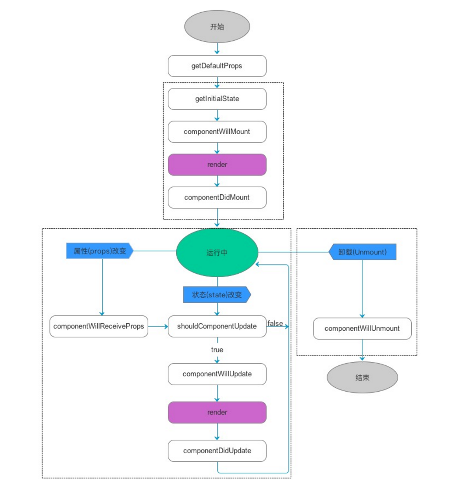
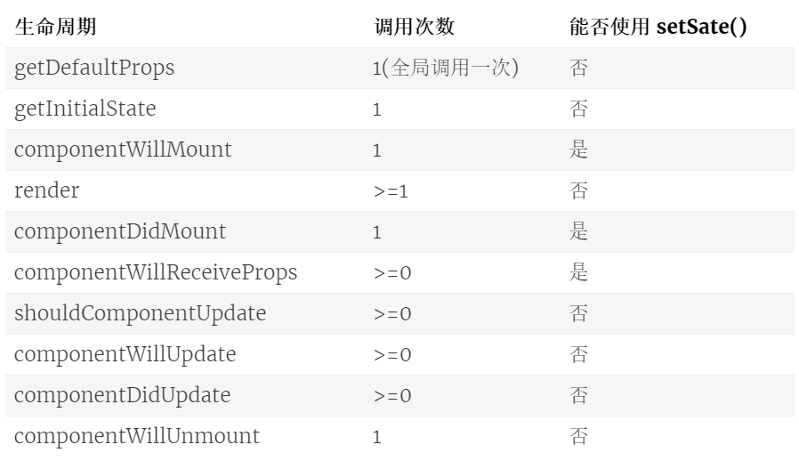

## 双向数据绑定
- 在angular与vue中，我们可以通过model指令实现表单数据双向绑定
- 但react中因为没有指令，我们可以通过监听表单onChange事件来模拟实现

```javascript
var Timer = React.createClass({

	// 设置初始状态
    getInitialState: function() {
      return {
        content: 'Hello'
      };
    },

	// 表单变化事件处理器
    changeHandler: function(e) {
      this.setState({
        content: e.target.value
      });
    },

	// 指定组件渲染内容
    render: function() {
      return (
        <div>
          <input value={ this.state.content } onChange={ this.changeHandler }/>
          <p>{ this.state.content }</p>
        </div>
      );
    }
});

ReactDOM.render(<Timer/>, document.querySelector('#app'));
```

## DOM获取
- 在React中，主要的开发模式是通过`setState`方法修改状态，触发`视图`自动更新，但是偶尔也需要进行`DOM`操作
- React中可以通过`ref`属性对元素进行标记，然后通过组件的`refs`属性拿到对应元素
- refs是访问组件内部DOM节点的唯一可靠方法；当子组件`销毁`时会`自动释放`引用
- 这里我们在组件渲染完毕后的生命周期函数，通过refs拿到input，让其获得焦点

```javascript
var Timer = React.createClass({

	// 设置初始状态
    getInitialState: function() {
      return {
        content: 'Hello'
      };
    },

    // 组件渲染后自动被调用，内部通过refs拿到渲染好的input元素，获取焦点
    componentDidMount: function() {
    	this.refs.textInput.focus();
    },

	// 表单变化事件处理器
    changeHandler: function(e) {
      this.setState({
        content: this.refs.textInput.value
      });
    },

	// 指定组件渲染内容
    render: function() {
      return (
        <div>
          <input value={ this.state.content } onChange={ this.changeHandler } ref='textInput'/>
          <p>{ this.state.content }</p>
        </div>
      );
    }
});

ReactDOM.render(<Timer/>, document.querySelector('#app'));
```

## 自定义组件内容
- 有时候我们使用一个组件，想自定义这个组件的部分内容，让组件用起来更加灵活
- 比如我们有一个漂亮的相框组件，里面可以由组件使用者填充子元素，再完美不过了
- 在react中使用某个组件时，是可以嵌套子组件的，可以通过props.children拿到组件调用者传递的子组件

```javascript
function PhotoBox(props) {
    var style = {
    margin: '30px 10px',
    display: 'inline-block',
    verticalAlign: 'top',
    width: 200,
    height: 300,
    border: '4px solid pink',
    textAlign: 'center'
  };

  return (
    <div style={ style }>
      { props.children }
    </div>
  );
}

function PhotoBoxList(props) {
  return (
    <section>
      <PhotoBox>
        <h2>不看会后悔</h2>
        <p>md, 看了后悔一辈子</p>
      </PhotoBox>
      <PhotoBox>
        <h2>错过就没了</h2>
        <p>bd, 我宁愿错过</p>
      </PhotoBox>
      <PhotoBox>
        <h2>一本震惊</h2>
        
      </PhotoBox>
    </section>
  );
}

ReactDOM.render(<PhotoBoxList/>, document.querySelector('#app'));
```

## 声明周期钩子函数
- 和vue一样，react也在组件的声明周期中提供了各种构造函数
- [参考资料](https://race604.com/react-native-component-lifecycle/)


#### 初始化
- getDefaultProps：创建组件类时，1次
- getInitialState：创建组件时，1次

```
var Test = React.createClass({

  render: function() {
    return (
      <div>
        <p ref="p1">{ this.props.propsList }</p>
        <p ref="p2">{ this.state.stateList }</p>
      </div>
    );
  },

  getDefaultProps: function() {
    console.log('getDefaultProps');
    return {
      propsList: [ 22, 44, 66, 88 ]
    };
  },

  // props可用，state与refs都不可用
  getInitialState: function() {
    console.log('getInitialState');
    console.log(this.props);
    console.log(this.state);
    console.log(this.refs);
    return {
      stateList: [ 1, 3, 5, 7, 9 ]
    };
  }
});

ReactDOM.render(<Wrap/>, document.querySelector('#app'));
```

#### 组件`挂载`函数
- componentWillmount：挂载前，1次
    + 一般会把ajax请求放置到这里来写
- componentDidmount：挂载后，1次
    + 在这里可以进行初始dom操作
- componentWillUnmount：卸载后，1次
    + 这里一般停止或清除一些react无法销毁的东西，比如定时器

```javascript
var Test = React.createClass({

  render: function() {
    return (
      <div>
        <p ref='p1'>{ this.props.propsList }</p>
        <p ref='p2'>{ this.state.stateList }</p>
      </div>
    );
  },

  getDefaultProps: function() {
    return {
      propsList: [ 22, 44, 66, 88 ]
    };
  },

  getInitialState: function() {
    return {
      stateList: [ 1, 3, 5, 7, 9 ]
    };
  },

  // 挂载前，首次可以使用state，在这里一般会发送ajax请求数据
  componentWillMount: function() {
    console.log('componentWillMount');
    console.log(this.state);
    console.log(this.refs);
  },

  // 挂载后，首次课可以使用refs，这里可以进行dom操作
  componentDidMount: function() {
    console.log('componentDidMount');
    console.log(this.state);
    console.log(this.refs);
  },

  // 卸载前，可以清除一些react无法销毁的东西，比如未停止的定时器
  componentWillUnmount: function() {
    console.log('componentWillUnmount');
    console.log(this.state);
    console.log(this.refs);
  }

});

var Wrap = React.createClass({

  getInitialState: function() {
    return {
      isShow: true
    };
  },

  clickHandler: function() {
    this.setState({
      isShow: !this.state.isShow
    });
  },

   render: function() {
     return (
       <div>
        { this.state.isShow? <Test/>: '' }
        <button onClick={ this.clickHandler }>显示隐藏</button>
       </div>
     );
   }
});

ReactDOM.render(<Wrap/>, document.querySelector('#app'));
```

#### `属性状态更新`函数
- shouldComponentUpdate( nextProps, nextState )：收到变化消息，至少0次
    + 这个钩子必须返回一个布尔值用于告知react是否要进行视图刷新，可用于性能优化
- componentWillUpdate( nextProps, nextState )：视图刷新前，至少0次
- componentDidUpdate( prevProps, prevState )：视图刷新后，至少0次

```javascript
var Timer = React.createClass({

  getInitialState: function() {
    return {
      startTime: 0,                   // 记录按下开始按钮时的时间
      duration: 0,                    // 已运行时间
      valId: null
    };
  },

  start: function() {
    this.state.startTime = Date.now();

    this.state.valId = setInterval(function() {
      this.setState({
        duration: Date.now() - this.state.startTime
      });
    }.bind(this), 13);
  },

  end: function() {
    clearInterval(this.state.valId);
  },

  render: function() {
    return (
      <div>
        <p>{ this.state.duration }</p>
        <button onClick={ this.start }>开始</button>
        <button onClick={ this.end }>结束</button>
      </div>
    )
  },

  // 当属性或状态更新时被调用，必须返回true或false来告诉react要不要刷新视图
  shouldComponentUpdate: function() {
    console.log('shouldComponentUpdate');
    return false;
  },

  // 数据更新时，刷新视图之前
  componentWillUpdate: function() {
    console.log('componentWillUpdate');
  },

  // 数据更新时，刷新视图之后
  componentDidUpdate: function() {
     console.log('componentDidUpdate');
  },

  // 卸载后防止内存泄漏，尝试停止定时器
  componentWillUnmount: function() {
    clearInterval(this.state.valId);
  }

});

ReactDOM.render(<Timer/>, document.querySelector('#app'));
```

#### 组件`渲染`函数
- render：渲染时，至少1次
    + 提供组件的视图内容

#### `特殊`函数
- componentWillReceiveProps：将要修改属性，至少0次
    + props变化时，回先执行这个函数，我们可以视情况修改相关联的state

#### 生命周期函数整理
