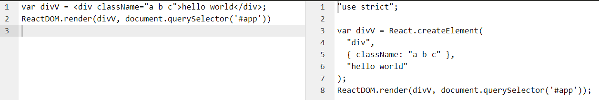
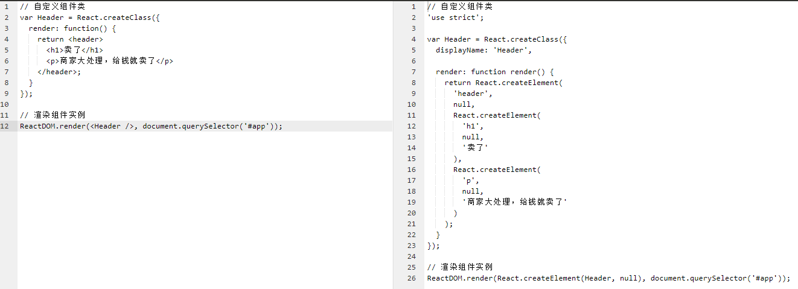
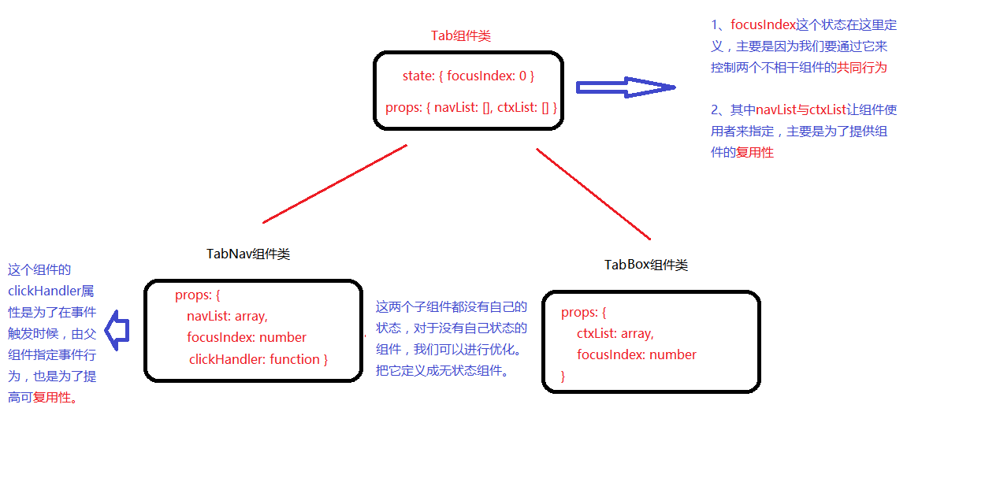

# React
- React 是一个用于构建`用户界面`的 JavaScript 库, 起源于 `Facebook` 内部项目, 于 `2013 年 5 月`开源
- React 专注于`组件化`开发, 使用纯 `javascript` 构建高可复用性的组件, 能够应对频繁的需求变化

#### 特点
- `JSX` 语法, 可加快开发效率, 增强可读性
- `虚拟` DOM 概念, 减少与 DOM 的交互
- `单向`响应数据流, 让组件简单好用

#### 资源
- [官网](https://facebook.github.io/react/)
- [中文文档](https://discountry.github.io/react/)
- [中文社区](http://react-china.org/)
- [阮一峰教程](http://www.ruanyifeng.com/blog/2016/09/react-technology-stack.html)

## 入门

#### 准备工作
- 开发 react 应用需要中引入两个js：`react.js` 与 `react-dom.js`
- `react.js` 的主要作用是`创建`虚拟 DOM
- `react-dom.js` 的主要作用是把虚拟 DOM 转为真实 DOM 然后进行`渲染`

#### 初体验
- 先使用 `React.createElement` 创建虚拟DOM
- 然后使用 `ReactDOM.render` 渲染虚拟DOM

```html
<html>
	<head>
	  <meta charset="UTF-8">
	  <title>React组件式开发</title>
	  <!-- 1、先引入react.js-->
	  <script src="react.js"></script>
	  <!-- 2、再引入react-dom.js-->
	  <script src="react-dom.js"></script>
	</head>
	<body>
	  <!-- 3、视图中定义一个占位标签 -->
      <div id="app"></div>
      <!-- 4、编写脚本 -->
      <script>
	      /**
	       * React.createElement用于创建虚拟DOM元素, 一般有三个参数：
	       * param1：元素类型
	       * param2：元素属性
	       * param3：子元素或文本
	       * 备注: 如果元素有多个子元素, 可以继续增加参数, 或者传一个数组
	       * */
	      var vDiv = React.createElement('div', { className: 'wrap' }, 'hello world!');
	      /**
	       * ReactDom.render用于渲染虚拟DOM元素：
	       * param1：要渲染的虚拟DOM
	       * param2：页面中的占位标签
	       * */
	      ReactDOM.render(vDiv, document.querySelector('#app'));
      </script>
	</body>
</html>
```

#### 元素添加行内样式
- 元素的`style`属性需要使用一个样式`对象`来描述
- 且样式对象中的`样式名称`需要使用`驼峰式`命名法来命令

```javascript
// 样式对象
var divStyle = {
	padding: 10,
	backgroundColor: 'skyblue',
	fontSize: 24
};

 // 创建div元素, 通过style属性设置行内样式
ReactDOM.render(
	React.createElement('div', { style: divStyle }, '玉龙雪山'),
	document.querySelector('#app')
);
```

#### 元素添加事件绑定
- `事件绑定`同样需要使用`属性`来完成, 并且采用`驼峰式`命名法
- 注意：绑定事件时`不要`加小括号`()`，加了函数会立即调用

```javascript
// 事件处理器会收到两个参数, 原生事件对象与react事件对象
function clickHandle(e, re) {
	console.log(e.target);
}

 // 创建div元素, 通过onClick属性监听点击事件
ReactDOM.render(
	React.createElement('div', { onClick: clickHandle }, '玉龙雪山'),,
	document.querySelector('#app')
);
```

#### 事件传参
- 如果需要给事件回调`传参`, 可以通过 `bind` 方法实现

```javascript
// 前面两个为10, 20, 后面两个为原生事件对象与React事件对象
function clickHandle() {
	console.log(arguments);
}

ReactDOM.render(
	React.createElement('div', { onClick: clickHandle.bind(10, 20) }, '玉龙雪山'),,
	document.querySelector('#app')
);
```

## 创建复杂的视图
- 上面创建的`元素`只有`一个`, 下面我们尝试着`创建`一些比较`复杂`的视图结构

#### 创建ul列表
- render方法必须基于一个`根元素`开始渲染
- 如果一组`兄弟元素`有多个, 需要分别设置唯一的`key属性`用于性能优化

```javascript
// 使用多个参数设置ul的子元素
ReactDOM.render(
	React.createElement('ul', { className: 'wrap' },
		React.createElement('li', { key: 1 }, '红葡萄酒'),
		React.createElement('li', { key: 2 }, '白葡萄酒'),
		React.createElement('li', { key: 3 }, '黄葡萄酒')
	),
	document.querySelector('#app'));
```

#### 基于数据动态生成ul列表
- 实际开发当中`数据`都是`写活`的, 至少会和视图做一定的分离

```javascript
// 列表数据
var list = [ '馄饨', '抄手', '包面', '云吞', '扁食' ];

// 使用数组的方式设置ul的子元素
ReactDOM.render(
	React.createElement('ul', { className: 'wrap' },
		list.map(v => React.createElement('li', { key: v }, v))
	),
	document.querySelector('#app'));
```

## 方法说明

#### React.createElement
- 用于创建虚拟DOM元素

| 参数序号 | 数据类型 | 描述信息 |
| - | - | - |
| 1 | String | 元素类型 |
| 2 | Object | 元素属性 |
| 3 | VDOM | Array<VDOM> | 一个或多个子元素 |

#### ReactDom.reader
- 用于渲染虚拟DOM

| 参数序号 | 数据类型 | 描述信息 |
| - | - | - |
| 1 | VDOM | 虚拟DOM |
| 2 | DOM | 占位标签, 页面中的真实DOM |

## JSX
- 一种`语法`规则, 能够在 `javascript` 中编写 `xml` 代码

#### 说明
- 创建`复杂`的 DOM 结构, 使用 `createElement` 方法显得很`繁琐`笨重, 且难以维护
- 同时React中也没有`模版`的概念, 所以我们可以使用 `jsx`, 以`类似`与`html`的方式创建虚拟 DOM
- 但是`浏览器`并不支持 jsx 语法，所以我们需要通过 `babel` 解析成普通的 `javascript` 然后执行

#### 小试牛刀

```html
<html>
	<head>
	  <meta charset="UTF-8">
	  <title>React组件式开发</title>
	  <script src="react.js"></script>
	  <script src="react-dom.js"></script>
	  <!-- 额外引入这个js即可使用jsx语法，这个js是由babel与babel-preset-react插件构成-->
	  <script src="browser.min.js"></script>
	</head>
	<body>
	    <!-- 视图占位 -->
        <div id="app"></div>

      <!-- 脚本编写, 因为浏览器无法运行含有jsx语法的脚本, 所以这里要把type改写为text/babel, 然交由babel解析执行 -->
      <script type="text/babel">
          // 把之前的createElement方法替换成xml标签来表示虚拟DOM
	      ReactDOM.render(
	      	<div className="a b c">牛逼轰轰</div>,
	      	document.querySelector('#app')
      	);
      </script>
	</body>
</html>
```

#### 转换前后比对
- [babel官网代码在线解析](http://babeljs.io/repl/)
- [babel中文网代码在线解析](http://babeljs.cn/repl/)
- 

## jsx表达式
- 上面在使用 `jsx` 创建的元素`数据`与类名都是`写死`的
- 如果要`写活`, 可以使用`表达式`语法, 其功能与使用和Vue中的模版表达式一样, 不过这里是`一对`大括号

#### jsx表达式中使用变量

```jsx
var className = 'a b c';
var content = '抱抱果';

ReactDOM.render(
	<div className={ className }>{ str }</div>,
	document.querySelector('#app')
);
```

#### jsx表达式中使用逻辑运算

```jsx
var className = 'a b c', hasClass = true;
var content = '抱抱果';

ReactDOM.render(
	<div className={ hasClass? className : '' }>{ str }</div>,
	document.querySelector('#app')
);
```

#### jsx表达式中调用方法

```jsx
function getContent() {
	return '爱我你就抱抱我';
}

ReactDOM.render(
	<div>{ getContent() }</div>;
	document.querySelector('#app')
);
```

#### jsx语法设置元素行内样式与事件监听
- `jsx` 就是把所有的 `React.createElement` 换成了 `xml` 的标签写法
- 然后使用表达式去引用外部的变量

```jsx
// 样式对象
var styleObj = {
	padding: 10,
	backgroundColor: 'skyblue',
	fontSize: 24
};

// 事件句柄
function clickHandle(e) {
	console.log(e.target);
}

// 事件绑定记得不要加小括号()调用
ReactDOM.render(
	<div style={ styleObj } onClick={ clickHandle } ></div>,
	document.querySelector('#app'));
```

#### jsx语法创建ul列表
- 使用 `React` 开发, 相比 `Vue` 与 `Angular` , 因为没有`指令`, 所以`函数`一定要用的溜

```jsx
var list = [ '馄饨', '抄手', '包面', '云吞', '扁食' ];

ReactDOM.render(
	<ul className="wrap">
	{
		list.map(v => <p key={ i }>{ val }</p>)
	}
	</ul>,
	document.querySelector('#app'));
```

#### jsx中添加注释
- 在 jsx 中写注释，最好在大括号{}中使用js的多行注释，否则会有问题

```jsx
var list = [ '馄饨', '抄手', '包面', '云吞', '扁食' ];
ReactDOM.render(
	<ul className="wrap">
	{
		list.map(function(val, i) {
			{ /* 内层的li组件 */ }
			return <p key={ i }>{ val }</p>;
		})
	}
	</ul>
	, document.querySelector('#app'));
```

## 自定义组件
- 为了达到复用的目的，有时候我们需要在内置组件的基础上创建自定义组件
- 创建自定义组件，要先创建组件类，然后才可以创建对应的组件实例

#### 自定义Header组件
- 先通过`React.createClass`方法创建组件类，然后就可以创建组件实例了
- 这里创建组件实例使用的是jsx语法`<Header />`，最终会转换成`React.createElement(Header)`

```jsx
// 自定义组件类
var Header = React.createClass({
	render: function() {
		return <header>
			<h1>卖了</h1>
			<p>商家大处理，给钱就卖了</p>
		</header>;
	}
});

// 渲染组件实例
ReactDOM.render(<Header />, document.querySelector('#app'));
```

###### 转换比对
- 可以在[中文网](http://babeljs.cn/repl/)与[官网](http://babeljs.io/repl/)做在线尝试
- 

###### 补充注意事项
- `React.createClass`方法传入一个配置对象
    + 其中有一个**render函数配置项**是必须的，不配置会报错
    + render必须要有**return**结果，return的标签也必须使用一个**根标签**包裹，否则也报错
-  `React.createClass`创建组件类需要使用变量接收存储
    + 这个变量名**首字母**必须**大写**，否则无法创建实例

#### 自定义Tab组件
- 这里案例基于已有的样式结构进行改造与学习
- 

###### 静态页面转react组件
- 需要注意jsx语法中的class属性要修改为className

```jsx
// tab组件类
var Tab = React.createClass({
	render: function() {
	  return <div className="wrapper" id="wrapper">
	    <ul className="tab" id="tab-menu">
	      <li className="tab-item active">国际大牌<span>◆</span></li>
	      <li className="tab-item">国妆名牌<span>◆</span></li>
	      <li className="tab-item">清洁用品<span>◆</span></li>
	      <li className="tab-item">男士精品</li>
	    </ul>
	    <div className="products" id="tab-main">
	      <div className="main selected">
	          <a href="###"></a>
	      </div>
	      <div className="main">
	          <a href="###"></a>
	      </div>
	      <div className="main">
	          <a href="###"></a>
	      </div>
	      <div className="main">
	          <a href="###"></a>
	      </div>
	    </div>
	  </div>;
	}
});

// 渲染到页面
ReactDOM.render(<Tab />, document.querySelector('#app'));
```

###### 抽取组件中的状态
- tab栏的文字与内容框内容可以抽取成组件状态使用
- `React.createClass`中有一个`getInitialState`配置项用于设置组件的状态
    + 这个配置项类似于vue组件中的data，同样要求是一个函数返回一个对象的形式

```jsx
// tab组件类
var Tab = React.createClass({

	// 定义组件状态，函数必须返回一个对象或null
	getInitialState: function () {
	  return {
	    navList: ['国际大牌', '国妆名牌', '清洁用品', '男士精品'],
	    contentList: ['imgs/guojidapai.jpg', 'imgs/guozhuangmingpin.jpg', 'imgs/qingjieyongpin.jpg', 'imgs/nanshijingpin.jpg'],
	    focusIndex: 0  // 用来控制当前所选tab的下标
	  };
	},

	render: function() {
      var _this = this;
      return (
      	<div className="wrapper" id="wrapper">
	        <ul className="tab" id="tab-menu">
	            {
		            this.state.navList.map(function(val, i){
		              return (
		              	<li className={ _this.state.focusIndex == i? 'tab-item active': 'tab-item' } key={ i }>{ val }
			                <span>◆</span>
			            </li>
		              );
		            })
	            }
	        </ul>
	        <div className="products" id="tab-main">
	            {
		            this.state.contentList.map(function(val, i){
		              return (
		              	<div className={ _this.state.focusIndex == i? 'main selected': 'main' } key={ i }>
		                    <a href="###"></a>
		                </div>
		              );
		            })
	            }
	        </div>
	    </div>;
      );
    }
});

// 渲染到页面
ReactDOM.render(<Tab/>, document.querySelector('#app'));
```

###### 功能实现 - DOM操作版本
- 实现`点击切换`tab的功能，首先需要以属性的方式进行`事件绑定`，注意`onClick驼峰式`写法
    + 指定`事件回调`，在createClass的配置项当中，除了定好的配置
    + 我们还可以添加一些自己的东西，这里面的东西最终会被添加到组件实例身上，我们可以通过实例来调用
- 另外在实现这个功能的时候我们需要得到用户所点击dom的下标，以此进行dom的切换处理
    + 这里可以巧妙的通过`bind`方法进行数据绑定以达到传参的目的

```jsx
var Tab = React.createClass({

    // 该函数用于定义组件状态，函数必须返回一个对象或null
    getInitialState: function () {
      return {
        navList: ['国际大牌', '国妆名牌', '清洁用品', '男士精品'],
        contentList: ['imgs/guojidapai.jpg', 'imgs/guozhuangmingpin.jpg', 'imgs/qingjieyongpin.jpg', 'imgs/nanshijingpin.jpg'],
        focusIndex: 0  // 用来控制当前所选tab的下标
      };
    },

    // 拿到要切换到的下标，修改页面dom
    changeTab: function(index) {
        var navs = document.querySelectorAll('.tab-item');
        var ctxs = document.querySelectorAll('.main');

        // 遍历元素，下标与index对上的都是要展示的元素，添加额外class，否则不加
        navs.forEach(function(nav, i) {
          if(index == i) {
            nav.className = 'tab-item active';
          }else {
            nav.className = 'tab-item';
          }
        });
        ctxs.forEach(function(ctx, i) {
          if(index == i) {
            ctx.className = 'main selected';
          }else {
            ctx.className = 'main';
          }
        });
    },

    render: function() {
      var _this = this;
      return <div className="wrapper" id="wrapper">

        {/* tab导航栏 */}
        <ul className="tab" id="tab-menu">
          {
            _this.state.navList.map(function(val, i){
              return (
              	<li className={ _this.state.focusIndex == i? 'tab-item active': 'tab-item' }
	                onClick={ _this.changeTab.bind(_this, i) } key={ i }>
	                { val }
	                <span>◆</span>
	            </li>
              );
            })
          }
        </ul>

        {/* tab内容框 */}
        <div className="products" id="tab-main">
          {
            _this.state.contentList.map(function(val, i){
              return (
              	<div className={ _this.state.focusIndex == i? 'main selected': 'main' } key={ i }>
                    <a href="###"></a>
                </div>
              );
            })
          }
        </div>;
      </div>;
    }
});

// 渲染到页面
ReactDOM.render(<Tab />, document.querySelector('#app'));
```

###### 功能实现 - 状态操作版本
- 上面在实现切换功能时使用了大量的dom操作，如果可以`摒弃`繁琐的`dom操作`，通过`状态`来控制它们就好了
- react组件专门提供了一个`setState`方法专门用于`修改组件`的状态，修改后react会`自动刷新`视图
    + 如果以`手动赋值`的方式修改状态，视图是`不会刷新`的
    + 必须通过`setState`方法修改状态，react才可以得知状态变化`刷新视图`

```jsx
var Tab = React.createClass({

    // 该函数用于定义组件状态，函数必须返回一个对象或null
    getInitialState: function () {
      return {
        navList: ['国际大牌', '国妆名牌', '清洁用品', '男士精品'],
        contentList: ['imgs/guojidapai.jpg', 'imgs/guozhuangmingpin.jpg', 'imgs/qingjieyongpin.jpg', 'imgs/nanshijingpin.jpg'],
        focusIndex: 0  // 用来控制当前所选tab的下标
      };
    },

    // 切换tab栏，内部通过组件实例的setState方法修改状态，修改后视图会自动刷新
    changeTab: function(index) {
      this.setState({
        focusIndex: index
      });
    },

    render: function() {
      var _this = this;
      return <div className="wrapper" id="wrapper">

        {/* tab导航栏 */}
        <ul className="tab" id="tab-menu">
          {
            _this.state.navList.map(function(val, i){
              return (
              	<li className={ _this.state.focusIndex == i? 'tab-item active': 'tab-item' }
	                onClick={ _this.changeTab.bind(_this, i) } key={ i }>
	                { val }
	                <span>◆</span>
	            </li>
              );
            })
          }
        </ul>

        {/* tab内容框 */}
        <div className="products" id="tab-main">
          {
            _this.state.contentList.map(function(val, i){
              return (
              	<div className={ _this.state.focusIndex == i? 'main selected': 'main' } key={ i }>
                    <a href="###"></a>
                </div>
              );
            })
          }
        </div>;
      </div>;
    }
});

// 渲染到页面
ReactDOM.render(<Tab />, document.querySelector('#app'));
```

###### 组件数据传递
- 上面的组件使用设计上有一些不足，比如使用组件时想要更换数据，我得修改组件源代码
- 如果能够在使用的时候去指定组件中渲染的数据就更好了
- 数据传递 - 原理类似vue中数据父传子
    + React中通过标签**属性**的方式进行**数据传递**，子组件有一个只读对象**props**来拿到值
    + 这其实就是vue中数据父传子的方式：父通过属性把值传给子，子通过props接收，基本理念是一样一样的

```jsx

```

###### 抽取子组件
- 为了让组件**可复用**性更强，所以我们把tab导航与tab内容做成两个子组件，这样我们就要设计到父子数据的传递
- 同时两个组件有一个公共的状态`focusIndex`，两个不相干的组件如何使用共同状态呢
    + 把这个状态定义在他们的父组件中，由父传递给子，这样保证两者所用数据保持一致
- 另外一个问题是，我们需要在tab导航组件中监听事件，修改父的`focusIndex`数据，怎么办呢
    + 修改父级数据 - 原理类似vue中数据子传父
    + 在React中我们可以把父组件中的`函数`传递给子组件，`子组件`在合适的时机`调用`即可实现数据传递
    + 这其实就是vue中数据子传父的方式：子通过自定义事件的方式触发父中函数的调用，从而传递参数

```jsx
// tab导航子组件
var TabNav = React.createClass({
    render: function() {
      var _this = this;
      return (
        <ul className="tab" id="tab-menu">
          {
            {/* 通过实例.propts拿到来自父的数据 */}
            _this.props.navList.map(function(val, i){
              return (
              	<li className={ _this.props.focusIndex == i? 'tab-item active': 'tab-item' }
	              	{/* 通过调用父提供的方法实现子传父 */}
	                onClick={ _this.props.changeTab.bind(null, i) } key={ i }>
	                { val }
	                <span>◆</span>
	            </li>
              )
            })
          }
        </ul>
      );
    }
});

// tab内容
var TabContent = React.createClass({
    render: function() {
      var _this = this;
      return (
        <div className="products" id="tab-main">
          {
            _this.props.contentList.map(function(val, i){
              return (
              	<div className={ _this.props.focusIndex == i? 'main selected': 'main' } key={ i }>
                    <a href="###"></a>
                </div>
              );
            })
          }
        </div>
      );
    }
});

// tab容器
var Tab = React.createClass({

    // 该函数用于定义组件状态，函数必须返回一个对象或null
    getInitialState: function () {
      return {
        navList: ['国际大牌', '国妆名牌', '清洁用品', '男士精品'],
        contentList: ['imgs/guojidapai.jpg', 'imgs/guozhuangmingpin.jpg', 'imgs/qingjieyongpin.jpg', 'imgs/nanshijingpin.jpg'],
        focusIndex: 2  // 用来记录当前tab的下标
      };
    },

    // 切换tab栏，内部通过组件实例的setState方法修改状态，修改后视图会自动刷新
    changeTab: function(index) {
      this.setState({
        focusIndex: index
      });
    },

    render: function() {
      var _this = this;
      return (
        <div className="wrapper" id="wrapper">
          {/* tab导航栏 */}
          <TabNav navList={ this.state.navList } focusIndex={ this.state.focusIndex } changeTab={ this.changeTab }  />
          {/* tab内容框 */}
          <TabContent contentList={ this.state.contentList } focusIndex={ this.state.focusIndex }  />
        </div>
      );
    }
});

ReactDOM.render(<Tab/>, document.querySelector('#app'));
```

###### 无状态组件
- 在react中，如果一个组件只有props，没有state，那么可以写成无状态组件
- 无状态组件要比传统组件更加轻量级，创建时更快，简单好维护
- 无状态组件的写法很简单，需要我们提供一个具有返回值的构造函数，这个函数可以接收props来使用


```
// tab导航 - 无状态组件
var TabNav = function(props) {
    return (
      <ul className="tab" id="tab-menu">
        {
          props.navList.map(function(val, i){
            return (
            	<li className={ props.focusIndex == i? 'tab-item active': 'tab-item' }
	              onClick={ props.changeTab.bind(null, i) } key={ i }>
	              { val }
	              <span>◆</span>
	            </li>
            );
          })
        }
      </ul>
    );
};

// tab内容 - 无状态组件
var TabContent = function(props) {
    return (
      <div className="products" id="tab-main">
        {
          props.contentList.map(function(val, i){
            return (
            	<div className={ props.focusIndex == i? 'main selected': 'main' } key={ i }>
	                <a href="###"></a>
	            </div>
            );
          })
        }
      </div>
    );
}

// tab容器
var Tab = React.createClass({

    // 该函数用于定义组件状态，函数必须返回一个对象或null
    getInitialState: function () {
      return {
        navList: ['国际大牌', '国妆名牌', '清洁用品', '男士精品'],
        contentList: ['imgs/guojidapai.jpg', 'imgs/guozhuangmingpin.jpg', 'imgs/qingjieyongpin.jpg', 'imgs/nanshijingpin.jpg'],
        focusIndex: 2  // 用来记录当前tab的下标
      };
    },

    // 切换tab栏，内部通过组件实例的setState方法修改状态，修改后视图会自动刷新
    changeTab: function(index) {
      this.setState({
        focusIndex: index
      });
    },

    render: function() {
      var _this = this;
      return (
        <div className="wrapper" id="wrapper">
          {/* tab导航栏 */}
          <TabNav navList={ this.state.navList } focusIndex={ this.state.focusIndex } changeTab={ this.changeTab }  />
          {/* tab内容框 */}
          <TabContent contentList={ this.state.contentList } focusIndex={ this.state.focusIndex }  />
        </div>
      );
    }
});

ReactDOM.render(<Tab/>, document.querySelector('#app'));
```

## 总结

#### 组件创建与渲染
- React.createClass：用于创建组件类
- React.createElement：用于创建组件实例
- ReactDOM.render：用于渲染组件实例

#### jsx语法
- 就是在js中书写xml，xml的特点就是标签与标签属性不受限，可以由开发者任意创造
- 为了便于web开发，react内置了各种h5标签组件，以及对h5标签的特殊属性都做了处理，我们可以在此基础上创建各种自定义组件
- 为了让xml编写更加灵活，jsx中可以通过代码块{}来嵌入脚本，实现更高的灵活性，这也让我们的js相比vue会多不少

#### 组件状态
- 现在大部分页面都是动态的，其中大多数的功能都会和数据挂钩
- 这些数据我们称其为状态，通常状态发生变化，组件内容或样式会跟着进行更新
- 在创建组件类的时候，我们可以通过getInitialState配置项来设置组件的初始状态
- 当状态发生变化时，我们可以通过setState方法来修改状态，这样做的目的是为了让React自动更新视图

#### 父子组件数据传递
- React的开发思想是把页面的每个功能拆分成一个个组件，然后进行各种组合、嵌套构成我们的页面
- 这样多个组件之间，可能就需要数据的共享与传递，React中数据的通信主要是通过props只读对象来完成
- 数据父传子：把数据通过属性方式传给子，子通过props对象进行访问
- 数据子传父：把函数通过属性方式传给子，子在特定的时机通过调用方法把数据传给父使用
- 兄弟间数据共享：把共享的数据放置到他们共同的父组件上，然后父通过属性下发给不同的子进行共享

## 双向数据绑定
- 在angular与vue中，我们可以通过model指令实现表单数据双向绑定
- 但react中因为没有指令，我们可以通过监听表单onChange事件来模拟实现

```javascript
var Timer = React.createClass({

	// 设置初始状态
    getInitialState: function() {
      return {
        content: 'Hello'
      };
    },

	// 表单变化事件处理器
    changeHandler: function(e) {
      this.setState({
        content: e.target.value
      });
    },

	// 指定组件渲染内容
    render: function() {
      return (
        <div>
          <input value={ this.state.content } onChange={ this.changeHandler }/>
          <p>{ this.state.content }</p>
        </div>
      );
    }
});

ReactDOM.render(<Timer/>, document.querySelector('#app'));
```

## DOM获取
- 大部分情况下我们都是通过 `setState` 方法修改状态，触发`视图`自动更新，但是偶尔也需要进行 `DOM` 操作
- React 中可以通过 `ref` 属性对元素进行标记，然后通过组件的 `refs` 属性拿到对应元素
- `refs` 是访问组件内部DOM的`唯一`可靠方法；当子组件`销毁`时会自动释放引用

```javascript
// 定义一个组件, 组件内的input会自动获得焦点
var Timer = React.createClass({

	// 设置初始状态
    getInitialState: function() {
      return {
        content: 'Hello'
      };
    },

    // 组件渲染后自动被调用，内部通过refs拿到渲染好的input元素，获取焦点
    componentDidMount: function() {
    	this.refs.textInput.focus();
    },

	// 表单变化事件处理器
    changeHandler: function(e) {
      this.setState({
        content: this.refs.textInput.value
      });
    },

	// 指定组件渲染内容
    render: function() {
      return (
        <div>
          <input value={ this.state.content } onChange={ this.changeHandler } ref='textInput'/>
          <p>{ this.state.content }</p>
        </div>
      );
    }
});

ReactDOM.render(<Timer/>, document.querySelector('#app'));
```

## 自定义组件内容
- 有时候我们使用一个组件，想`自定义`这个组件的部分`内容`，让组件用起来更加灵活
- 比如我们有一个漂亮的`相框组件`，里面可以由组件使用者`填充子元素`，再完美不过了
- 在react中使用某个组件时，是可以嵌套子组件的，可以通过props.children拿到组件调用者传递的子组件

```javascript
// 相框外边框组件
function PhotoBox(props) {
    var style = {
    margin: '30px 10px',
    display: 'inline-block',
    verticalAlign: 'top',
    width: 200,
    height: 300,
    border: '4px solid pink',
    textAlign: 'center'
  };

  return (
    <div style={ style }>
      { props.children }
    </div>
  );
}

// 相框组件
function PhotoBoxList(props) {
  return (
    <section>
      <PhotoBox>
        <h2>不看会后悔</h2>
        <p>md, 看了后悔一辈子</p>
      </PhotoBox>
      <PhotoBox>
        <h2>错过就没了</h2>
        <p>bd, 我宁愿错过</p>
      </PhotoBox>
      <PhotoBox>
        <h2>一本震惊</h2>
        
      </PhotoBox>
    </section>
  );
}

ReactDOM.render(<PhotoBoxList/>, document.querySelector('#app'));
```

## 生命周期钩子函数
- 与 Vue 一样, 对于`有状态`组件 React 同样提供了贯穿组件`生命周期`的钩子`函数`
- [参考资料](https://race604.com/react-native-component-lifecycle/)


#### 准备工作
- 创建一个 App `根组件`, 再创建一个 AppHeader `子组件`
- `App` 组件用于控制 `AppHeader` 子组件 的`显示隐藏`与`参数传递`, 以做完整的`钩子函数`测试

```jsx
// 子组件, 用于测试使用
var AppHeader = React.createClass({

	getInitialState() {
		return {
			count: 0
		};
	},

	render() {
		return (
			<div>
				{ /* 显示props数据 */ }
				<h2>{ this.props.title }</h2>
				{ /* 显示state数据, 点击还可修改state数据 */ }
				<p onClick={ function() { this.setState({ count: ++this.state.count }) } }>{ this.state.count }</p>
			</div>
		);
	}
});

// 根组件
var App = React.createClass({

	getInitialState() {
		return {
			isShow: true,
			title: '首页'
		};
	},

	render() {
		return (
			<main>
				{ /* 控制子组件显示隐藏, 并把title传递过去 */ }
				{ this.state.isShow && <AppHeader msg={ this.state.title }/> }
				<button>{ this.state.isShow? '隐藏': '显示' }</button>
			</main>
		);
	}
});

// 渲染根组件到视图
ReactDOM.render(
	<App/>,
    document.querySelector('#app')
);
```

#### 定义阶段
- getDefaultProps: 设置默认的 `props` , 在组件`声明`阶段执行, `全局1次`
- 该函数会在`定义`组件的那一刻`执行`, 有没有使用该组件渲染视图并不会影响其执行

```jsx
// 子组件, 用于测试使用
var AppHeader = React.createClass({

	// 设置默认props, 这时候props与state都不能使用
    getDefaultProps() {
        console.log(this.props);   // undefined
        console.log(this.state);    // undefined
        return {
            title: '默认值'
        };
    },

	getInitialState() {...},

	render() {...}
});
```

#### 初始化阶段
- getInitialState: 设置初始的 `state` , 在组件`实例化`阶段执行, 每个实例`1次`
    + 功能作用类似于 `Vue` 中的 `data` 配置项

```jsx
// 子组件, 用于测试使用
var AppHeader = React.createClass({

	// 设置初始状态, 这时候props可以使用了, 但是state不行
	getInitialState() {
		console.log(this.props);   // 有值
        console.log(this.state);    // null
		return {
			count: 0
		};
	},

	render() {...}
});
```

#### 渲染阶段
- componentWillMount：`挂载前`，1次
    + 一般会把ajax请求放置到这里来写
- componentDidMount：`挂载后`，1次
    + 在这里可以进行初始dom操作


```javascript
var Test = React.createClass({

  render: function() {
    return (
      <div>
        <p ref='p1'>{ this.props.propsList }</p>
        <p ref='p2'>{ this.state.stateList }</p>
      </div>
    );
  },

  getDefaultProps: function() {
    return {
      propsList: [ 22, 44, 66, 88 ]
    };
  },

  getInitialState: function() {
    return {
      stateList: [ 1, 3, 5, 7, 9 ]
    };
  },

  // 挂载前，首次可以使用state，在这里一般会发送ajax请求数据
  componentWillMount: function() {
    console.log('componentWillMount');
    console.log(this.state);
    console.log(this.refs);
  },

  // 挂载后，首次课可以使用refs，这里可以进行dom操作
  componentDidMount: function() {
    console.log('componentDidMount');
    console.log(this.state);
    console.log(this.refs);
  },

  // 卸载前，可以清除一些react无法销毁的东西，比如未停止的定时器
  componentWillUnmount: function() {
    console.log('componentWillUnmount');
    console.log(this.state);
    console.log(this.refs);
  }

});

var Wrap = React.createClass({

  getInitialState: function() {
    return {
      isShow: true
    };
  },

  clickHandler: function() {
    this.setState({
      isShow: !this.state.isShow
    });
  },

   render: function() {
     return (
       <div>
        { this.state.isShow? <Test/>: '' }
        <button onClick={ this.clickHandler }>显示隐藏</button>
       </div>
     );
   }
});

ReactDOM.render(<Wrap/>, document.querySelector('#app'));
```

#### `属性状态更新`函数
- shouldComponentUpdate( nextProps, nextState )：收到变化消息，至少0次
    + 这个钩子必须返回一个布尔值用于告知react是否要进行视图刷新，可用于性能优化
- componentWillUpdate( nextProps, nextState )：视图刷新前，至少0次
    + 这时候this.props还未更新, 但是this.state已经更新了
- componentDidUpdate( prevProps, newState )：视图刷新后，至少0次
    + 这时候this.props与this.state都已经更新了

```javascript
var Timer = React.createClass({

  getInitialState: function() {
    return {
      startTime: 0,                   // 记录按下开始按钮时的时间
      duration: 0,                    // 已运行时间
      valId: null
    };
  },

  start: function() {
    this.state.startTime = Date.now();

    this.state.valId = setInterval(function() {
      this.setState({
        duration: Date.now() - this.state.startTime
      });
    }.bind(this), 13);
  },

  end: function() {
    clearInterval(this.state.valId);
  },

  render: function() {
    return (
      <div>
        <p>{ this.state.duration }</p>
        <button onClick={ this.start }>开始</button>
        <button onClick={ this.end }>结束</button>
      </div>
    )
  },

  // 当属性或状态更新时被调用，必须返回true或false来告诉react要不要刷新视图
  shouldComponentUpdate: function() {
    console.log('shouldComponentUpdate');
    return false;
  },

  // 数据更新时，刷新视图之前
  componentWillUpdate: function() {
    console.log('componentWillUpdate');
  },

  // 数据更新时，刷新视图之后
  componentDidUpdate: function() {
     console.log('componentDidUpdate');
  },

  // 卸载后防止内存泄漏，尝试停止定时器
  componentWillUnmount: function() {
    clearInterval(this.state.valId);
  }

});

ReactDOM.render(<Timer/>, document.querySelector('#app'));
```

#### 组件`渲染`函数
- render：渲染时，至少1次
    + 提供组件的视图内容

#### `特殊`函数
- componentWillReceiveProps：将要修改属性，至少0次
    + props变化时，回先执行这个函数，我们可以视情况修改相关联的state

#### 销毁阶段
- componentWillUnmount：`卸载后`，1次
    + 这里一般停止或清除一些react无法销毁的东西，比如定时器

#### 生命周期函数整理

