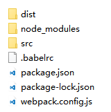
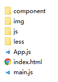

# React-ES6
- React 专门针对 `ES6` 语法特点设计了`可选`的组件定义方式
- [中文文档](https://doc.react-china.org/)

#### 注意事项
- 组件名称`首字母`必须`大写`
- 元素的 `class` 属性要写成 `className`
- 事件绑定需要使用`驼峰式`命名，比如 `onClick` 、`onMouseDonw`

#### 与ES5的区别
- 使用 `defaultProps` 静态成员定义默认 `props`
- 使用 `state` 实例成员在`构造器`中定义初始 `state `
- `事件`回调中的 `this` 不再指向组件实例, 如有需要我们自己可以通过 `bind` 方法修改

```jsx
// 定义组件类，然后继承React库提供的Component类即可
class Test extends React.Component {

	// 构造函数里面负责定义实例的state
    constructor(props) {
        super(props);

        // 通过实例属性的方法定义初始state
        this.state = {
            title: '报告'
        };
    }

    render() {
        return (
            <div>
                <h1>{ this.state.title }</h1>
                <p>{ this.props.msg }</p>
            </div>
        );
    }
}

// 通过静态属性的方式定义默认props
Test.defaultProps = {
    msg: '总有刁民想害朕'
};

ReactDOM.render(
    <Test />,
    document.querySelector('#app')
);
```

# 豆瓣电影

## 项目搭建

#### 安装依赖
- 

#### 根目录结构


#### src目录结构


#### webpack配置 - webpack.config.js
```javascript
var path = require('path');  // 因为部分配置需要绝对路径，导入path计算

// 引入webpack插件
var webpack = require('webpack');  // 自身有一些优化插件，用到了公共模块抽取查插件，压缩混淆js插件
var htmlPlugin = require('html-webpack-plugin');  // html处理
var cleanPlugin = require('clean-webpack-plugin');  // 删除文件
var extractTextPlugin = require('extract-text-webpack-plugin'); // 抽取公共css
var optimizeCssAssetsPlugin = require('optimize-css-assets-webpack-plugin'); // 压缩css

// 抽取css的loader配置
var cssConfig = extractTextPlugin.extract( {fallback: "style-loader", use: ["css-loader"]} );
var lessConfig = extractTextPlugin.extract( {fallback: "style-loader", use: ["css-loader", "less-loader"]} );
var sassConfig = extractTextPlugin.extract( {fallback: "style-loader", use: ["css-loader", "sass-loader"]} );

// webpack主配置
var config = {

  // 入口模块
  entry: {
    main: path.resolve(__dirname, 'src/main.js'),
    libs: ['react', 'react-dom']
  },

  // 输出路径
  output: {
    path: path.resolve(__dirname, 'dist'),
    filename: '[name]_[chunkhash:8].js'
  },

  // 模块配置
  module: {
    rules: [
      // css模块
      { test: /\.css$/, use: cssConfig },

      // less模块
      { test: /\.less$/, use: lessConfig },

      // sass模块
      { test: /\.(sass|scss)$/, use: sassConfig },

      // html模块
      { test: /\.(html|tpl)$/, use: [ 'html-loader' ] },

      // url模块
      { test: /\.(jpg|jpeg|png|gif|svg)$/, use: ['url-loader' ] },

      // js模块
      { test: /\.js$/, use: [ 'babel-loader' ], exclude: /node_modules/ }
    ]
  },

  // 插件配置
  plugins: [

    // 清除dist目录
    new cleanPlugin(['dist']),

    // html处理
    new htmlPlugin({
      template: 'src/index.html',
      filename: 'index.html',
      inject: 'body',
      minify: {
        collapseWhitespace:true, // 合并空白字符
        removeComments:true, // 移除注释
        removeAttributeQuotes:true // 移除属性上的引号
      }
    }),

    // js处理 => 公共抽取，压缩混淆
    new webpack.optimize.CommonsChunkPlugin({
      name: 'lib',
      chunks: [ 'main', 'libs' ]
    }),
    new webpack.optimize.UglifyJsPlugin(),

    // css处理 => 样式提取，压缩
    new extractTextPlugin('css/bundle.css'),
    new optimizeCssAssetsPlugin()
  ]

};

module.exports = config;
```

#### babel配置 - .babelrc
```json
{
	"presets": [
		"react",
		[
			"env",
		   {
		        "targets": {
		          "browsers": ["last 3 versions", "ie >= 8"]
		        }
	  		}
         ]
	],
	"plugins": [ "transform-runtime" ]
}
```

## 环境测试

#### index.html
- 修改 `src/index.html` ,页面中添加一个`占位标签`

```html
<body>
  <main id="app"></main>
</body>
```

#### App.jsx
- 创建 `src/component/App.jsx` , 定义并导出`根组件`

```javascript
// 导入第三方包
import React from 'react';

// 导出根组件
export default class App extends React.Component {
  render() {
    return (
      <h1>测试</h1>
    );
  }
}
```

#### main.js
- 创建 `src/main.js` , 导入`根组件`然后`渲染`到页面

```javascript
// 导入第三方包
import React from 'react';
import { render } from 'react-dom';

// 导入根组件
import App from './component/App.jsx';

// 渲染到视图
ender(<App />, document.getElementById('app'));
```

## 豆瓣API
- 我们的案例使用的是由豆瓣提供的开放接口，下面列出了所使用的接口 url 与跨域配置

#### API信息
- 
- http://api.douban.com/v2/movie/in_theaters       【正在热映】
- http://api.douban.com/v2/movie/coming_soon   【即将上映】
- http://api.douban.com/v2/movie/top250              【top250】

#### 代理配置
- 但是我们案例所使用的域名与豆瓣不一样，所以会遭到浏览器的跨域访问限制
- 这里我们直接使用webpack-dev-server工具提供的代理功能即可解决问题
- 在webpack的配置文件中添加如下配置信息

```javascript
// webpack-dev-server配置
devServer: {
	contentBase: path.resolve(__dirname, 'dist'),
	publicPath: '/',
	historyApiFallback: true,
	open: true,
	// 代理配置，/v2的请求转发到'http://api.douban.com'
	proxy: {
	  '/v2/*': {
	    target: 'https://api.douban.com',
	    secure: false,
	    compress: true,
	    changeOrigin: true
	  }
	}
}
```

#### 测试
- 修改 `src/component/App.js` , 在 `componentWillMount` 钩子函数中请求接口数据
- 注意这里使用的是 `fetch` API, 它返回一个 `Promise` 实例, 需要通过 `then` 拿到 `response` 对象

```javascript
import React from 'react';

// 导出根组件
export default class App extends React.Component {
    render() {
        return (
            <main>根组件</main>
        );
    }

    // 最早可使用state的钩子函数, 相当与Vue中的created
    componentWillMount() {
        // 接口前面不要加豆瓣域名, 而是请求本地webpack-dev-server工具启的服务,
        // 这个工具发现请求的path为/v2开头, 那么就会自动帮我们去豆瓣拿数据然后返给我们
        fetch('/v2/movie/in_theaters')
        .then(rsp => rsp.json())
        .then(json => console.log(json));
    }
}
```

## 集成Ant Design
- 这里我们使用阿里开发的一款基于 `React` 的开源UI框架 `Ant Design`
- 
- 安装依赖包：`npm i  antd`

#### 按需加载说明
- 这个UI框架提供了很多组件与对应的样式，由于我们只使用其中的一部分
- 所以我们配置一下按需加载，官方也建议我们这样做
- 安装依赖包：`npm i  babel-plugin-import -D`

#### 按需加载配置
- 修改`.babelrc`文件中的`plugins`配置项

```json
{
    "plugins":["transform-runtime", ["import", { "libraryName": "antd", "style": "css" }]]
}
```

#### 测试
- 在 `src/component/App.js` 中引入 `DatePicker` 日期组件进行测试

```javascript
// 导包
import React, { Component } from 'react';

// 导入项目要使用的Antd组件
import { DatePicker } from 'antd';

// 根组件
export default class App extends Component {
  render() {
    return (
      <div>
        <h1>测试</h1>
        <DatePicker />
      </div>
    );
  }
}
```

## 首页布局
- 在 App.js 中，使用UI组件库提供的 `Layout` 组件进行框架主体布局，然后进行调整

```jsx
// 导包
import { Component } from 'react'

// 导入antd组件
import { Layout, Menu } from 'antd';
const { Header, Content, Footer } = Layout;

// 引入自己的样式表
import './css/App.css'

// 定义根组件
export default class App extends Component {
    render() {
        return (
	        <Layout className="layout">

	            <Header>
	                <div className="logo"/>
	                <Menu theme="dark" mode="horizontal"
              			defaultSelectedKeys={['1']} style={{ lineHeight: '64px' }}>
	                    <Menu.Item key="1">1</Menu.Item>
	                    <Menu.Item key="2">2</Menu.Item>
	                    <Menu.Item key="3">2</Menu.Item>
	                </Menu>
	            </Header>

	            <Content style={{height: '100%'}}>
	                <div style={{background: '#fff', minHeight: 280, height: '100%'}}>
	                    content
	                </div>
	            </Content>

	            <Footer style={{textAlign: 'center'}}>
	                传智播客 ©2017 黑马程序员
	            </Footer>

	        </Layout>
        );
    }
}
```

## 集成react-router
- 
- 

#### 安装
- 命令：`npm install react-router-dom`

#### 导入
- 在 `React` 中一切`皆组件`，所以`路由`的使用方式也是依靠`组件`实现的
- 在 `src/component/App.js` 根组件中`导入`基本所需的`三个`路由组件

```javascript
// 导包
import { Component } from 'react'
import { HashRouter as Router, Link, Route } from 'react-router-dom';
```

#### 使用
- 使用 `Router` 组件把根容器组件`Layout`包裹起来
- 注意：Router组件内只能包裹`一个`根元素，不能有其他兄弟元素，否则报错

```javascript
<Router>
	<Layout className="layout" style={{ height: '100%' }}></Layout>
</Router>
```

#### Link组合使用
- 把需要`导航`的地方使用`Link`组件包裹起来

```javascript
<Header>
    <div className="logo" />
    <Menu theme="dark" mode="horizontal"
      defaultSelectedKeys={['1']} style={{ lineHeight: '64px' }}>
      <Menu.Item key="1">
        <Link to="/">首页</Link>
      </Menu.Item>
      <Menu.Item key="2">
        <Link to="/movie">电影</Link>
      </Menu.Item>
      <Menu.Item key="3">
        <Link to="/about">关于</Link>
      </Menu.Item>
    </Menu>
</Header>
```

#### Route组件使用
- 使用Route组件`占位`，并配置`path`与`component`属性，指定路由规则
- 注意：path路由规则默认是进行`模糊匹配`，可通过添加`exact`属性，将其设置为`严格匹配`
```javascript
<Route exact path="/" component={ Home }/>
<Route path="/movie" component={ Movie }/>
<Route path="/about" component={ About }/>
```

#### 页面组件
- 在component目录下创建三个页面级组件，然后在App组件中导入使用

## 电影页面组件

#### 布局
- 左侧的导航我们是从Layout中一个含有左侧导航的例子中提取的代码，然后进行的改造

#### 电影列表子组件
- 首先把项目的src/component目录结构进了调整，给每个页面级组件都单独创建了一个文件夹
    + /components/home
    + /components/about
    + /components/movie
- 然后在/components/movie/sub/list.js中创建了一个电影列表子组件
- 这个子组件需要根据路由参数请求不同的接口，这些路由参数可以从props属性中提取

```javascript
import React, { Component } from 'react';

// 定义电影页面的列表子组件
export default class MovieList extends Component {

  // 因为这个组件是route路由组件负责引入的，它在引入的时候给这个组件传入了3个url相关的参数
  constructor(props) {
    super(props);
    console.log(props.match.params.type);
  }

  render() {
    return (
      <div>电影列表组件</div>
    )
  }

  // 在组件挂载前，先根据url中的type参数，请求一次接口
  componentWillMount() {
    var type = this.props.match.params.type;
    var url = '/v2/movie/';
    if(type == 're') {
      url += 'in_theaters ';
    }else if(type == 'ji') {
      url += 'coming_soon';
    }else if(type == 250) {
      url += 'top250';
    }

    fetch(url)
      .then( resp => resp.json() )
      .then( data => console.log(data) );
  }

  componentWillReceiveProps() {
    console.log('type变化了，要重新请求接口')
  }
}
```
