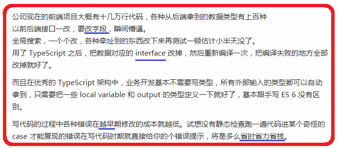

# TypeScript

## 简介
- TypeScript是一种由微软开发的自由和`开源`的编程语言，它是JavaScript的一个`超集`，扩展了JavaScript的语法
- TypeScript如它的名字一样,最广为人知的特点是增加了类型系统,是一门`强类型`语言
- 相比弱类型语言,丢失了灵活性,但在编写大型项目时会降低程序复杂度,在编译时发现问题,减少bug增强程序健壮性

#### 特性
- 兼容ES6
- 强类型
- 枚举
- 泛型
- 类
- 接口
- 装饰器

#### 资料
- [官网](http://www.typescriptlang.org/)
- [中文网](https://www.tslang.cn/index.html)

#### 使用说明
- typeScript无法直接在`浏览器`当中运行,所以使用ts需要先安装对应的`编译器`
- 这个编译器的作用`类似`与我们之前使用`less`或`sass`编译器,它可以把ts转换为浏览器支持的标准语法

#### 编译器安装
- 这里安装需要确保本地已经拥有`npm`包管理工具

``` bash
# 安装命令
npm install -g typescript
# 检测命令
tsc -v
```

#### 编译器使用
- 创建holle.ts文件,typescript编写的脚本使用ts作为`后缀名`,这个与less/sass也一样
- 运行编译命令: `tsc hello.ts`, 就会生成对应的es5js文件

```typescript
class Person {
  public name: string;
  public age: number;
  constructor(name: string, age: number) {
    this.name = name;
    this.age = age;
  }
  speak(): void {
    console.log(`${this.name}今年${this.age}岁了`);
  }
}
let xiaoming = new Person('小明', 16);
xiaoming.speak();
```

#### 配置文件使用
- 在使用编译ts脚本时, 有时候需要我们明确指定一些`编译规则`
- 比如要指定`编译后`的js为`es3`还是`es5`还是`es6`, 或者启用处于实现阶段的`新特性`, 比如装饰器
- 都需要我们通过`tsconfig.json`配置文件来指定


# 类型

## 为什么要类型
- 使用typeScript的类型定义可以让工具更早的帮我们分析出潜在bug与隐患
- 下面通过一个小例子给大家演示类型的好处与弊端

#### javascript
- 假如我们做一个加法运算,求两数之和
- 如果没有类型检测,我们很有可能会不小心和一个字符串相加,从而产生bug

```javascript
let a = 10;
let b = '20';
let c = 30;
let sum = a + b + c; // 102030
```

#### typescript
- 如果使用typescript编写上面的代码,然后进行编译
- 你会发现详细的`错误提示`,这样显著`提升`了程序的健壮性
- 当然缺点也是有的,即`失去`了js原本的简洁性,增加编码量

```typescript
let a: number = 10;
let b: string = '20';
let c: number = 30;
let sum: number = a + b + c;
```

## 基本类型

#### number类型
- 数字类型的变量的只能赋值为数字,`不区分`整数与`小数`

```typescript
let num: number = 10;
num = 20;      // 正常
num = 'abc';  // 报错
```

#### string类型
- 字符串类型的变量的只能赋值为字符或字符串

```typescript
let str: string = 'abc';
str = 'cba';    // 正常
str = 123;     // 报错
```

#### boolean类型
- 字符串类型的变量的只能赋值为true或false

```typescript
let bol: boolean = true;
bol = false;    // 正常
bol = 1;         // 报错
```

#### undefined类型
- undefined类型的变量只能赋值为undefined

```typescript
let undef: undefined;
undef = undefined;   // 正常
undef = '';                 // 报错
```

#### null类型
- null类型的变量只能赋值为null

```typescript
let empty: null;
empty = null;    // 正常
empty = 0;        // 报错
```

#### 组合类型(也叫联合类型)
- ts为了适当保留js开发的灵活性, 提供了组合类型, 让变量可以赋值为多种类型

```typescript
let num: (number | string);
num = 123;      // 正常
num = '456';    // 正常
num = true;     // 报错
```

#### any类型
- 如果组合类型不能满足你, 那么可以选择any任意类型, 不过使用any后你就失去了ts的类型检查

```typescript
let data: any;
num = 123;      // 正常
num = '456';    // 正常
num = true;     // 正常
```

#### 补充
- 默认情况下`undefined`与`null`可以赋值给其他类型, null又可以赋值给undefined类型
- 如果想严谨一些, 可以配置编译选项`strictNullChecks`为true

```typescript
let num: number;
let str: string;
let bol: boolean;

num = undefine;  // 正常
str = null;             // 正常
bol = null;            // 正常
```

## 数组类型

#### 基本类型数组
- 在基本数据类型后面添加[]即可表示对应类型的数组

```typescript
let numArr: number[] = [1, 2, 3];
let strArr: string[] = ['a', 'b', 'c'];
let bolArr: boolean[] = [true, false];
let undifArr: undefined[] = [undefined];
let nulArr: null[] = [null];
```

#### 组合类型数组
```typescript
let arr1: (number|string)[] = [1, 2, 'abc', 'cba', 4, 5];
let arr2: (number|boolean)[] = [1, 2, true, false];
```

#### 任意类型数组
```typescript
let anyArr: any[] = [1, 'abc', true, null, undefined];
```

## 函数

#### 参数与返回值类型
- 声明形参类型的语法与变量一样,都是 `变量名:类型`
- 声明返回值类型的语法需要写在小括号的后面 `():类型`

```typescript
function sum(a: number, b: number): number {
	return a + b;
}

sum(10, 20);  // 正常
sum('a', 30);  // 报错
```

#### 参数个数
- 在typescript中会`严格`检查函数`调用`时传参的个数是否符合要求

```typescript
function sum(a: number, b: number): number  {
	return a + b;
}

sum(10, 20);       // 正常
sum(5);              // 报错
sum(5, 8, 10);     // 报错
```

#### 可选参数
- 如果某些参数是可选的, 可以使用`?`号进行标识, 也可采用`es6`的默认值语法
- 注意: 可选参数务必定义在形参的`最后`

```typescript
function sum(a: number, b?: number, c: number = 50): number  {
	return b? a + b: a;
}

sum(5);                   // 正常
sum(5, 8, 10);          // 正常
sum(5, 8, 10, 20);     // 报错
```

#### 任意参数与类型
- 可以通过es6语法接收任意多参数, 并通过数组方式定义参数的类型

```typescript
function sum(...arg: number[]): number {
  return arg.reduce((sum, v) => {
    return sum + v;
  }, 0);
}

sum(1, 2, 3);              // 正常
sum(1, 2, 3, 4, 5);       // 正常
sum(1, 2, 3, 4, 'abc');  // 报错
```

#### 无返回值
- 如果函数`没有`返回值, 那么请用`void`来标识

```typescript
function log(msg): void {
	console.log(msg);
	return 10;                // 报错
}
```

#### 异常
- 如果某些函数内部一定会`抛出错误`, 或者永远不会执行完毕, 请用`never`来表示

```typescript
function error(msg: string): never {
  msg = `您的程序运行出现异常, 错误信息为: ${msg}`;
	throw new Error(msg);
}
```

## 枚举类型
- 枚举是typeScript扩展的一种`数据类型`, 这种类型可以用来存储`有限`且不可变的数据

#### 语法与特性
- 枚举类型需要使用新的关键字`enum`来定义, 语法有点类似与类或接口, 但是作用完全不同
- 枚举类型也算一种对象类型, 定义时`首字母`最好大写
- 枚举中元素的`key`必须是字符串, `value`可以是字符串或数字

```typescript
enum Gender { man = '男', woman = '女' };
enum Gender2 { man, woman };     // 如果不赋值, 那么会从0开始给他们赋默认值

// 通过key取值
console.log(Gender.man);              // 男
console.log(Gender2.man);            // 0

// 报错, 值不可变
Gender.man = '公';
Gender2.man = 10;
```

#### 特殊特性
- 如果元素的value为数字, 那么可以反向获取key

```typescript
// 默认的数字值从0开始, 这里我们也自己指定
enum Directions  { 左 = 37, 上 = 38, 右 = 39, 下 = 40 };

console.log(Directions[37]);            // 左
console.log(Directions[38]);            // 上
```

```typescript
// 指定value为字符串
enum Directions  { 左 = 'left', 上 = 'top', 右 = 'right', 下 = 'bottom' };

console.log(Directions.left);           // 报错, 不能通过字符串反向获取key
console.log(Directions.top);           // 报错, 不能通过字符串反向获取key
```

## 作用

#### 作用1 - 限制变量的赋值范围
- 假如我有一个color变量, 要求这个变量的值只能为'红', '黄',' 蓝', '绿', '紫', 不能为其他
- 像这样的需求我们可以使用枚举来解决

```javascript
// 先把有限的值定义成枚举类型, 并给每个值取个名字
enum Color {red = '红', yellow = '黄', blue = '蓝', green = '绿', purple = '紫'};

// 然后定义一个变量, 指明这个变量只能存储Color里面的东西
let color: Color = Color.red;

color = Color.yellow;          // 正常
color = '白';                        // 报错
color = '黑';                        // 报错
color = '紫';                        // 报错, 必须用Color给其赋值
```

#### 作用2 - 定义固定数据, 拟补const不足
- 我们知道enum定义的数据内容是不可变的, 它的表现与`const`不同
- 如果使用const变量保存一个对象, 那么就不能给`变量`赋新值, 但是却可以给变量存储的对象的`属性`赋新值
- 所以要是有一些固定不变的数据, 比如: 周一到周日, 中国所有省, 四季, 人种等等, 我们都可以使用enum来定义

```typescript
// 他们的默认值为0, 1, 2, 3
enum Season { '春', '夏', '秋', '冬' };

// 枚举有个特性, 如果值为数字, 可以反向取值, 利用这个特性我们可以遍历取出所有值
for(let i = 0; i < 2; i++) {
	console.log(Gender[i]);
}
```

## 面向对象

#### 字面量对象
- 在typeScript中,无法给对象`动态`添加属性,必须`预先`定义

```typescript
let obj = { a: 1 };
obj.a = 10;   // 正常
obj.b = 20;   // 报错
```

#### class中的实例属性
- ts不允许在`构造器`中动态给实例添加属性, 必须要先进行`声明`

```typescript
class Person {

	name: string;         // 定义实例属性name及类型
	age: number = 0;  // 定义实例属性时可以赋一个默认值

	constructor(name: string, age: number, gender: string) {
		this.name = name;        // 正常
		this.age = age;              // 正常
		this.gender = gender;    // 报错,没有预先定义,无法动态添加属性
	}

}
```

#### class中的实例属性 - 简写版
- 在进行面向对象开发时, 会经常在new的时候传值, 上面那样预先定义再赋值的写法虽严禁但实在过于重复
- 所以ts提供了一种`简写`形式, 即在构造器形参上面添加`权限修饰符`, 加上后ts就知道这个形参是要被赋给实例的

```typescript
class Person {
  // 形参加上权限修饰符之后, 不用提前声明, 也不用写this.xxx = xxx这样的代码了, ts会自动添加
	constructor(public name: string, public age: number, public gender: string) {}
}

let xiaohong = new Person('小红', 12, '女');
console.log(xiaohong.age);   // 12
```

#### 静态成员
- 在es6中,`只允许`使用static关键字定义静态方法,不能定义`静态属性`
- 但是在ts中没有这个限制, 只要前面`加上`static关键字就是静态成员, 否则就是实例成员

```typescript
class Person {
	static maxAge: number = 250;
	static getTotal() {
		return '70亿';
	}
}

// 静态成员通过类名调用
Person.maxAge;            // 250
Person.getTotal();          // '70亿'
```

## 访问权限修饰符
- 访问权限修饰符的作用是`限定`属性的可`访问`范围
- 访问修饰符与主流面向对象语言一样, 有三个: `public private protected`

#### public
- 只有public权限的属性或方法才可以在`类外部`使用
- 如果不明确指明权限的话, 那么`默认`就是public

```typescript
class Person {
	public name: string;    // 手动赋予public权限
	age: number;              // 默认赋予public权限

	constructor(name: string, age: number) {
		this.name = name;
		this.age = age;
	}

	public say(): void {
		console.log(`我是${this.name}`);
	}
}

let p = new Person('小虎', 20);
p.say();        // 我是小虎
p.name       // 小虎
p.age          // 20
```

#### private
- 只供`类内部`使用的属性或方法,可以通过private关键字来修饰

```typescript
class Person {
	public name: string;
	private age: number;

	constructor(name: string, age: number) {
		this.name = name;
		this.age = age;
	}

	public say(): void {
		console.log(`我是${this.name},我${this.age}岁了`);
	}
}

let p = new Person('小虎', 20);
p.say();        // 我是小虎,我20岁了
p.name       // 小虎
p.age          // 报错,age是私有属性,只能在类的内部使用
```

#### protected
- 只供`类`或`子类`内部使用的属性或方法,可以通过protected关键字来修饰

```typescript
class Animal {
	protected name: string;
	private age: number;

	constructor(name: string, age: number) {
		this.name = name;
		this.age = age;
	}
}

class Person extends Animal {
	public sayName(): void {
		console.log(`我是${this.name}`);  // 正常, 父中protected属性在父子类中均可使用
	}
	public sayAge(): void {
		console.log(`我${this.age}岁了`);  // 报错, 父中private属性只能在父中使用
	}
}

let p = new Person('小芳', 18);
p.name         // 报错, protected属性不能在外面使用
p.age            // 报错, private属性不能在外面使用
```

## 读写修饰符

#### readonly
- ts提供了`只读`属性修饰符readonly, 属性一旦赋值便不可修改
- 注意: 只读修饰符`不能`作用与`方法`

```typescript
class Person {
	readonly name: string;
	readonly age: number;

	constructor(name: string, age: number) {
		this.name = name;
		this.age = age;
	}

  // 报错, 不能使用readonly修饰方法
	readonly say() {
		console.log('说一嘴');
	}
}

let p = new Person('小美', 20);
p.name;                    // 小美
p.name = '大美';       // 报错, name是只读属性
```

#### 联合使用
- 读写修饰符允许`配合`一个权限修饰符共同使用, 但权限修饰符`必须`写在前面

```typescript
class Person {
	public readonly name: string;
	private readonly age: number;
	private protected grender: string;
}
```

## 接口
- 接口就是契约, 可用来限定对象应该由哪些属性或方法构成
- 定义接口需要使用`interface`关键字

#### 作用
- 在编写大型项目时, 我们可能需要先`设计`一下这个项目的构成, 比如需要那些模块, 实现那些类, 每个类有那些功能
- 那么在设计的过程中我们可以使用`代码`进行记录与描述, 这些`简单`的代码就是接口
- 接口不会实现任何`具体`的业务逻辑, 它的`作用`就是用来规范或提醒将来如何实现
- 使用接口还有很多好处, 比如下面这个人使用接口后的评价


#### 语法与特性
```
interface Person {
	name: string;
	age: number;
	gender: string = '男';              // 报错, 接口里的属性不能赋值
	say(): void;
	study(): void;
	run(): void{ console.log('跑') }  // 报错, 接口里的方法不能实现
}
```

## 使用范例

#### 用接口约束类
- 我们先使用`interface`设计一个接口, 里面`描述`某种类应该有的属性与方法, 然后我们再根据接口去实现对应的类
- 同时为了让`工具`能够自动帮我们分析实现的对不对,有没有缺失, 可以在类上使用`implements`关键接口

```typescript
// 使用接口定义Person类应该有的属性与方法
interface PersonInterface {
  name: string;
  age: number;
  eat(food: string): void;
}

// 当真正编写Person类时, 使用implements关联对应的接口, 以约束我们的实现
class CNPerson implements PersonInterface {

		// 如果不添加name或age就会报错, 多添加不会报错
    constructor(public name: string, public age: number, public gender: string) {}

    // 不实现这个方法就会报错
    eat(food: string): void {
    	console.log('我要吃${food}');
    }

    // 多实现不会报错
    say(): void {
    	console.log(`我是${this.name}`);
    }
}
```

#### 用接口约束字面量对象
- 我们在定义`变量`时, 如果想限制这个变量可存储的`对象`具体结构, 那么变量的类型可以为某个`接口`的名称
- 注意: 接口类型的变量, 必须`严格`按照接口的定义`数据结构`进行赋值,多了少了都不行

```typescript
interface data {
	a: number,
	b: string
};

let obj: data = { a: 10, b: 'abc' };         // 正常, 这个对象符合接口data定义的数据结构
let obj2: data = { a: 10 };                    // 报错, 缺失b属性
let obj3: data = { a: 10, b: true };        // 报错, b属性类型不对
let obj3: data = { a: 10, b: true, c:1 };  // 报错, 多了c属性
```

## 泛型

#### 为什么要泛型
- 假设有一个方法,可以传入任意多个`数字`,组成数组并返回

```typescript
function createArray(...arg: number[]): number[] {
	return arg;
}
```

- 假设我们现在要改造这个函数,让它可以实现更多需求,变得更通用
- 改造需求是:传入的参数可以是数字,也可以是字符串等其他`任意`类型
- 但是必须保证所有的参数类型`一致`,同时返回该类型构成的数组

```typescript
function createArray(...arg: any[]): any[] {
	return arg;
}
```

- 你可能会像上面那样写,但显然,这不能保证参数的类型是一致的

#### 使用泛型
- 要解决上面的问题,泛型就派上用场了
- 泛型的使用方式是在函数的后面使用`<>`定义一个变量
- 这个变量的值由`调用者`传入一个描述`数据类型`的字符串, 比如string/number/boolean等
- 然后我们就可以使用这个变量来`约束`参数与返回值的类型

```typescript
function createArray<Type>(...arg: Type[]): Type[] {
	return arg;
}

let arr1: number = createArray<number>(10, 20, 30);    // 正确
let arr2: string = createArray<string>('a', 'b', 'c')            // 正确
let arr3: any = createArray<string>('a', 'b', 10)               // 报错
```

#### 泛型在类中的应用
- 泛型除了可以应用在函数外, 还可以应用在类上
- 看下面的代码实现了一个缓存数据的类, 目前这个类对于缓存的数据没有要求

```typescript
class Cache {

    private data = {};

    set(key: string, val: any) {
        this.data[key] = val;
    }

    get(key: string): any {
        return this.data[key];
    }
}

let c: Cache = new Cache();
c.set('小红', 10);
c.get('小红');
```

- 假设现在需求变了, 要求每个缓存`只能`存储同一种类型的数据,
- 那可能你需要定义`多个`缓存类才能满足需求, 看下面的实现

```typescript
class CacheNumber {

    private data = {};

    set(key: string, val: number) {
        this.data[key] = val;
    }

    get(key: string): number {
        return this.data[key];
    }
}

class CacheString {

    private data = {};

    set(key: string, val: string) {
        this.data[key] = val;
    }

    get(key: string): string {
        return this.data[key];
    }
}
```

- 有了泛型后, 就不用向上面那样大费周折了, 而且支持的类型更多, 理论上无限

```typescript
class Cache<Type> {

    private data = {};

    set(key: string, val: Type) {
        this.data[key] = val;
    }

    get(key: string): Type {
        return this.data[key];
    }
}

let c = new Cache<string>();
c.set('小红', 10);     // 报错, val必须为字符串
c.set('小红', '10');    // 正常

// 如果变量在定义便赋了值, 那么ts会自动推导变量的类型
// 如果要手动写类型的话, 必须声明一致的泛型类型, 看下面例子
let c2: Cache = new Cache<number>();                     // 报错
let c3: Cache<string> = new Cache<number>();       // 报错
let c3: Cache<number> = new Cache<number>();    // 正常
```

#### 使用泛型定义数组

- 之前我们在定义数组类型时是这样写的

```typescript
let arr: number[] = [];
arr.push(10);        // 正常
arr.push('abx');    // 报错
```

- 学习了泛型之后还可以这样写

```typescript
let arr: Array<number> = [];
arr.push(10);        // 正常
arr.push('abx');    // 报错
```


# 装饰器

## 简介
- 装饰器的作用主要是用来修饰`类`行为的, 这就像它的名字一样, 给别人来个锦上添花
- 这个特性同样来自其他语言, 目前ECMA也有一个`提案`要把这项功能融入js当中, 未来有很大可能被正式采纳

#### 编译说明
- 由于装饰器`还没有`正式成为ECMA标准, 未来可能还会有些许变化
- 所以要在ts中使用它需要添加`experimentalDecorators`编译选项
- 同时还要指明编译后的`ES版`本大于等于5, 因为装饰器会用到`ES5`中的特性, 否则转换后的代码会有问题
- 使用编译命令: `tsc 文件名.ts --target ES5 --experimentalDecorators`
- 或者先写好配置文件, 然后直接运行`tsc`命令, 根据配置文件进行编译

#### 使用说明
- 目前装饰器`只能`应用与类/实例与静态成员身上
- 应用在`类`上, 装饰器函数可以自动接收一个参数: 类
- 应用在`静态方法`上, 装饰器函数可以自动接收三个参数: 类 属性名 描述对象
- 应用在`静态属性`上, 装饰器函数可以自动接收两个参数: 类 属性名
- 应用在`实例方法`上, 装饰器函数可以自动接收三个参数: 原型 属性名 描述对象
- 应用在`实例属性`上, 装饰器函数可以自动接收两个参数: 原型 属性名

## 初探装饰器
- 装饰器本质就是一个`函数`,内部封装了一些用以修饰别人的`公共`处理逻辑,
- 装饰器的`语法`就是在要修饰的东西`前面`使用`@`符号调用函数

#### 装饰器语法
```typescript
function decoratorFn(...arg: any[]) {
		console.log('我执行了, 并且我自动收到了下面的东西!');
		console.log(arg);
}

// 写法1: 在类的前一行使用装饰器
@decoratorFn
class Test {}

// 写法2: 在类前面的使用装饰器
@decoratorFn class Test2 {}
```

#### 装饰属性与方法
```typescript
function decoratorFn(...arg: any[]) {
		console.log('我执行了, 并且我自动收到了下面的东西!');
		console.log(arg);
}

class Test {
    @decoratorFn
    static staticProp: string = '静态属性';

    @decoratorFn
    static staticFn(): void {
    	console.log('静态方法');
    }

    @decoratorFn
    instanceProp: string = '实例属性';

    @decoratorFn
    instanceFn(): void {
    	console.log('实例方法');
    }
}
```

## 装饰器作用

#### 装饰类
- 在类上使用装饰器, 装饰函数会自动接收到`一个`值: 被装饰的类
- 拿到类后我们可以修改类的一些东西, 比如静态属性

```typescript
// 增强类的静态成员
function addFeature(target: any): void {
  let newFeature = ['拉', '撒', '睡'];
  if(target.feature) {
  	target.feature.push(...newFeature);
  }
}

@addFeature
class Person {
	static feature: string[] = ['吃', '喝'];
}

@addFeature
class Cat {
	static feature: string[] = ['吃', '喝'];
}

console.log(Person.feature);    // ['吃', '喝', '拉', '撒', '睡']
console.log(Cat.feature);         // ['吃', '喝', '拉', '撒', '睡']
```

#### 装饰器优点
- 装饰器的好处是在无需做任何`变动`的情况下实现了功能`增强`
- 装饰器也是复用的另外一种形式, 装饰器的特点是`目的性`很强, 在多人项目中很容易让别人`看懂`你的意图
- 下面是不用装饰器的代码, 仍然可以实现`相同`的功能, 但无论是代码还是语义, 都不如装饰器优雅

```typescript
function feature(target: any): void {
  target.feature = ['吃', '喝', '拉', '撒', '睡'];
}

class Person {}
class Dog {}

// 实现了和装饰器同样的效果, 但是写起来明显不如装饰器语法来的简单
// 同时语义上无法直观的看出调用feature方法是为了增强类, 谁知道feature内部干了什么
feature(Person);
feature(Dog);
```

#### 装饰方法
- 在方法上使用装饰器, 装饰函数会自动接收到`三个`值: (类|原型) 方法名 描述对象
- `静态`方法第一个参数为类, `实例`方法第一个参数为原型
- 拿到这些值后, 我们可以修改或者替换方法定义

```typescript
function executeTime(target: any, name: string, msg: any): void {
  // 缓存旧方法
  let oldFn = msg.value;

  // 赋值新方法, 新方法对旧方法进行了功能扩展
  msg.value = function(...arg: any[]) {
    let date = Date.now();
    oldFn.call(this, ...arg);
	  console.log(`执行了: ${Date.now() - date} 毫秒`);
  }
}

class Person {

	@executeTime
  static getTotal(): void {
    console.log('70亿');
  }

  @executeTime
  study(time: number): void {
  	for(let i =0; i < time; i++) {
  		console.log('学习');
  	}
  }
}

new Person().study(1000);
Person.getTotal()
```

## 装饰器工厂 - 可传参的装饰器
- 装饰器工厂的写法就是函数`返回`另一个函数, 这种写法好处是可以接收`用户`传递的参数
- 这样我们就可以根据用户的参数进行`个性化`定制

#### 语法
```typescript
// 外层的函数可收到用户传递的参数
function test(param: string): any {
  console.log(param);

  // 内层函数可收到装饰器自动传递的参数, 说白了就是以前的装饰器函数
	return function(target: any): void {
	  console.log(target);
	}
}

// 这里的装饰器语法相比以前多了小括号调用与传参
@test('可以传参?')
class Person {}
```

#### 范例
```typescript
function feature(level: string): any {
	return function(target: any): void {
	  // 高等生物
	  if(level === '高等') {
	    target.feature.push('玩', '乐');
	  }
	  // 低等生物
	  else if(level === '低等') {
	    target.feature.push('拉', '撒');
	  }
	}
}

@feature('高等')
class Person {
	static feature: string[] = ['吃', '喝'];
}

@feature('低等')
class Dog {
	static feature: string[] = ['吃', '喝'];
}
```

