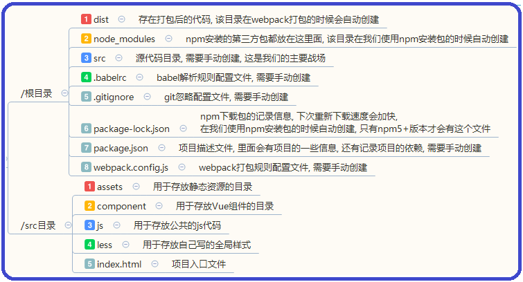
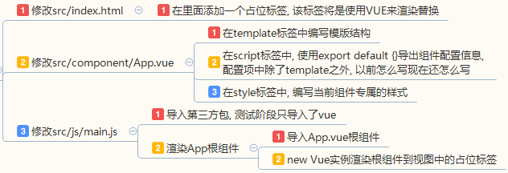
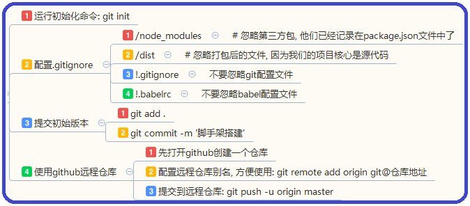
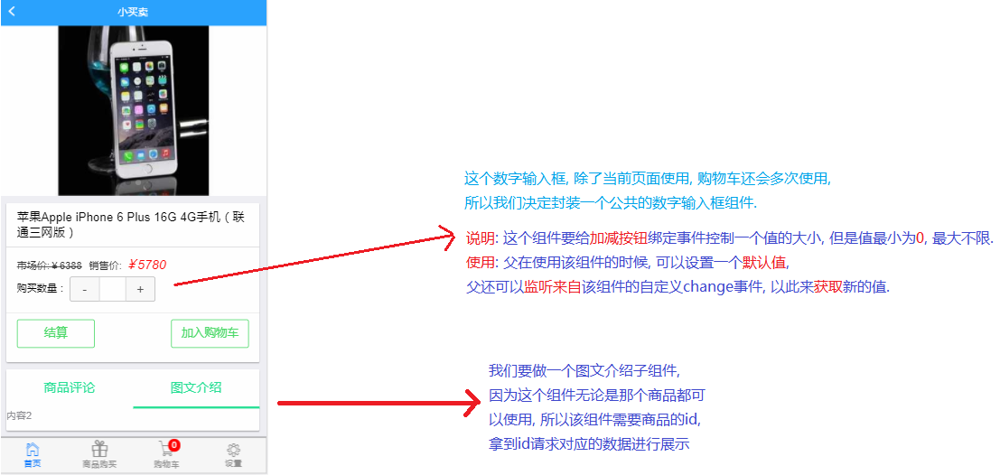
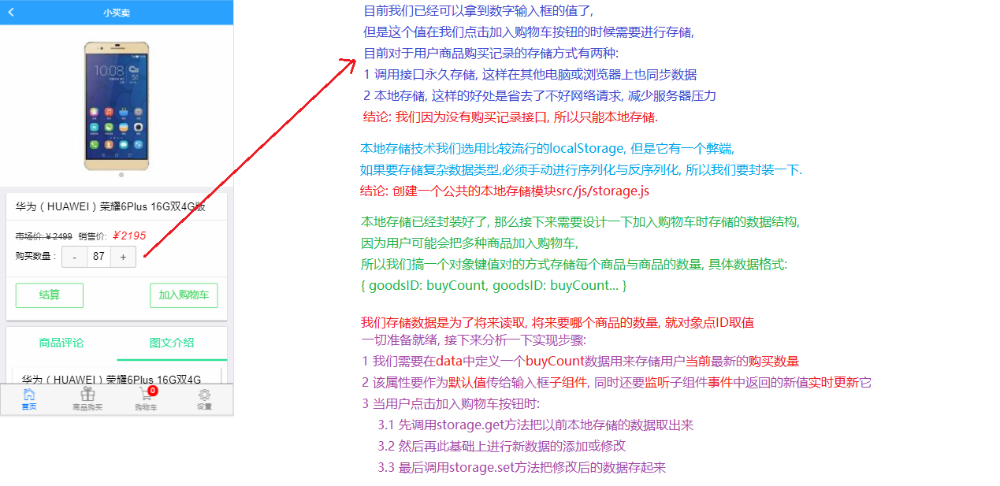

# 搭建vue开发环境

## npm


## 目录结构


## 打包配置

#### babel配置 - .babelrc

```json
{
    "presets": [ "env" ],
    "plugins":["transform-runtime"]
}
```

#### webpack配置 - webpack.config.js

```javascript
const path = require('path');
const htmlWebapckPlugin = require('html-webpack-plugin');
const cleanWebpackPlugin = require('clean-webpack-plugin');

// 配置文件要求我们必须导出一个配置对象
module.exports = {

    // 入口
    entry: path.resolve(__dirname, './src/js/main.js'),

    // 输出
    output: {
        path: path.resolve(__dirname, './dist'),
        filename: 'bundle_[chunkhash:8].js'
    },

    //  插件配置
    plugins: [

        // 压缩html, 自动注入打包好的js文件到body里
        new htmlWebapckPlugin({
            template: './src/index.html',        // 要处理的html
            filename: 'index.html',                 // 处理后的html名称
            inject: 'body',                               // 自动注入js到什么地方
            minify:{                                         // 压缩优化HTML页面
                collapseWhitespace:true,         // 合并空白字符
                removeComments:true,           // 移除注释
                removeAttributeQuotes:true   // 移除属性上的引号
            }
        }),

        // 每次打包前先清除dist目录
        new cleanWebpackPlugin(['./dist'])
    ],

    // loader的作用是为了让webpack可以打包其他类型的模块
    module: {

        // 配置loader, 该配置选项是必须的
        rules: [

            // 打包css
            {
                test: /\.css$/,
                use: [ 'style-loader', 'css-loader' ]
            },

            // 打包less
            {
                test: /\.less$/,
                use: [ 'style-loader', 'css-loader', 'less-loader' ]
            },

            // 打包html模版
            {
                test: /\.(html|tpl)$/,
                use: [ 'html-loader' ]
            },

            // 打包url文件
            {
                test: /\.(png|jpg|gif|jpeg|svg)$/,
                use: [
                    // 默认配置全部打包进来
                    // 'url-loader'

                    // 指定小于10kb的图片才转为base64编码打包
                    {loader: 'url-loader', options: {limit: 10240}}
                ]
            },

            // 转换特殊语法编写的js文件
            {
                test: /\.js$/,
                use: [ 'babel-loader' ],
                exclude: path.resolve(__dirname, './node_modules')  // 如果项目引入了node-modules的东西,不转换它们
            },

      // 解析vue文件
            {
        test: /\.vue$/,
        use: [ 'vue-loader' ]
      }
        ]
    },

    devServer: {
        contentBase: 'src',
        open: true,
        port: 7777
    }
};
```

## 环境测试

#### 步骤预览


#### index.html

```html
<!DOCTYPE html>
<html lang="en">
  <head>
      <meta charset="UTF-8">
      <meta name="viewport" content="width=device-width, initial-scale=1.0">
      <meta http-equiv="X-UA-Compatible" content="ie=edge">
      <title>Document</title>
  </head>
  <body>
      <div id="app"></div>
  </body>
</html>
```

#### main.js
- 这里主要是把`根组件`渲染到页面中
- 其中`render`配置项的作用与`template`一样, 用来指定模版, 使用了`vue-loader`就必须使用它替代template
- [可以参考官方文档](https://cn.vuejs.org/v2/guide/installation.html#运行时-编译器-vs-只包含运行时)

```javascript
// 导入Vue库
import Vue from 'Vue';

// 导入根组件
import App from '../component/App.vue';

// 渲染根组件到占位标签上
new Vue({
    el: '#app',
    render(createElement) {
        return createElement(App);
    }
});
```

#### App.vue

```html
<template>
  <main>
    <h1>{{ title }}</h1>
  </main>
</template>

<script>
// 导出组件配置
export default {
    data() {
        return {
            title: 'Hello World!'
        }
    }
}
</script>

<style scoped>
h1 {
    font-size: 30px;
    color: red;
}
</style>
```

## git版本管理

#### 操作


#### .gitignore预览

```config
# 忽略第三方包, 他们已经记录在package.json文件中了
node_modules/

# 忽略打包后的文件, 因为我们的项目核心是源代码
dist/

# 忽略隐藏文件
.*

# 不忽略git配置文件和babel配置文件
!.gitignore
!.babelrc
```

## 集成mint-ui
- 我们采用一个`Vue`组件库`mint-ui`来辅助项目开发
- [官方文档](http://mint-ui.github.io/docs/#/zh-cn2)

#### 安装
- 命令: `npm i mint-ui -S`

#### 启用
- 在`src/js/main.js`中导入`mint-ui`与mint-ui下的`全局样式`
- 然后调用`use`方法启用插件

```javascript
// 1.1 导入第三方类库
import Vue from 'vue';
import MintUI from 'mint-ui';
import 'mint-ui/lib/style.css';

// 1.2 启用vue插件
Vue.use(MintUI);

// 2.1 导入根组件
import App from '../component/App.vue';

// 2.2 挂载根组件, 启动应用
new Vue({
	el: '#app',
	render(cNode) {
		return cNode(App);
	},
	// router: new VueRouter(routerConfig)
});
```

#### 实现页面头部
- 在`src/component/App.vue`中使用mintUi的`Header`组件来实现

```vue
<template>
  <main>
    <mt-header fixed title="小本买卖" slot="right"></mt-header>
  </main>
</template>
```

## 集成mui
- 这是一个`原生js`编写的`UI`组件库, 这里我们采用它提供的`样式`来进行布局
- [官方文档](http://dev.dcloud.net.cn/mui/)

#### 安装
- 命令: `npm i https://github.com/dcloudio/mui.git -S`

#### 样式导入
- 在`src/js/main.js`中导入`mui`中的`全局样式`

```javascript
// 1.1 导入第三方类库
import Vue from 'vue';
import MintUI from 'mint-ui';
import 'mint-ui/lib/style.css';
import 'mui/dist/css/mui.css';
```

#### 实现页面底部
- 在`src/component/App.vue`中使用mui的`tab bar`组件来实现

```vue
<template>
  <main>
  	<!-- 页面公共头部 -->
    <mt-header fixed title="小本买卖"></mt-header>

	<!-- 页面公共底部 -->
	<nav class="mui-bar mui-bar-tab">
		<router-link to="/" class="mui-tab-item">
			<span class="mui-icon mui-icon-home"></span>
			<span class="mui-tab-label">首页</span>
		</router-link>
		<router-link to="/goods/list" class="mui-tab-item">
			<span class="mui-icon mui-icon-extra mui-icon-extra-gift"></span>
			<span class="mui-tab-label">商品购买</span>
		</router-link>
		<router-link to="/shopcart" class="mui-tab-item">
			<span class="mui-icon mui-icon-extra mui-icon-extra-express">
				<span class="mui-badge">0</span>
			</span>
			<span class="mui-tab-label">购物车</span>
		</router-link>
		<router-link to="/settings" class="mui-tab-item">
			<span class="mui-icon mui-icon-gear"></span>
			<span class="mui-tab-label">设置</span>
		</router-link>
	</nav>
  </main>
</template>
```

## 封装公共ui插件
- 我们实现的页面`头部`与`底部`是可以复用的, 将来还会有很多可`复用`的功能要实现
- 我们可以把他们`封装`成一个个单独的组件, 最后把他们`组装`成一个vue`插件`

#### 提取公共header组件
- 创建src/component/common/header.vue

```vue
<template>
    <header>
        <mt-header fixed title="小买卖"></mt-header>
        <i></i>
    </header>
</template>

<style scoped>
header i{
    display: block;
    height: 40px;
}
</style>
```

#### 提取公共footer组件
- 创建src/component/common/footer.vue

```vue
<template>
    <footer>
        <nav class="mui-bar mui-bar-tab">
            <router-link class="mui-tab-item" to="/index">
                <span class="mui-icon mui-icon-home"></span>
                <span class="mui-tab-label">首页</span>
            </router-link>
            <router-link class="mui-tab-item" v-bind:to="{ name: 'gl' }">
                <span class="mui-icon mui-icon-extra mui-icon-extra-gift"></span>
                <span class="mui-tab-label">商品购买</span>
            </router-link>
            <router-link class="mui-tab-item" v-bind:to="{ name: 'sc' }">
                <span class="mui-icon mui-icon-extra mui-icon-extra-cart">
                	<span class="mui-badge">0</span>
            	</span>
                <span class="mui-tab-label">购物车</span>
            </router-link>
            <router-link class="mui-tab-item" to="/settings">
                <span class="mui-icon mui-icon-gear"></span>
                <span class="mui-tab-label">设置</span>
            </router-link>
        </nav>
        <i></i>
    </footer>
</template>

<style scoped>
i {
    display: block;
    height: 50px;
}
</style>
```

#### 编写插件
- 创建src/component/common/index.js
- 然后`导入`所有公共组件, 在`install`方法中把他们注册成`全局`组件

```javascript
// 导入所有公共组件
import HeaderComponent from './header.vue';
import FooterComponent from './footer.vue';

// 导出插件配置, 该配置要求提供一个install方法, 这个方法会被注入Vue
// 需要我们调用Vue的filter component directive等方法进行功能扩展
export default {
    install(Vue) {
    	// 把导入的组件注册为全局组件
        Vue.component('app-header', HeaderComponent);
        Vue.component('app-footer', FooterComponent);
    }
}
```

#### 启用插件
- 在`src/js/main.js`中导入自己封装的公共ui插件
- 然后调用`use`方法启用插件

```javascript
// 1.1 导入第三方类库
import Vue from 'vue';
import MintUI from 'mint-ui';
import 'mint-ui/lib/style.css';
import 'mui/dist/css/mui.css';
import Common from '../component/common';

// 1.2 启用vue插件
Vue.use(MintUI);
Vue.use(Common);
```

#### 使用
- 在`src/component/App.vue`中使用`app-header`与`app-footer`实现页面头部与底部布局

```vue
<template>
  <main>
    <app-header></app-header>
    <app-footer></app-footer>
  </main>
</template>
```

## 集成vue-router
- why? 我们需要使用`路由`来动态`替换`页面`中间`部分的组件

#### 安装
- 命令: `npm i vue-router -S`

#### 预先编写路由配置
- 创建`src/router/router.js`
- 配置`linkActiveClass`定制底部导航`焦点`样式
- 配置`routes`控制组件的替换

```javascript
// 导入受路由控制的组件
import HomeComponent from '../component/home/home.vue';
import NewsListComponent from '../component/news/news_list.vue';
import NewsDetailComponent from '../component/news/news_detail.vue';

// 导出路由配置
export default {
    linkActiveClass: 'mui-active',
    routes: [

        // 首页路由配置
        { path: "/", redirect: "/index" },
        { name: "i", path: "/index", component: HomeComponent },

        // 新闻路由配置
        { name: "nl", path: "/news/list", component: NewsListComponent },
        { name: "nd", path: "/news/detail/:id", component: NewsDetailComponent }
    ]
};
```

#### 启用
- 在src/js/main.js中导入`路由插件`与`路由配置`
- 然后调用`use`方法启用插件, 并配置`router`选项

```javascript
// 1.1 导入第三方类库
import Vue from 'vue';
import MintUI from 'mint-ui';
import 'mint-ui/lib/style.css';
import 'mui/dist/css/mui.css';
import Common from '../component/common';
import VueRouter from 'vue-router';

// 1.2 启用vue插件
Vue.use(MintUI);
Vue.use(Common);
vue.use(VueRouter);

// 2.1 导入路由配置
import routerConfig from '../router/router.js';

// 2.2 导入组件
import App from '../component/App.vue';

// 3 挂载根组件, 启动应用
new Vue({
	el: '#app',
	render(cNode) {
		return cNode(App);
	},
	router: new VueRouter(routerConfig)
});
```

#### 测试

###### 创建组件
- 把`路由`配置的三个`组件`分别创建出来
- src/component/home/home.vue
- src/component/news/news_list.vue
- src/component/news/news_detail.vue

###### 使用router-view占位标签
- 修改src/component/App.vue

```vue
<template>
  <main>
    <app-header></app-header>
    <router-view></router-view>
    <app-footer></app-footer>
  </main>
</template>
```

## 集成axios
- why? 接下来编写的每个页面`数据`都需要发送`http请求`来获取

#### 安装
- 命令: `npm i axios -S`

#### 编写api配置文件
- 接口有很多且不容易`记忆`, 所以我们专门创建一个`配置`文件, 里面以`对象`的形式存储所有接口地址
- 创建`src/js/api_config.js`

```javascript
const domain = 'http://vue.studyit.io/api';

export default {
    // 获取轮播图的接口
    getLunbo: `${domain}/getlunbo`,

    // 新闻相关接口
    getNL: `${domain}/getnewslist`,
    getND: `${domain}/getnew/`,                // 接口需要新闻id参数(/getnew/:id)
};
```

#### 注入vue实例
- 在`mian.js`中把接口配置对象`注入`到vue实例方便使用

```javascript
// 2.1 导入配置
import routerConfig from '../router'       // 自动找到index.js引入
import apiConfig from './api_config.js'

// 2.2 扩展实例成员
Vue.prototype.axios = axios;               // 把axios库放置到原型, 组件实例即可直接调用axios对象
Vue.prototype.api = apiConfig;           // 把api配置放置到原型, 组件实例即可直接调用api对象

// 2.3 导入根组件
import AppComponent from '../component/App.vue';

// 2.4 渲染根组件, 启动项目
new Vue({
    el: '#app',
    render(createNode) {
        return createNode(AppComponent);
    },
    router: new VueRouter(routerConfig)
});
```

## 首页

#### 轮播图
- 使用mint-ui中的`mt-swipe`组件实现效果
- 通过`axios`调用接口获取数据

```vue
<template>
    <article>
        <!-- 轮播图 -->
        <mt-swipe :auto="10000">
            <mt-swipe-item v-for="item in lunbos" v-bind:key="item.url">
                <a v-bind:href="item.url">
                    
                </a>
            </mt-swipe-item>
        </mt-swipe>
    </article>
</template>

<script>
export default {
    data() {
        return {
            lunbos: []
        }
    },

    methods: {
        // 请求数据, 成功后把数据存储到lunbos中
        getLunbo() {
            this.axios.get(this.api.getLunbo)
            .then( rep => this.lunbos = rep.data.message );
        }
    },

    // 组件初始化完毕后, 自动调用接口获取数据渲染轮播图
    created() {
        this.getLunbo();
    }
}
</script>

<style lang="less" scoped>
@height: 260px;
article {
    height: @height;
    img {
        height: @height;
    }
}
</style>
```

#### 九宫格
- 使用mui中的`九宫格`实例实现效果
- 然后修改对应的文字描述/图标与连接地址

```vue
<template>
    <article>
        <!-- 轮播图 -->
        <mt-swipe :auto="10000">
            <mt-swipe-item v-for="item in lunbos" v-bind:key="item.url">
                <router-link v-bind:to="item.url">
                    
                </router-link>
            </mt-swipe-item>
        </mt-swipe>
        <!-- 六宫格 -->
        <ul class="mui-table-view mui-grid-view mui-grid-9">
            <li class="mui-table-view-cell mui-media mui-col-xs-4 mui-col-sm-3">
                <router-link to="/">
                    <span class="mui-icon mui-icon-home"></span>
                    <div class="mui-media-body">首页</div>
                </router-link>
            </li>
            <li class="mui-table-view-cell mui-media mui-col-xs-4 mui-col-sm-3">
                <router-link to="/news/list">
                    <span class="mui-icon mui-icon-chat"></span>
                    <div class="mui-media-body">热点新闻</div>
                </router-link>
            </li>
            <li class="mui-table-view-cell mui-media mui-col-xs-4 mui-col-sm-3">
                <router-link to="/photo/list">
                    <span class="mui-icon mui-icon-image"></span>
                    <div class="mui-media-body">图片分享</div>
                </router-link>
            </li>
            <li class="mui-table-view-cell mui-media mui-col-xs-4 mui-col-sm-3">
                <router-link to="/">
                    <span class="mui-icon mui-icon-search"></span>
                    <div class="mui-media-body">搜索</div>
                </router-link>
            </li>
            <li class="mui-table-view-cell mui-media mui-col-xs-4 mui-col-sm-3">
                <router-link to="/">
                    <span class="mui-icon mui-icon-phone"></span>
                    <div class="mui-media-body">联系我们</div>
                </router-link>
            </li>
            <li class="mui-table-view-cell mui-media mui-col-xs-4 mui-col-sm-3">
                <router-link to="/">
                    <span class="mui-icon mui-icon-info"></span>
                    <div class="mui-media-body">关于我们</div>
                </router-link>
            </li>
        </ul>
    </article>
</template>
```

## 新闻列表
- 修改`src/component/news/news_list.vue`
- 使用mui的`图文列表`进行布局
- 调用接口`api.newsL`实现数据动态化

```javascript
<template>
    <article>
        <!-- mui的图文列表实现整体布局 -->
        <ul class="mui-table-view">
            <li class="mui-table-view-cell mui-media"
            v-for="item in newsList" v-bind:key="item.id">
                <router-link v-bind="{ to: `/news/detail/${item.id}` }">
                    
                    <div class="mui-media-body">
                        <!-- 使用mui-ellipsis类实现文本超越一行显示省略号 -->
                        <h4 class="mui-ellipsis">{{ item.title }}</h4>
                        <p class="mui-ellipsis">
                            <span>{{ item.add_time | dateFormat('YYYY-MM-DD') }}</span>
                            <span>浏览{{ item.click }}次</span>
                        </p>
                    </div>
                </router-link>
            </li>
        </ul>
    </article>
</template>

<script>
export default {
    data() {
        return {
            newsList: []
        };
    },

    methods: {
        // 获取新闻列表数据
        getNewsList() {
            this.axios.get(this.api.newsL)
            .then( rsp => this.newsList = rsp.data.message )
        }
    },

    // 上来就调用接口初始化数据
    created() {
        this.getNewsList();
    }
}
</script>
```

## 封装公共过滤器插件
- 新闻列表中的`时间`显示不太直观, 这里我们自己封装一个`过滤器`进行处理
- 考虑到`将来`可能还会出现`其他`的过滤器封装, 所以决定像公共组件那样`封装`成一个过滤器`插件`

#### 过滤器插件模型
- 封装插件, 我们首先需要创建`src/filter/index.js`
- 然后在这里`导入`每个单独封装的过滤器, 把它们`注册`成全局的

```javascript
// 导入所有的过滤器
import DateFilter from './date.js';
import JsonFilter from './json.js';

// 在这里统一进行注册
export default {
    install(Vue) {
        Vue.filter('date', DateFilter);
        Vue.filter('json', JsonFilter);
    }
};
```

#### 实现date过滤器
- 因为我们写的过滤器最终都通过`index.js`进行`注册`
- 所以这里只需对外`导出`一个过滤器`函数`就可以了

```javascript
// 只导出过滤器函数就可以了
export default function(time) {
    let date = new Date(time);
    return `${date.getFullYear()}-${date.getMonth() + 1}-${date.getDate()}`;
};
```

#### 实现json过滤器
- 我们再`多`封装一个过滤器来给大家说明`日后`如何`扩展`新的过滤器
- 每次只需`导出`一个过滤器`函数`, 然后在`index.js`中`注册`, 就可以任意使用了

```javascript
export default function(obj) {
    return JSON.stringify(obj);
};
```

#### 启用过滤器插件
- 我们封装的过滤器插件, 需要在`mian.js`中进行`启用`

```javascript
// 1.1 导入第三方包
import Vue from 'vue';
import MintUi from 'mint-ui';
import 'mint-ui/lib/style.css';
import Common from '../component/common';
import 'mui/dist/css/mui.css';
import 'mui/examples/hello-mui/css/icons-extra.css';
import axios from 'axios';
import VueRouter from 'vue-router';
import Filter from '../filter'                    // 过滤器插件, 自动找到index.js引入

// 1.2 启用vue插件
Vue.use(MintUi);
Vue.use(Common);
Vue.use(VueRouter);
Vue.use(Filter);                                     // 启用过滤器插件
```

#### 测试过滤器
- 使用`date`过滤器格式化`src/component/news/news_list.vue`中的`add_time`数据

```vue
<div class="mui-media-body">
    <h4 class="mui-ellipsis">{{ item.title }}</h4>
    <p class="mui-ellipsis">
        <span>创建时间: {{ item.add_time | date }}</span>
        <span>点击数: {{ item.click }}</span>
    </p>
</div>
```

#### 补充说明
- 导出`传统`的过滤器定义`方式`也是可以的, 因为`Vue.filter`方法最终`原物`返回过滤器`函数`
- 但是这样过滤器会`重复`注册, 代码也`冗余`, 所以不采那

```javascript
import Vue from 'vue';

export default Vue.filter('json', function(obj) {
    return JSON.stringify(obj);
};
```

## 新闻详情
- 修改`src/component/news/news_detail.vue`
- 使用mui的`卡片视图`进行布局
- 通过`this.$route.params.id`获取新闻ID, 然后调用接口`api.newsD`实现数据动态化

```vue
<template>
    <article>
        <!-- 使用mui的卡片视图布局, 注意: 卡片视图都是flex, 这里把他改成block -->
        <div class="mui-card">
            <div class="mui-card-header">
                <h4>{{ newsDetail.title }}</h4>
                <p class="mui-ellipsis">
                    <span>创建时间: {{ newsDetail.add_time | date }}</span>
                    <span>点击数: {{ newsDetail.click }}</span>
                </p>
            </div>
            <!-- content内容中含有html标签, 要让它正常展示, 必须使用v-html -->
            <div class="mui-card-footer" v-html="newsDetail.content"></div>
        </div>
    </article>
</template>

<script>
export default {
    data() {
        return {
            id: this.$route.params.id,
            newsDetail: []
        };
    },

    methods: {
        // 获取新闻详情, 需要注意接口返回的数据是一个数组
        getNewsDetail() {
            this.axios.get(this.api.newsD + this.id)
            .then( rsp => this.newsDetail = rsp.data.message[0] )
        }
    },

    // 上来就调用接口初始化数据
    created() {
        this.getNewsDetail();
    }
}
</script>

<style scoped>
/* 卡片视图默认是flex布局, 这里把它恢复正常 */
.mui-card-header, .mui-card-content, .mui-card-footer {
    display: block;
}
</style>
```

## 头部添加返回按钮
- 返回按钮只在非首页时展示, 即`$route.path != '/path'`
- 利用`$router.go(-1)`方法实现返回上一页

```vue
<template>
    <header>
        <mt-header fixed title="小买卖">
            <mt-button icon="back" slot="left"
                v-if="$route.path != '/index'" @click="$router.go(-1)">
            </mt-button>
        </mt-header>
        <i></i>
    </header>
</template>
```

## 图片模块准备工作

#### 接口配置
- 下面把项目中用到的`所有`接口一口气都配置完毕了

```javascript
const domain = 'http://vue.studyit.io/api';

export default {
    // 获取轮播图的接口
    lunB: `${domain}/getlunbo/`,

    // 新闻相关接口
    newsL: `${domain}/getnewslist/`,
    newsD: `${domain}/getnew/`,                         // 该接口需要新闻id: /getnew/:id

    // 图片相关接口
    photoC: `${domain}/getimgcategory/`,
    photoL: `${domain}/getimages/`,                   // 该接口需要分类id: /getimages/:id
    photoD: `${domain}/getimageinfo/`,             // 该接口需要图片id: /getimageinfo/:id
    photoT: `${domain}/getthumimages/`,          // 该接口需要图片id: /getthumimages/:id

    // 商品相关接口
    goodsL: `${domain}/getgoods/`,                    // 该接口需要页码: /getgoods/?pageindex=number
    goodsD: `${domain}/goods/getdesc/`,          // 该接口需要商品id: /getdesc/:id
    goodsT: `${domain}/getthumimages/`,          // 该接口需要商品id: /getthumimages/:id
    goodsP: `${domain}/goods/getinfo/`,                        // 该接口需要商品id: /getinfo/:id

    // 购物车相关接口
    shopcL: `${domain}/goods/getshopcarlist/`,  // 该接口需要一串id: /getshopcarlist/:ids

    // 评论相关接口
    commentL: `${domain}/getcomments/`,        // 该接口需要id: /getcomments/:id
    commentS: `${domain}/postcomment/`,        // 该接口需要id: /postcomment/:id, 该需要content内容
};
```

#### 路由配置

```javascript
// 导入受路由控制的组件
import HomeComponent from '../component/home/home.vue';
import NewsListComponent from '../component/news/news_list.vue';
import NewsDetailComponent from '../component/news/news_detail.vue';
import PhotoListComponent from '../component/photo/photo_list.vue';
import PhotoDetailComponent from '../component/photo/photo_detail.vue';

// 导出路由配置
export default {
    routes: [
        // 首页路由配置
        { path: "/", redirect: "/index" },
        { name: "i", path: "/index", component: HomeComponent },

        // 新闻路由配置
        { name: "nl", path: "/news/list", component: NewsListComponent },
        { name: "nd", path: "/news/detail/:id", component: NewsDetailComponent },

        // 图片路由配置
        { name: "pl", path: "/photo/list/:id", component: PhotoListComponent },
        { name: "pd", path: "/photo/detail/:id", component: PhotoDetailComponent },
    ]
};
```

## 图片列表
- 使用mui的`列表`实例实现`分类列表`布局
- 使用mui的`卡片视图`实例实现`图片列表`布局
- 调用接口`this.api.photoL`实现数据动态化
- 监听`$route`变化, 当`分类`改变时切换`列表`数据

```vue
<template>
    <article>
        <!-- 分类导航: 使用mui的列表布局 -->
        <ul class="mui-table-view">
            <li class="mui-table-view-cell">
                <router-link v-bind:to="{ name: 'pl', params: { id: 0 } }">全部</router-link>
            </li>
            <li v-for="item in photoCategoryList" v-bind:key="item.id"
                class="mui-table-view-cell">
                <router-link v-bind:to="{ name: 'pl', params: { id: item.id } }">{{ item.title }}</router-link>
            </li>
        </ul>

        <!-- 图片列表: 使用mui的卡片视图布局 -->
        <div class="mui-card" v-for="item in photoList" v-bind:key="item.id">
            <router-link v-bind:to="{ name: 'pd', params: { id: item.id } }">
                <div class="mui-card-header mui-card-media"
                	v-bind="{ style: `height:40vw;background-image:url(${item.img_url})` }"></div>
                <div class="mui-card-content">
                    <div class="mui-card-content-inner">
                        <p>{{ item.title }}</p>
                        <p style="color: #333;">{{ item.zhaiyao }}</p>
                    </div>
                </div>
            </router-link>
        </div>
    </article>
</template>

<script>
export default {
    data() {
        return {
            photoCategoryList: [],
            photoList: []
        };
    },

    methods: {
        // 获取图片分类列表
        getPhotoCategoryList() {
            this.axios.get(this.api.photoC)
            .then( rsp => this.photoCategoryList = rsp.data.message );
        },

        // 获取图片列表, 需要使用分类ID来获取指定的图片列表
        getPhotoList() {
            this.axios.get(this.api.photoL + this.$route.params.id)
            .then( rsp => this.photoList = rsp.data.message );
        }
    },

    // 在组件初始化完毕后执行一次
    created() {
        this.getPhotoCategoryList();
        this.getPhotoList();
    },

    watch: {

        // 监听url的变化, 变化后拿到新的id,
        // 调用接口发送请求修改photoList数据
        $route() {
            this.getPhotoList();
        }
    }
}
</script>

<style lang="less" scoped>
.mui-table-view {
    overflow: hidden;
    li {
        float: left;
        color: deepskyblue;
    }
}

.mui-card-header, .mui-card-header {
    display: block;
}
</style>
```

## 图片详情
- 使用mui的`卡片视图`实现上下主体布局
- 使用mui的`图文表格`实现缩略图布局
- 调用接口`this.api.photoD`与`this.api.photoT`实现数据动态化

```vue
<template>
    <article>
        <!-- 使用mui的卡片视图布局, 注意: 卡片视图都是flex, 这里把他改成block -->
        <div class="mui-card">
            <div class="mui-card-header">
                <h4>{{ photoDetail.title }}</h4>
                <p class="mui-ellipsis">
                    <span>创建时间: {{ photoDetail.add_time | date }}</span>
                    <span>点击数: {{ photoDetail.click }}</span>
                </p>
            </div>
            <!-- 使用mui的图文表格布局 -->
            <ul class="mui-table-view mui-grid-view">
		        <li class="mui-table-view-cell mui-media mui-col-xs-4"
                    v-for="item in photoThumList" v-bind:key="item.src">
                    
                </li>
		    </ul>
            <!-- content内容中含有html标签, 要让它正常展示, 必须使用v-html -->
            <div class="mui-card-footer">{{ photoDetail.content }}</div>
        </div>
    </article>
</template>

<script>
export default {
    data() {
        return {
            id: this.$route.params.id,
            photoDetail: {},
            photoThumList: []
        };
    },

    methods: {
        // 获取图片详情
        getPhotoDetail() {
            this.axios.get(this.api.photoD + this.id)
            .then( rsp => this.photoDetail = rsp.data.message[0] )
        },

        // 获取图片缩略图
        getphotoThumList() {
            this.axios.get(this.api.photoT + this.id)
            .then( rsp => this.photoThumList = rsp.data.message )
        }
    },

    created() {
        this.getPhotoDetail();
        this.getphotoThumList();
    }
}
</script>

<style scoped>
.mui-card-header, .mui-card-footer {
    display: block;
}
.mui-card h4 {
    font-size: 14px;
}
</style>
```

## 集成图片预览插件
- [npm文档](https://www.npmjs.com/package/vue-picture-preview)

#### 安装
- 命令: `npm i vue-picture-preview -S`

#### 启用
- 在`src/js/main.js`中导入`vue-picture-preview`
- 然后调用`Vue.use`方法启用插件

#### 放置占位标签
- 根据文档说明需要在`根组件`中放置一对`lg-preview`标签, 这个标签将来会被`html结构`所覆盖
- 根据测试插件的`布局`与我们的页面`头部底部`绝对定位布局有`冲突`, 所以把标签放置到`最前面`

```vue
<template>
    <main>
        <lg-preview></lg-preview>
        <app-header></app-header>
        <router-view></router-view>
        <app-footer></app-footer>
    </main>
</template>
```

#### 添加预览图片
- 修改`src/component/photo/detail.vue`
- 给缩略图`img`添加`v-preview`指令, 值为缩略图`地址`

```vue
<!-- 使用mui的图文表格布局 -->
<ul class="mui-table-view mui-grid-view">
    <li class="mui-table-view-cell mui-media mui-col-xs-4"
        v-for="item in photoThumList" v-bind:key="item.src">
        <!-- 使用v-preview指令 -->
        
    </li>
</ul>
```

## 商品购买与购物车模块准备工作

#### 路由配置

```javascript
// 导入受路由控制的组件
import HomeComponent from '../component/home/home.vue';
import NewsListComponent from '../component/news/news_list.vue';
import NewsDetailComponent from '../component/news/news_detail.vue';
import PhotoListComponent from '../component/photo/photo_list.vue';
import PhotoDetailComponent from '../component/photo/photo_detail.vue';
import GoodsListComponent from '../component/goods/goods_list.vue';
import GoodsDetailComponent from '../component/goods/goods_detail.vue';
import ShopcartComponent from '../component/shopcart/shopcart.vue';

// 导出路由配置
export default {
    routes: [
        // 首页路由配置
        { path: "/", redirect: "/index" },
        { name: "i", path: "/index", component: HomeComponent },

        // 新闻路由配置
        { name: "nl", path: "/news/list", component: NewsListComponent },
        { name: "nd", path: "/news/detail/:id", component: NewsDetailComponent },

        // 图片路由配置
        { name: "pl", path: "/photo/list/:id", component: PhotoListComponent },
        { name: "pd", path: "/photo/detail/:id", component: PhotoDetailComponent },

        // 商品相关路由
        { name: "gl", path: '/goods/list/', component: GoodsListComponent },
        { name: "gd", path: '/goods/detail/:id', component: GoodsDetailComponent },

        // 购物车
        { name: "sc", path: '/shopcart', component: ShopcartComponent },
    ]
};
```

#### 商品列表模版

```vue
<template>
  <article>
    <ul class="mui-table-view mui-grid-view">
      <!-- 商品详情1 -->
      <li class="mui-table-view-cell mui-media mui-col-xs-6">
      	<router-link to="/">
	        <div class="mui-card">
	          <!-- 商品图片 -->
	          <div class="mui-card-header">
	          	
	          </div>
	          <!-- 商品描述 -->
	          <div class="mui-card-footer ">
	            <p class="mui-ellipsis-2">大范甘迪水电费斯蒂芬森分适当放松的的否是方式方式的否是放是</p>
	          </div>
	          <!-- 商品价格 -->
	          <div class="mui-card-content">
	            <p class="price">
	            	<span>￥233</span>
	            	<s>￥2342</s>
	            </p>
	            <p class="tip">
	            	<span>热卖中</span>
	            	<span>剩余5654件</span>
	            </p>
	          </div>
	        </div>
        </router-link>
      </li>

      <!-- 商品详情2 -->
      <li class="mui-table-view-cell mui-media mui-col-xs-6">
        <div class="mui-card">
          <!-- 商品图片 -->
          <div class="mui-card-header">
          	
          </div>
          <!-- 商品描述 -->
          <div class="mui-card-footer ">
            <p class="mui-ellipsis-2">大范甘迪水电费斯蒂芬森分适当放松的的否是方式方式的否是放是</p>
          </div>
          <!-- 商品价格 -->
          <div class="mui-card-content">
            <p class="price">
            	<span>￥233</span>
            	<s>￥2342</s>
            </p>
            <p class="tip">
            	<span>热卖中</span>
            	<span>剩余5654件</span>
            </p>
          </div>
        </div>
      </li>
    </ul>

    <!-- 加载更多 -->
    <div class="mui-card-header">
    	<button class="mui-btn mui-btn-success mui-btn-block mui-btn-outlined">加载更多</button>
    </div>
  </article>
</template>

<style lang="less" scoped>
.mui-card {
	box-shadow: 0px 0px 4px rgba(0, 0, 0, .3);
}
.mui-card-header {
	padding: 8px;
	/*height: 100px;*/
	img {
		width: 100%;
		height: 100%;
	}
}
.mui-card-content {
  text-align: center;
  .price {
    margin-bottom: 4px;
    color: #000;
    span {
      color: red;
    }
  }
  .tip {
    overflow: hidden;
    padding: 0 8px;
    font-size: 12px;
    span:first-child {
      float: left;
    }
    span:last-child {
      float: right;
    }
  }
}
</style>
```

#### 商品详情模版

```vue
<template>
  <article>
  	<!-- 商品购买 -->
    <div class="mui-card">
      <!-- 名称 -->
      <div class="mui-card-header">小米666</div>
      <!-- 价格 -->
      <div class="mui-card-content mui-card-content-inner">
        <div class="price">
        	<s>市场价:￥8888</s>
        	<span>销售价: </span> <em>￥888</em>
    	</div>
        <div> <span>购买数量：</span>
          <!--数字输入框 -->
          <div class="mui-numbox">
          	<button class="mui-btn mui-btn-numbox-minus">-</button>
          	<input class="mui-input-numbox" type="number">
          	<button class="mui-btn mui-btn-numbox-plus">+</button>
          </div>
        </div>
      </div>
      <!-- 按钮 -->
      <div class="mui-card-footer">
      	<button type="button" class="mui-btn mui-btn-success mui-btn-block mui-btn-outlined">结算</button>
        <div></div>
        <button type="button"
        	class="mui-btn mui-btn-success mui-btn-block mui-btn-outlined">加入购物车</button>
      </div>
    </div>

	<!-- 评论与介绍 -->
	<div class="mui-card">
		<!-- 选项卡, value的值会与子元素的id匹配 -->
	    <mt-navbar value="info">
		  <mt-tab-item id="comment">商品评论</mt-tab-item>
		  <mt-tab-item id="info">图文介绍</mt-tab-item>
		</mt-navbar>
		<!-- 内容, value的值会与子元素的id匹配 -->
	    <mt-tab-container value="info">
		  <mt-tab-container-item id="comment">
		    <mt-cell v-for="n in 10" v-bind:key="n" v-bind:title="n"></mt-cell>
		  </mt-tab-container-item>
		  <mt-tab-container-item id="info">
		    <mt-cell v-for="n in 5" v-bind:key="n" v-bind:title="n"></mt-cell>
		  </mt-tab-container-item>
		</mt-tab-container>
	</div>
  </article>
</template>

<style lang="less" scoped>
.mui-card-content {
  .price {
    color: rgb(51, 51, 51);
    margin-bottom: 4px;
    span {
      margin-left: 6px;
    }
    em {
      font-size: 18px;
      color: red;
    }
  }
}
.mui-card-footer {
  div {
    width: 100%;
  }
  .mui-btn {
    padding: 8px 0;
    font-size: 16px;
  }
}
.mint-tab-item {
	&.is-selected {
		margin-bottom: 0;
		border-bottom: 3px solid #2ce094;
		color: #2ce094;
	}
}
.mint-tab-item-label {
	font-size: 18px;
	color: #2ce094;
}
</style>
```

#### 购物车模版

```vue
<template>
  <article>
    <!-- 商品列表 -->
    <div class="goods">
      <mt-switch class="switch"></mt-switch> 
      <div class="inforight">
        <h4 class="mui-ellipsis-2">小米斯蒂芬斯蒂芬适当当释放斯蒂芬斯蒂芬斯放倒第三放松的</h4>
        <div class="bottom">
          <ul>
            <li>￥6666</li>
            <li>
              <div class="mui-numbox"> <button class="mui-btn mui-btn-numbox-minus">-</button> <input class="mui-input-numbox" type="number"> <button class="mui-btn mui-btn-numbox-plus">+</button> </div>
            </li>
            <li>
              <a href="javascript:void(0)">删除</a>
            </li>
          </ul>
        </div>
      </div>
    </div>

    <!-- 总价 -->
    <div class="total">
      <div class="total_val">
        <ul>
          <li>总计（不含运费）</li>
          <li>已勾选商品10件,总价:￥1000元</li>
        </ul>
      </div>
      <div class="total_btn">
        <mt-button type="primary">付 款</mt-button>
      </div>
    </div>
  </article>
</template>

<style lang="less" scoped>
.goods {
  border-bottom: 1px solid rgba(0, 0, 0, 0.3);
  height: 102px;
  display: flex;
  padding: 5px;
  .switch {
    flex: 0 0 52px;
  }
  .img {
    margin-left: 5px;
    height: 75px;
    width: 75px;
    flex: 0 0 85px;
  }
  .inforight {
    margin-left: 5px;
    flex: 1;
  }
  .inforight ul {
    padding-left: 0px;
  }
  .inforight li {
    list-style: none;
    display: inline-block;
  }
  .inforight h4 {
    color: #0094ff;
    font-size: 14px;
  }
  .bottom li:first-child {
    color: red;
    margin-right: 5px;
  }
  .bottom li:last-child {
    margin-left: 5px;
  }
}
.total {
  height: 84px;
  background-color: rgba(0, 0, 0, 0.1);
  display: flex;
  padding: 5px 14px;
  ul {
	    padding-left: 0px;
	    margin: 14px 0;
	    li {
	      list-style: none;
	      font-size: 14px;
	    }
	  }
	  &_val {
	  	flex: 1;
	  }
	  &_btn {
	  	flex: 0 0 60px;
      margin: 18px 0 0 0;
	  }
}
</style>
```

#### 模版组件测试
- 创建`src/component/goods/goods_list.vue`, 然后`套用`写好的模版
- 创建`src/component/goods/goods_detail.vue`, 然后`套用`写好的模版
- 创建`src/component/shopcart/shopcart.vue`, 然后`套用`写好的模版
- 修改`src/component/common/footer.vue`底部组件中`商品购买`与`购物车`导航

## 商品列表

#### 数据动态化
- 在data中定义`pageIndex`属性存储当前数据页码, `goodsList`属性存储列表数据
- 然后调用接口`this.api.goodsL`实现数据动态化

```vue
<script>
export default {
  data() {
    return {
      goodsList: [],      // 商品列表数据
      pageIndex: 1,     // 当前页
    };
  },

  methods: {
    // 获取商品列表, 需要pageindex查询字符串
    getGoodsList() {
        this.axios.get(`${this.api.goodsL}?pageindex=${this.pageIndex}`)
        .then(
        	(rsp) => {
          		this.goodsList.push(...rsp.data.message); // 请求回来的数据累加到goodsList列表
        	}
        );
      }
    }
  },

  created() {
    this.getGoodsList();
  }
};
</script>
```

#### 加载更多
- 在methods中定义`loadMore`方法, 然后绑定到`加载更多`按钮的`click`事件上
- 该方法执行时`pageindex++`, 然后再复用`getGoodsList`方法请求加载`下一页`数据

#### 优化
- 在data中定义`lastPage`属性记录当前是否为最后一页数据
- 在methods中定义`isLastPage`方法判断`请求`回来的`数据`是否为`空`, 是则把`lastPage`设为true
- 然后利用`lastPage`属性控制`加载更多`按钮是否可用, 以及文字描述

```vue
<!-- 加载更多 -->
<div class="mui-card-header">
  <button v-on:click="loadMore()" v-bind:disabled="lastPage"
    class="mui-btn mui-btn-success mui-btn-block mui-btn-outlined">
    {{ lastPage? '已全部加载完毕': '加载更多' }}
  </button>
</div>

<script>
export default {
  data() {
    return {
      goodsList: [],    // 商品列表数据
      pageIndex: 1,     // 当前页
      lastPage: false   // 是否最后一页
    };
  },

  methods: {
    // 获取商品列表, 需要一个pageindex查询字符串, 用来指定页码
    getGoodsList() {
      this.axios.get(`${this.api.goodsL}?pageindex=${this.pageIndex}`)
      .then((rsp) => {
        // 请求回来的数据累加到goodsList列表
        this.goodsList.push(...rsp.data.message);
        this.isLastPage(rsp.data.message)
      });
    },

    // 加载下一页数据
    loadMore() {
      this.pageIndex++;
      this.getGoodsList();
    },

    // 是否还有下一页数据, 没有把lastPage设为true
    isLastPage(goodsList) {
      if(goodsList.length == 0) {
        this.lastPage = true;
      }
    }
  },

  created() {
    this.getGoodsList();
  }
};
</script>
```

## 商品详情

#### 轮播图
- 使用`mint-ui`中的`swipe`组件实现轮播效果
- 调用接口`this.api.goodsT`实现图片资源动态化

```vue
<template>
  <article class="goods-detail">
	<!-- 轮播图 -->
	<mt-swipe :auto="10000">
	    <mt-swipe-item v-for="item in lunbos" v-bind:key="item.src">
	      
	    </mt-swipe-item>
	</mt-swipe>
  </article>
</template>

<script>
export default {
  data() {
    return {
      id: this.$route.params.id,
      lunbos: [],
      goodsDetail: {}
    };
  },

  methods: {
    // 获取商品缩略图列表
    getLunbo() {
        this.axios.get(this.api.goodsT + this.id)
        .then( rep => this.lunbos = rep.data.message );
    }
  },

  // 组件初始化完毕后, 自动调用接口获取数据渲染轮播图
    created() {
        this.getLunbo();
    }
}
</script>

<style>
// 设置轮播图与图片高度, 并让图片居中显示
.mint-swipe {
  height: 260px;
  background-color: white;
  img {
    display: block;
    margin: 0 auto;
    height: 260px;
  }
}
</style>
```

#### 商品价格信息
- 调用接口`this.api.goodsP`动态化价格区数据

#### 评论与介绍切换
- 使用`mint-ui`中的`mt-navbar`与`mt-tab-container`组件实现
- [官方对应文档](http://mint-ui.github.io/docs/#/zh-cn2/navbar)

```vue
<template>
  <article>
	<!-- 评论与介绍 -->
	<div class="mui-card">
		<!-- 选项卡, 利用value的值控制选取那个子元素 -->
    	<mt-navbar v-model="navbarSelector">
			<mt-tab-item id="commont">商品评论</mt-tab-item>
			<mt-tab-item id="intro">图文介绍</mt-tab-item>
		</mt-navbar>
		<!-- 内容, 利用value的值控制选取那个子元素 -->
        <mt-tab-container v-model="navbarSelector">
			<mt-tab-container-item id="commont">
		    <p>内容1</p>
			</mt-tab-container-item>
		<mt-tab-container-item id="intro">
		    <app-intro v-bind:id="id"></app-intro>
		    </mt-tab-container-item>
		</mt-tab-container>
	</div>
  </article>
</template>
```

#### 所需子组件
- 

#### 图文介绍子组件

```vue
<template>
    <!-- 使用mui的卡片视图进行布局 -->
    <div class="mui-card">
        <div class="mui-card-header">{{ intro.title }}</div>
        <div class="mui-card-content">
            <div class="mui-card-content-inner" v-html="intro.content"></div>
        </div>
    </div>
</template>

<script>
export default {
    props: [ 'id' ],

    data() {
        return {
            intro: {}
        };
    },

    methods: {
        // 获取图文介绍, 但是需要由父亲告诉我id
        getIntro() {
            this.axios.get(this.api.goodsD + this.id)
            .then( rsp => this.intro = rsp.data.message[0] );
        }
    },

    created() {
        this.getIntro();
    }
}
</script>
```

#### 数字输入框公共组件

```vue
<template>
    <!-- 使用mui的数字输入框实现布局 -->
    <div class="mui-numbox">
        <button class="mui-btn mui-btn-numbox-minus" @click="sub">-</button>
        <input class="mui-input-numbox" type="number" v-model="val">
        <button class="mui-btn mui-btn-numbox-plus" @click="add">+</button>
    </div>
</template>

<script>
export default {
    props: [ 'initVal' ],

    data() {
        return {
            val: this.initVal || 0  // 优先使用父指定的默认值, 父不指定默认为0
        };
    },

    methods: {
        // 减减, 最小值为0
        sub() {
            this.val > 0 && this.val--;
        },

        // 加加, 最大值不限
        add() {
            this.val++;
        }
    },

    watch: {
        // 值发生变化就通过事件的方式传给父
        val() {
            this.$emit('change', this.val);
        }
    }
}
</script>
```

## 商品详情加入购物车功能

#### 业务分析


#### storage封装
- 创建`src/js/storage.js`

```javascript
export default {

    // localStorage.setItem的封装
    set(key, val) {
        localStorage.setItem(key, JSON.stringify(val));
    },

    // localStorage.getItem的封装
    get(key) {
        let val = localStorage.getItem(key);
        // 先尝试着解析数据, 成功了就返回解析后的值, 不成功就原物返回
        try {
            val = JSON.parse(val);
        }finally {
            return val;
        }
    },

    // 清除所有本地存储的数据
    clear() {
        localStorage.clear();
    }
}
```

#### 实现代码
- 修改`src/component/goods/goods_detail.vue`

```vue
<template>
  <article>
  	<!-- 商品购买 -->
    <div class="mui-card">
      <!-- 名称 -->
      <div class="mui-card-header">{{ goodsPrice.title }}</div>
      <!-- 价格 -->
      <div class="mui-card-content mui-card-content-inner">
        <div class="price">
        	<s>市场价:￥{{ goodsPrice.market_price }}</s>
        	<span>销售价: </span> <em>￥{{ goodsPrice.sell_price }}</em>
    	</div>
        <div> <span>购买数量：</span>
          <!--数字输入框 -->
          <app-numbox v-bind:initVal="buyCount" @change="getTotal"></app-numbox>
        </div>
      </div>
      <!-- 按钮 -->
      <div class="mui-card-footer">
      	<button type="button" class="mui-btn mui-btn-success mui-btn-block mui-btn-outlined">结算</button>
        <div></div>
        <button type="button" @click="addShopcart"
        	class="mui-btn mui-btn-success mui-btn-block mui-btn-outlined">加入购物车</button>
      </div>
    </div>
  </article>
</template>

<script>
import IntroComponent from './son/intro.vue';
import storage from '../../js/storage.js';

export default {
  data() {
    return {
      id: this.$route.params.id,
      lunbos: [],
      goodsPrice: {},
      navbarSelector: 'commont',
      buyCount: (storage.get('goodsBuyData') || {})[this.$route.params.id] // storage数据回显
    };
  },

  methods: {
    // 获取商品缩略图
    getGoodsThumList() {
      this.axios.get(this.api.goodsT + this.id)
      .then( rsp => this.lunbos = rsp.data.message );
    },

    // 获取商品价格信息
    getGoodsPrice() {
      this.axios.get(this.api.goodsP + this.id)
      .then( rsp => this.goodsPrice = rsp.data.message[0] );
    },

    // 获取最新的购买数量, 并存储起来
    getTotal(total) {
      this.buyCount = total;
    },

    // 加入购物车
    addShopcart() {
      let oldBuyData = storage.get('goodsBuyData') || {};  // 取出旧的值
      oldBuyData[this.id] = this.buyCount;                         // 添加或修改商品的购买记录
      storage.set('goodsBuyData', oldBuyData);                // 把新的数据存起来
    }
  },

  created() {
    this.getGoodsThumList();
    this.getGoodsPrice();

    // 初始化buyCount
    let buyData = storage.get('goodsBuyData') || {};  // 从本地storage取值
    this.buyCount = buyData[this.id] || 0;                   //  取出当前商品的购买数量, 没有则为0
  },

  components: {
    'app-intro': IntroComponent
  }
}
</script>
```

## 购物车

#### 数据动态化
- 修改`src/component/shopcart/shopcart.vue`
- 调用接口`this.api.sc`实现数据动态化
- 购物车中每个`商品`都有个滑动`开关`, 需要一个`变量`来控制
- 所以我们在`请求`回来的每个商品`数据`上添加一个`isSelector`属性, 值为`true`

```vue
<template>
  <article>
    <!-- 商品列表 -->
    <div class="goods" v-for="item in buyGoodsList" v-bind:key="item.id">
      <mt-switch class="switch" v-model="item.isSelected"></mt-switch>
      
      <div class="inforight">
        <h4 class="mui-ellipsis-2">{{ item.title }}</h4>
        <div class="bottom">
          <ul>
            <li>￥{{ item.sell_price }}</li>
            <li>
              <div class="mui-numbox"> <button class="mui-btn mui-btn-numbox-minus">-</button> <input class="mui-input-numbox" type="number"> <button class="mui-btn mui-btn-numbox-plus">+</button> </div>
            </li>
            <li>
              <a href="javascript:void(0)">删除</a>
            </li>
          </ul>
        </div>
      </div>
    </div>
  </article>
</template>

<script>
import storage from '../../js/storage.js';

export default {
	  data() {
	    return {
	      buyGoodsList: []
	    }
	  },

	  methods: {
	    // 获取购物车列表数据
	    getBuyGoodsList() {
	      // 接口需要一串id
	      let ids = Object.keys(storage.get('goodsBuyData')).join(',');
	      this.axios.get(this.api.shopcL + ids)
	      .then(
	        rsp => {
	          // 给每个商品补充一个isSelected属性, 默认值为true
	          rsp.data.message.forEach(goods => goods.isSelected = true);
	          this.buyGoodsList = rsp.data.message;
	        }
	      );
	    }
	  },

	  created() {
	    this.getBuyGoodsList();
	  }
  }
};
</script>
```

#### 总数与总价计算
- 在`data`中定义商品购买数据`goodsBuyData`, 初始值从`storage`中获取
- 然后使用`计算属性`定义总数与总价, 因为这两个值`依赖`与商品的多种值的变化: `开关, 单价, 数量`

```vue
<template>
  <article>
    <!-- 总价 -->
    <div class="total">
      <div class="total_val">
        <ul>
          <li>总计（不含运费）</li>
          <li>已勾选商品{{ selectedGoodsTotal }}件,总价:￥{{ selectedGoodsPriceTotal }}元</li>
        </ul>
      </div>
      <div class="total_btn">
        <mt-button type="primary">付 款</mt-button>
      </div>
    </div>
  </article>
</template>

<script>
import storage from '../../js/storage.js';

export default {
  data() {
    return {
      buyGoodsList: [],
      goodsBuyData: storage.get('goodsBuyData') || {}
    }
  },

  methods: {
    // 获取购物车列表数据
    getBuyGoodsList() {
      // 接口需要一串id
      let ids = Object.keys(this.goodsBuyData).join(',');
      this.axios.get(this.api.shopcL + ids)
      .then(
        rsp => {
          // 给每个商品补充一个isSelected属性, 默认值为true
          rsp.data.message.forEach(goods => goods.isSelected = true);
          this.buyGoodsList = rsp.data.message;
        }
      );
    }
  },

  created() {
    this.getBuyGoodsList();
  },

  computed: {
    // 勾选商品总件数
    selectedGoodsTotal() {
      // 遍历商品列表, 如果商品是开启状态, 那么获取(商品的购买数量), 累加到总数
      return this.buyGoodsList.reduce((sum, goods) => {
        return goods.isSelected? sum + this.goodsBuyData[goods.id] : sum;
      }, 0);
    },

    // 勾选商品总价
    selectedGoodsPriceTotal() {
      // 遍历商品列表, 如果商品是开启状态, 那么获取(商品的购买数量 * 商品单价), 累加到总数
      return this.buyGoodsList.reduce((sum, goods) => {
        return goods.isSelected? sum + this.goodsBuyData[goods.id] * goods.sell_price : sum;
      }, 0);
    }
  }
};
</script>
```

#### 修改购买数量与删除功能
- 数字输入框使用公共的`app-numbox`组件, 传入`intiVal`默认值并监听`change`事件
- 使用`watch的`深度`监听`goodsBuyData`的变化, 实时`存储`到本地`storage`
- 使用`this.$delete`方法删除购买数量, 这样`watch`才能`监听`到数据的`删除变化`

```vue
<template>
  <article>
    <!-- 商品列表 -->
    <div class="goods" v-for="item in buyGoodsList" v-bind:key="item.id">
      <mt-switch class="switch" v-model="item.isSelected"></mt-switch>
      
      <div class="inforight">
        <h4 class="mui-ellipsis-2">{{ item.title }}</h4>
        <div class="bottom">
          <ul>
            <li>￥{{ item.sell_price }}</li>
            <li>
              <!-- 公共数字输入框, 关联goodsBuyData数据 -->
              <app-numbox :initVal="goodsBuyData[item.id]" @change="goodsBuyData[item.id] = $event"></app-numbox>
            </li>
            <li>
              <!-- 删除按钮 -->
              <a href="javascript:void(0)" @click="delGoods(item.id)">删除</a>
            </li>
          </ul>
        </div>
      </div>
    </div>
  </article>
</template>

<script>
import storage from '../../js/storage.js';

export default {
  data() {
    return {
      buyGoodsList: [],
      goodsBuyData: storage.get('goodsBuyData') || {}
    }
  },

  methods: {
    // 获取购物车列表数据
    getBuyGoodsList() {
      // 接口需要一串id
      let ids = Object.keys(this.goodsBuyData).join(',');
      this.axios.get(this.api.shopcL + ids)
      .then(
        rsp => {
          // 给每个商品补充一个isSelected属性, 默认值为true
          rsp.data.message.forEach(goods => goods.isSelected = true);
          this.buyGoodsList = rsp.data.message;
        }
      );
    },

    // 删除商品
    delGoods(id) {
      // 从购买数量中删除, 在vue中删除数据需要使用$delete方法, 否则vue无法得知数据的变化
      this.$delete(this.goodsBuyData,id);

      // 从商品列表中删除
      this.buyGoodsList = this.buyGoodsList.filter(item => item.id != id);
    }
  },

  created() {
    this.getBuyGoodsList();
  },

  watch: {
    // 深度监听购买数据的变化, 实时存储到本地storage
    goodsBuyData: {
      handler() {
        storage.set('goodsBuyData', this.goodsBuyData);
      },
      deep: true
    }
  },

  computed: {
    // 已勾选的商品总件数
    selectedGoodsTotal() {
      // 遍历购物车商品列表, 如果该商品是选中状态, 那么获取这个商品的购买数量累加起来
      return this.buyGoodsList.reduce((sum, goods) => {
        return goods.isSelected? sum + this.goodsBuyData[goods.id] : sum;
      }, 0);
    },

    // 已勾选的商品总价
    selectedGoodsPriceTotal() {
      // 遍历购物车商品列表, 如果该商品是选中状态, 那么获取这个商品的价格 * 购买数量, 然后结果累加起来
      return this.buyGoodsList.reduce((sum, goods) => {
        return goods.isSelected? sum + this.goodsBuyData[goods.id] * goods.sell_price : sum;
      }, 0);
    }
  }
};
</script>
```

## 集成vuex

#### 安装
- 命令: `npm i vuex -S`

#### 启用
- 在`src/js/main.js`中导入状态管理插件
- 然后调用`use`方法启用插件, 并配置`store`选项

```vue
// 1.1 导入第三方包
import Vuex from 'vuex';

// 1.2 启用vue插件
Vue.use(Vuex);

// 2.2 渲染根组件, 启动项目
new Vue({
    el: '#app',
    render(createNode) {
        return createNode(AppComponent);
    },
    router: new VueRouter(routerConfig),
    store: new Vuex.Store({})
});
```

## 商品详情改造

#### 分析
- 在`商品列表`页面中把商品`加入购物车`, 在`购物车`页面中`修改数量`, 都需要更新`底部`badge
- 我们可以把商品的购买数量使用`vuex`集中管理, 然后在不同的组件中`共享`数据
- 

#### vuex配置
- 创建`src/vuex/index.js`, 在这里定义全局状态与操作方法
- 然后在`main.js`中导入并传入`Store`构造器

```javascript
import Vue from 'vue';
import storage from '../js/storage.js'

export default {
    // 状态定义
    state: {
        buyData: storage.get('goodsBuyData') || {} // 初始值从本地取出
    },

    // 作用与使用方式类似于computed计算属性
    getter: {
        // 获取商品购买的ids
        getIds(state, getters) {
            return Object.keys(state.buyData);
        },

        // 获取商品购买总数
        getBuyTotal(state, getters) {
            return Object.values(state.buyData).reduce((sum, v) => sum + v, 0);
        }
    },

    // 作用与使用方式类似于methods方法
    mutations: {

        // 增加或修改商品购买数量
        // 注意vue中后续新增的数据不能使用=号直接赋值, 需要调用方法实现: Vue.set(对象, 属性, 值)
        updateBuyData(state, params) {
        	Vue.set(state.buyData, params.id, params.total);
        },

        // 删除商品购买数量
        // 注意vue中删除数据不能使用delete运算符, 需要调用方法实现: Vue.delete(对象, 属性)
        delBuyData(state, params) {
            Vue.delete(state.buyData, params.id);
        }
    }
};
```

#### 公共底部组件修改
- 修改`src/component/common/footer.vue`
- 使用`$store.getters.getBuyTotal`计算属性实现总数的计算

```vue
<router-link class="mui-tab-item" v-bind:to="{ name: 'sc' }">
    <span class="mui-icon mui-icon-extra mui-icon-extra-cart">
        <span class="mui-badge">{{ $store.getters.getBuyTotal }}</span>
    </span>
    <span class="mui-tab-label">购物车</span>
</router-link>
```

#### 商品购买组件修改
- 修改`src/component/goods/goods_detail.vue`

```vue
<template>
  <article>
    <!-- 轮播图 -->
    <mt-swipe :auto="10000">
      <!-- 我们这个商品缩略图是没有跳转连接的, 不需要router-link -->
      <mt-swipe-item v-for="item in lunbos" v-bind:key="item.src">
        
      </mt-swipe-item>
    </mt-swipe>

  	<!-- 商品购买 -->
    <div class="mui-card">
      <!-- 名称 -->
      <div class="mui-card-header">{{ goodsPrice.title }}</div>
      <!-- 价格 -->
      <div class="mui-card-content mui-card-content-inner">
        <div class="price"> <s>市场价:￥{{ goodsPrice.market_price }}</s> <span>销售价: </span> <em>￥{{ goodsPrice.sell_price }}</em> </div>
        <div> <span>购买数量：</span>
          <!--数字输入框 -->
          <app-numbox v-bind:initVal="buyCount" @change="getTotal"></app-numbox>
        </div>
      </div>
      <!-- 按钮 -->
      <div class="mui-card-footer">
      	<button type="button" class="mui-btn mui-btn-success mui-btn-block mui-btn-outlined">结算</button>
        <div></div>
        <button type="button" @click="addShopcart" class="mui-btn mui-btn-success mui-btn-block mui-btn-outlined">加入购物车</button>
      </div>
    </div>

	<!-- 评论与介绍 -->
	<div class="mui-card">
		<!-- 选项卡, 利用value的值控制选取那个子元素 -->
        <mt-navbar v-model="navbarSelector">
			  <mt-tab-item id="commont">商品评论</mt-tab-item>
			  <mt-tab-item id="intro">图文介绍</mt-tab-item>
			</mt-navbar>
			<!-- 内容, 利用value的值控制选取那个子元素 -->
        <mt-tab-container v-model="navbarSelector">
			  <mt-tab-container-item id="commont">
			    <p>内容1</p>
			  </mt-tab-container-item>
			  <mt-tab-container-item id="intro">
			    <app-intro v-bind:id="id"></app-intro>
			  </mt-tab-container-item>
			</mt-tab-container>
		</div>
  </article>
</template>

<script>
import IntroComponent from './son/intro.vue';
import storage from '../../js/storage.js';

export default {
  data() {
    return {
      id: this.$route.params.id,
      lunbos: [],
      goodsPrice: {},
      navbarSelector: 'commont',
      buyCount: (storage.get('goodsBuyData') || {})[this.$route.params.id]
    };
  },

  methods: {
    // 获取商品缩略图
    getGoodsThumList() {
      this.axios.get(this.api.goodsT + this.id)
      .then( rsp => this.lunbos = rsp.data.message );
    },

    // 获取商品价格信息
    getGoodsPrice() {
      this.axios.get(this.api.goodsP + this.id)
      .then( rsp => this.goodsPrice = rsp.data.message[0] );
    },

    // 获取最新的购买数量, 并存储起来
    getTotal(total) {
      this.buyCount = total;
    },

    // 加入购物车, 调用vuex中提供的修改方法即可
    addShopcart() {
      this.$store.commit('upBuyData', {
        id: this.id,
        total: this.buyCount
      });
    }
  },

  created() {
    this.getGoodsThumList();
    this.getGoodsPrice();
  },

  components: {
    'app-intro': IntroComponent
  }
}
</script>
```

## 购物车改造

#### 分析
- 在购物车页面中`修改`商品的数量, `删除`商品
- 都需要`更新`底部badge, `更新`本地storage, `更新`总数与总价

#### 代码实现
- 修改`src/component/shopcart/shopcart.vue`

```vue
<template>
  <article>
    <!-- 商品列表 -->
    <div class="goods" v-for="item in buyGoodsList" v-bind:key="item.id">
      <mt-switch class="switch" v-model="item.isSelected"></mt-switch>
      
      <div class="inforight">
        <h4 class="mui-ellipsis-2">{{ item.title }}</h4>
        <div class="bottom">
          <ul>
            <li>￥{{ item.sell_price }}</li>
            <li>
              <!-- 公共的数字输入框, 修改商品数量需要拿到id与子传给父的值, 所以这里需要使用()传参, $event就代表子传父的数据 -->
              <app-numbox v-bind:initVal="$store.state.goodsBuyData[item.id]" @change="modifyBuyData(item.id, $event)"></app-numbox>
            </li>
            <li>
              <a href="javascript:void(0)" @click="delGoods(item.id)">删除</a>
            </li>
          </ul>
        </div>
      </div>
    </div>

    <!-- 总价 -->
    <div class="total">
      <div class="total_val">
        <ul>
          <li>总计（不含运费）</li>
          <li>已勾选商品{{ buyTotal }}件,总价:￥品{{ buyPriceTotal }}元</li>
        </ul>
      </div>
      <div class="total_btn">
        <mt-button type="primary">付 款</mt-button>
      </div>
    </div>
  </article>
</template>

<script>
export default {
  data() {
    return {
      buyGoodsList: []
    }
  },

  methods: {
    // 获取购物车列表数据
    getBuyGoodsList() {
      let ids = Object.keys(this.$store.state.goodsBuyData).join(',');
      if(!ids) {
        return;
      }
      this.axios.get(this.api.shopcL + ids)
      .then(
        rsp => {
          // 给每个商品补充一个isSelected属性, 默认值为true
          rsp.data.message.forEach(goods => goods.isSelected = true);
          this.buyGoodsList = rsp.data.message;
        }
      );
    },

    // 修改购买数据
    modifyBuyData(id, val) {
      this.$store.commit('upBuyData', {
        id: id,
        total: val
      });
    },

    // 删除商品
    delGoods(id) {
      this.$store.commit('delBuyData', {
        id: id
      });
      this.buyGoodsList = this.buyGoodsList.filter(v => v.id != id);
    }
  },

  created() {
    this.getBuyGoodsList();
  },

  computed: {
    // 总数
    buyTotal() {
      return this.buyGoodsList.reduce((sum, goods) => {
        // reduce方法每次把上一次的sum结果传递进来, 供我们继续累加,
        // 如果商品为选中状态我们就累加, 否则原物传递到下一次计算
        return goods.isSelected? sum + this.$store.state.goodsBuyData[goods.id] : sum
      }, 0);
    },

    // 总价
    buyPriceTotal() {
      return this.buyGoodsList.reduce((sum, goods) => {
        // reduce方法每次把上一次的sum结果传递进来, 供我们继续累加,
        // 如果商品为选中状态我们就累加, 否则原物传递到下一次计算
        return goods.isSelected? sum + this.$store.state.goodsBuyData[goods.id] * goods.sell_price : sum
      }, 0);
    }
  }
};
</script>
```
