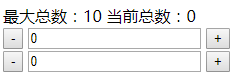

## axios
- 一个前后端通用的http请求库
- 在浏览器环境中使用XMLHttpRequest对象, Node中使用http模块

#### 入门
- 在浏览器环境中导入库, 然后使用库暴露的全局变量axios发送请求

###### get请求
- 成功回调接收一个`response`对象, 要拿到请求回来的数据, 需要通过`respone.data`来取
- 函数调用会返回一个`Promise`实例, 通过then或catch添加成功失败回调

```javascript
axios.get('http://vue.studyit.io/api/getprodlist')   // 得到一个Promise实例,
.then((rep) => console.log(rep.data))                   // 得到response对象, 通过data属性拿数据
.catch((err) => console.log(err))                           // 得到错误描述对象
```

###### post请求

```javascript
axios.get('http://vue.studyit.io/api/getprodlist')   // 得到一个Promise实例, 通过then或catch添加成功失败回调
.then((rep) => console.log(rep.data))                   // 得到response对象, 通过data属性拿数据
.catch((err) => console.log(err))                           // 得到错误描述对象
```

## 语法

#### axios(config)
```javascript
// 类似与jQ的ajax方法
axios({
    url: '',
    method: 'post',
    data: {}
}).then()
```

#### axios.method()
```javascript
// 类似与jQ的get、post方法
axios.get(url, config)
axios.post(url, data, config)
axios.delete(url, config)
axios.head(url, config)
axios.put(url, data, config)
axios.patch(url, data, config)
```

#### 特点
- 可以拦截请求与响应，或取消请求，或进行统一的请求配置与处理

## 使用

#### get请求
```javascript
let config = {
	params: { pageindex: 1 }
};
axios.get('/news/list', config)
	.then(rep => {
	    console.log(rep.data);
	});
```

#### post请求
```javascript
let data = {
	user_name: 'self',
	user_pwd: 111111
};
axios.post('/login', data)
	.then(rep => {
	    console.log(rep.obj);
	});
```

## 默认配置
```javascript
let config = {
  url:'/user',
  method:'get' //default
  baseURL:'https://some-domain.com/api/',
  transformRequest:[function(data){}],
  headers: {'X-Requested-With':'XMLHttpRequest'},
  params: {
    ID:12345
  },
  ...
};
axios.defaults = Object.as
```

# vue-router

## 简介

#### 作用
- 专为vue开发SPA单页应用时所提供的插件
- 能够让我们可以使用前端路由控制组件的渲染

#### 基本原理
- 普通的页面跳转都是由后端来控制的
- 我们可以修改浏览器地址栏的url，或者修改location.href值，向服务器发送请求切换页面
- 如果我们仅仅修改url中的hash值，浏览器是不会向页面发出请求的
- vue-router的运作原理就是利用hash的变化实现组件的动态切换，达到切换页面效果的目的
- vue-router内部使用了hash与H5两种方式

## 基本使用
```html
<div id="app">
	<header></header>
	<!-- 占位标签，路由变化时会动态切换组件，作用类似与component标签 -->
	<router-view></router-view>
	<footer></footer>
</div>
```
```javascript
// 全局登陆组件
let LoginComponent = {
	template: '<h4>登陆</h4>'
};
// 全局注册组件
let RegisterComponent = {
	template: '<h4>注册</h4>'
});
// 实例
var vm = new Vue({
	el: '#app',
	// 路由配置
	router: new VueRouter({
		routes: [
			{ path: '/login', component: LoginComponent },
			{ path: '/register', component: RegisterComponent }
		]
	})
});
```

## 路由实例与路由对象

#### 说明
- 配置了路由之后，在vue实例与组件身上会被注入两个对象$router与$route
- $router为new VueRouter()得到的实例，里面记录了路由配置信息，并提供了一些方法供我们调用
- $route为页面hash值解析后的一个对象，有点类似于node中`url.parser(req.url)`的返回结果

#### $route常用属性
- 注意：下面的属性都是对页面location.hash值进行的解析提取，不是location.href
- fullPath：完整路径，包含query与hash
- path：纯路径
- query：查询字符串解析后得到的对象
- params：路径参数解析后得到的对象
- name：当前路由配置的name属性

#### 使用路由参数
```javascript
// 全局详情组件
var comDetails = Vue.extend({
	template: '<article>详情</article>',
	created: function() {
		let id = this.$route.params.id;
		console.log(this.$route, id);
	}
});
// 实例
var vm = new Vue({
	el: '#app',
	// 路由配置
	router: new VueRouter({
		routes: [
			{ path: '/details/:id', component: 'v-details' }
		]
	})
});
```

## 跳转页面

#### 标签跳转
- 如果要通过点击页面元素实现页面跳转可以使用router-link标签
- router-link标签最终会被替换为普通的a标签，但router-link标签使用更灵活
- 写法1：`<router-link to="/login?keyword=1122">演示</router-link>`
- 写法2：`<router-link :to="{ path: '/login', query: { keyword: 1122 } }">演示</router-link>`
- 写法3：`<router-link :to="{ name: 'go', query: { keyword: 1122 } }">演示</router-link>`

#### 示例
```html
<div id="app">
	<header>
		<router-link to="/login?a=1">登陆-路径</router-link>
		<router-link :to="{ name: 'go', query: {b: 2} }">登陆-别名</router-link>
	</header>
	<!-- 占位标签，路由变化时会动态切换组件，作用类似与component标签 -->
	<router-view></router-view>
	<footer></footer>
</div>
```
```javascript
// 全局登陆组件
Vue.component('v-login', {
	template: '<h4>登陆</h4>'
});
// 实例
var vm = new Vue({
	el: '#app',
	// 路由配置
	router: new VueRouter({
		routes: [
			{ name: 'go', path: '/login', component: 'v-login' }
		]
	})
});
```

#### js跳转
- 如果向通过js来实现页面跳转可以使用$router.push方法
- 写法1：`$router.push('/login')`
- 写法2：`$router.push({path:'/login', query:{aa:11}})`
- 写法3：`$router.push({name:'details', params:{id:1}, query:{aa:11}})`

#### 示例
```javascript
// 实例
var vm = new Vue({
	el: '#app',
	method: {
		to: function(path) {
			this.$router.push(path);
		}
	},
	// 路由配置
	router: new VueRouter({
		routes: [
			{ path: '/login', component: 'v-login' },
			{ name: 'details', path: '/details/:id', component: 'v-details' },
		]
	})
});
vm.$router.push('/login');
vm.$router.push({path:'/login', query:{aa:11}});
vm.$router.push({name:'details', params:{id:1}, query:{aa:11}});
```

#### 重定向
```javascript
new VueRouter({
	routes: [
		// 访问根路径时重定向到index
		{ path: '/', redirect: '/index' }
		// 也可以使用名字进行重定向
		{ path: '/', redirect: { name: 'i' } },
		{ path: '/index', component: IndexComt },
	]
})
```

## 监听路由变化
```javascript
new Vue({
	el: '#app',
	watch: {
		$route: function(to, from) {
			console.log(`${from.path}跳转到了${to.path}`);
		}
	},
	// 路由配置
	router: router
});
```

## 嵌套路由

#### 说明
- 项目中有时候会出现组件嵌套组件的情况
- 这些子组件也要根据url进行动态切换，那么就需要嵌套配置
- 注意：嵌套配置时子路由path自动继承父路由path的path，配置时不要在前面加'/'

#### 示例
```javascript
let Compt1 = Vue.extend({
    template: '<p>子组件1</p>'
});
let Compt2 = Vue.extend({
    template: '<p>子组件2</p>'
});
let ComptContent = Vue.extend({
    template: `
    <div>
		<p>父级组件</p>
		<router-view></router-view>
	</div>`
});
// 路由配置
let router = new VueRouter({
    routes: [
        { path: '/page', component: ComptContent,
          children: [
        	{ path: 'one', component: Compt1 },
        	{ path: 'two', component: Compt2 }
          ]
        }
    ]
});
// 实例
var vm = new Vue({
    el: '#app',
    router: router
});
```

# vuex

#### 简介
- vuex是专为vue开发的状态管理插件（数据管理）
- 当项目中存在比较复杂的组件数据依赖或共享时可以考虑使用

## 基本使用

#### 需求


#### 实现
```html
<div id="app">
	<div>
		<span>最大总数：{{ maxTotal }}</span>
		<span>当前总数：{{ total }}</span>
	</div>
	<v-numbox></v-numbox>
	<v-numbox></v-numbox>
</div>
```
```javascript
// 数字框组件
Vue.component('v-numbox', {
	template:
		`<div>
			<button @click="sub">-</button>
			<input v-model="num"/>
			<button @click="add">+</button>
		</div>`,
	data() {
		return {
			num: 0
		};
	},
	methods: {
		add() {
			var state = this.$store.state;
			if(state.total < state.maxTotal) {
				this.num++;
				this.$store.commit('addTotal');
			}
		},
		sub() {
			if(this.num > 0) {
				this.num--;
				this.$store.commit('subTotal');
			}
		}
	}
});
```
```javascript
// 共享数据
var store = new Vuex.Store({

	// 数据定义
	state: {
		maxTotal: 10,
		total: 0
	},

	// 修改数据的方法
	mutations: {
		addTotal(state) {
			state.total++;
		},
		subTotal(state) {
			state.total--;
		}
	}

});
```
```javascript
// 实例
var vm = new vue({
	el: '#app',
	store,
	computed: {
		maxTotal() {
			return this.$store.state.maxTotal;
		},
		total() {
			return this.$store.state.total;
		}
	}
});
```

## 进阶

#### 配置项
- state
    + @作用：定义所有的状态
- getter
    + @作用：定义获取状态的方法
    + @备注：如果不需要对状态进行加工，直接通过state访问属性即可，无需调用这里的方法获取
- mutations
    + @作用：定义修改状态的方法
    + @备注：想要Vue调试工具监听状态的变化过程，必须调用这里的方法进行修改，否则监听不到
- actions
    + @作用：定义异步调用mutations方法的方法
    + @备注：想要Vue调试工具准确计算状态异步变化后的值，必须在这里异步调用mutations里的方法，否则值有错误
- modules
    + @作用：分割store为不同的模块

#### 其他方法
- Vuex.mapState
- Vuex.mapGetters
- Vuex.mapMutations
- Vuex.mapActions
